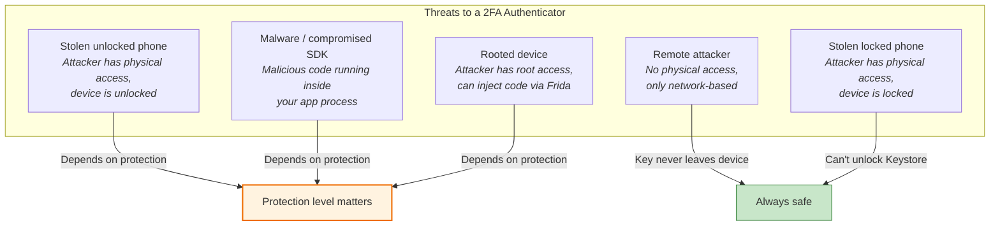
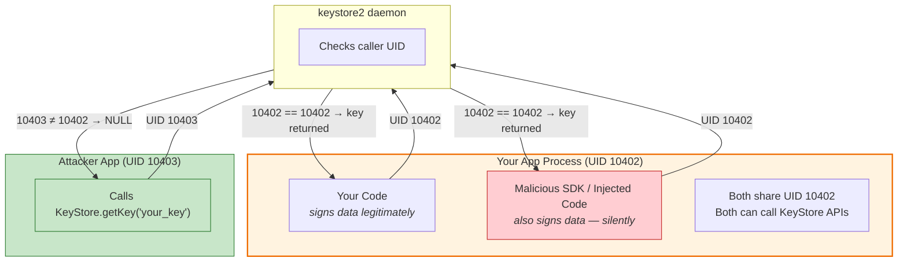
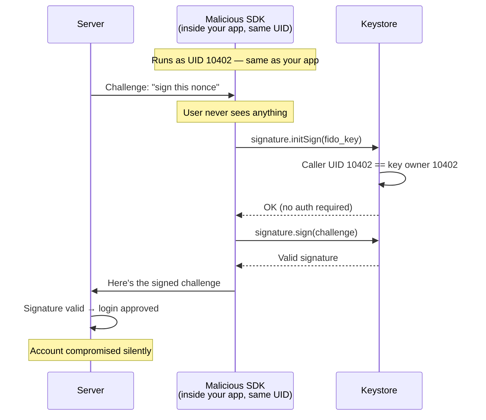
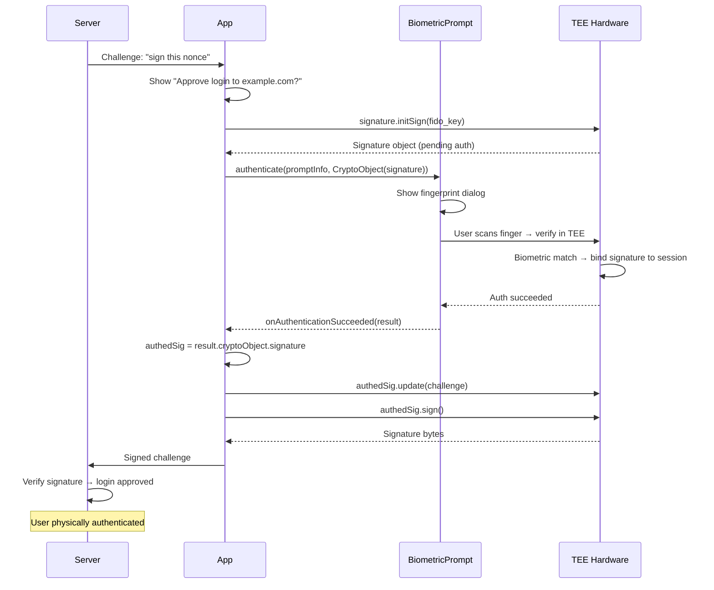
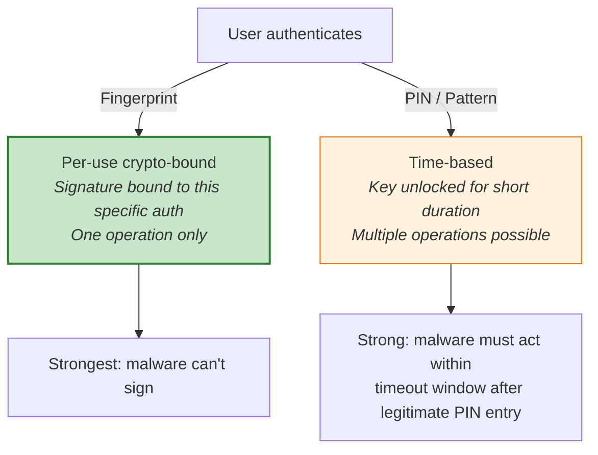
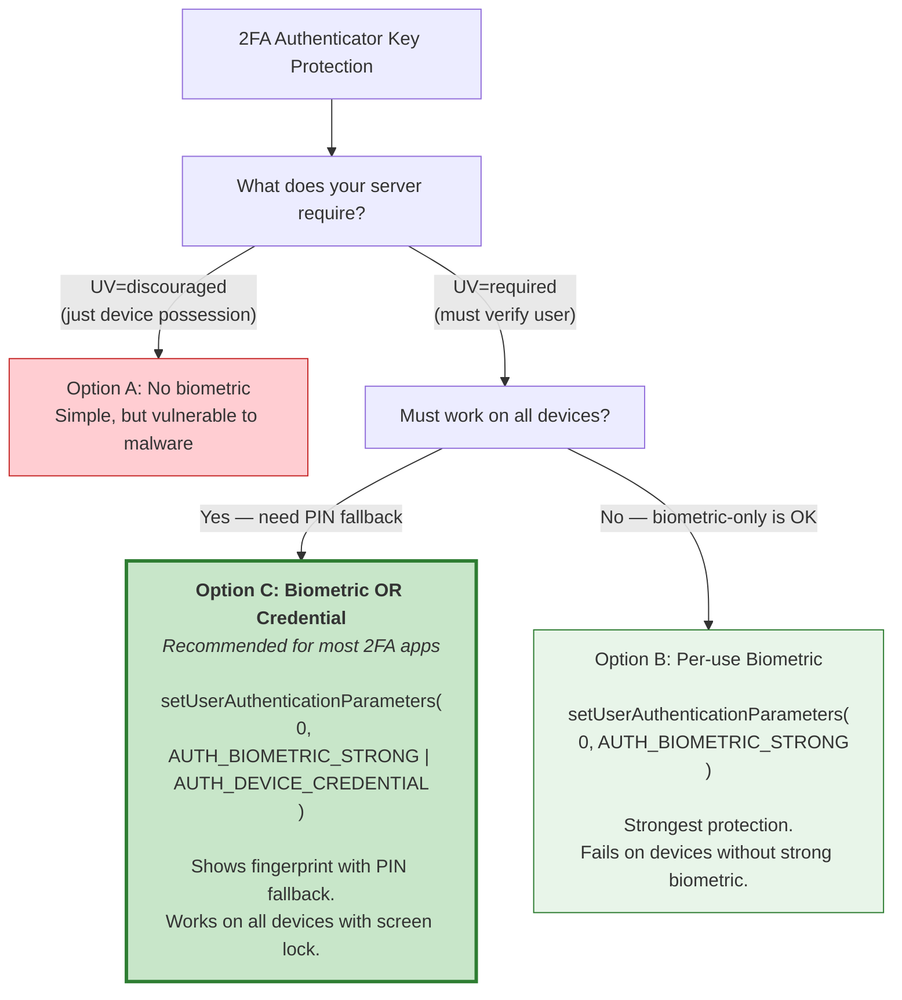
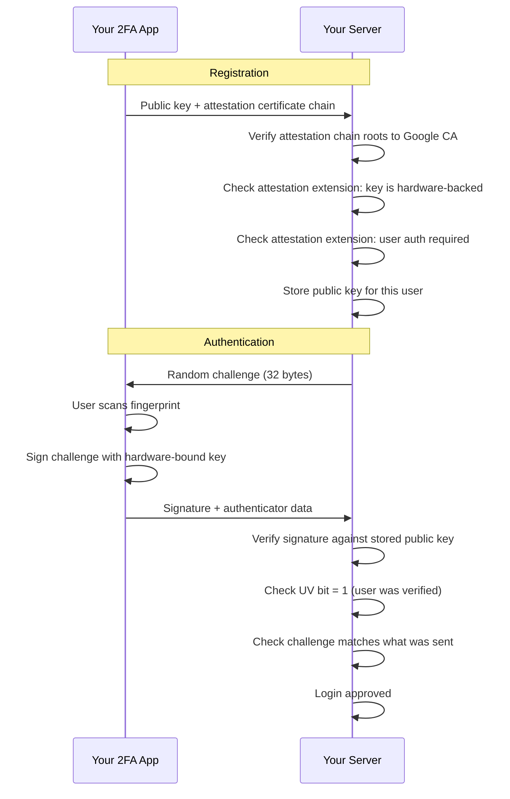
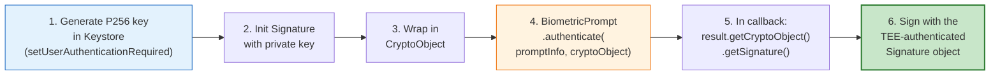

# 2FA Authenticator Architecture: WebAuthn-Style P256 Key with Android Keystore

## Your Problem

Build a 2FA authenticator that:
- Uses WebAuthn-similar flows
- Generates and stores a P256 (ECDSA) private key in Android Keystore
- Signs challenges from the server to prove device possession
- Needs the right protection level

**Core decision: Should we require biometric for each signing operation?**

---

## The Threat Model

Before choosing a protection level, define what you're protecting against:



For a 2FA authenticator, the **critical threats** are T1 (stolen unlocked phone) and T2 (malware). T3 (root) is a secondary concern. Let's see how each protection level handles them.

---

## Option A: No Biometric

```kotlin
KeyGenParameterSpec.Builder("fido_key", PURPOSE_SIGN)
    .setAlgorithmParameterSpec(ECGenParameterSpec("secp256r1"))
    .setDigests(KeyProperties.DIGEST_SHA256)
    // No setUserAuthenticationRequired
    .build()
```

### What it proves to the server
**Device possession only.** "This device has the private key." Not "the owner is present."

### Threat analysis

| Threat | Protected? | Details |
|---|---|---|
| Remote attacker | YES | Key never leaves device |
| Other apps on the device | YES | UID isolation — we proved this with the attacker app (see below) |
| Stolen locked phone | YES | Keystore locked when device locked |
| Stolen unlocked phone (thief opens your app) | **NO** | No auth gate — thief uses the app's UI directly |
| Malware in app process | **NO** | Malware silently signs challenges (see below) |
| Root attacker | **NO** | Injects code into your process via Frida, signs as your UID |

### Important: "Other Apps" vs "Malware in Your Process"

This is a critical distinction that's easy to confuse.

**A separate app (different APK, different UID) CANNOT access your keys.** We proved this by building an attacker app — all 7 attacks failed. The Keystore daemon checks the caller's UID and rejects requests from any UID that doesn't own the key.

**Malicious code inside YOUR app's process CAN use your keys.** This is NOT another app — it's code running as your UID. The Keystore can't tell the difference between your legitimate code and a malicious SDK running in the same process.

Three ways this happens:

1. **Compromised SDK** — you include a third-party library (ads, analytics, crash reporting) that contains hidden malicious code. It runs inside your process, as your UID.
2. **WebView exploit** — attacker exploits a browser vulnerability to execute native code inside your process.
3. **Frida injection** — a root attacker injects code into your running process. From the Keystore's perspective, it's your app calling `sign()`.



**The Keystore doesn't know who wrote the code — it only checks the UID.** Your code and a malicious SDK share the same UID. This is exactly why biometric per-use with CryptoObject matters: even if malicious code runs inside your process, it can't produce a valid CryptoObject without a real finger on the sensor — that check happens in TEE hardware, not at the UID level.

### When this is acceptable
- The server treats 2FA as **"something you have"** only (device possession)
- The first factor (password) is the identity proof
- You accept the risk of in-process malware silently approving logins
- You trust all SDKs included in your app
- Example: low-value accounts, notification-based "approve this login" where you trust the device

### The real problem


---

## Option B: Per-Use Biometric + CryptoObject (Recommended)

```kotlin
KeyGenParameterSpec.Builder("fido_key", PURPOSE_SIGN)
    .setAlgorithmParameterSpec(ECGenParameterSpec("secp256r1"))
    .setDigests(KeyProperties.DIGEST_SHA256)
    .setUserAuthenticationRequired(true)
    .setUserAuthenticationParameters(0, KeyProperties.AUTH_BIOMETRIC_STRONG)
    .build()
```

### What it proves to the server
**Device possession + user presence.** "This device has the key AND the owner just authenticated." This is what WebAuthn calls **User Verification (UV)**.

### Threat analysis

| Threat | Protected? | Details |
|---|---|---|
| Remote attacker | YES | Key never leaves device |
| Stolen locked phone | YES | Keystore locked |
| Stolen unlocked phone | **YES** | Attacker can't sign without fingerprint |
| Malware in app process | **YES** | Can't produce valid CryptoObject (TEE-bound) |
| Root attacker | **YES** | Can't forge auth token (HMAC key in TEE) |

### The flow


### Limitation
Requires `BIOMETRIC_STRONG` (Class 3). Devices without strong biometric hardware can't use this mode. Falls back to nothing — the user is blocked.

---

## Option C: Biometric OR Credential + CryptoObject (Best for Broad Compatibility)

```kotlin
KeyGenParameterSpec.Builder("fido_key", PURPOSE_SIGN)
    .setAlgorithmParameterSpec(ECGenParameterSpec("secp256r1"))
    .setDigests(KeyProperties.DIGEST_SHA256)
    .setUserAuthenticationRequired(true)
    .setUserAuthenticationParameters(
        0,  // per-use
        KeyProperties.AUTH_BIOMETRIC_STRONG or KeyProperties.AUTH_DEVICE_CREDENTIAL
    )
    .build()
```

### Difference from Option B
Allows PIN/pattern/password as fallback when biometric isn't available or fails.

### Important caveat
**`CryptoObject` only works with `BIOMETRIC_STRONG`**, not `DEVICE_CREDENTIAL`. When the user authenticates via PIN, the auth token is generated by Gatekeeper (in TEE) instead of Biometric TA — it's still TEE-signed, still unforgeable. But the crypto binding is **time-based**, not per-use.



For a 2FA authenticator, this tradeoff is usually acceptable — PIN fallback is better than blocking users on devices without strong biometrics.

---

## Recommendation



**For most 2FA authenticators, Option C is the right choice:**

1. **Per-use auth** (timeout=0) — each signing requires fresh user verification
2. **Biometric + credential** — fingerprint preferred, PIN/pattern fallback
3. **CryptoObject binding** — when biometric is used, it's hardware-bound and unforgeable
4. **Hardware-backed** — key material in TEE, non-extractable

---

## Complete Implementation

```kotlin
// ══════════════════════════════════════════════
// 1. KEY GENERATION (once, during registration)
// ══════════════════════════════════════════════

fun generateFidoKeyPair(alias: String): PublicKey {
    val keyGen = KeyPairGenerator.getInstance(
        KeyProperties.KEY_ALGORITHM_EC,
        "AndroidKeyStore"
    )
    keyGen.initialize(
        KeyGenParameterSpec.Builder(alias, KeyProperties.PURPOSE_SIGN)
            .setAlgorithmParameterSpec(ECGenParameterSpec("secp256r1"))
            .setDigests(KeyProperties.DIGEST_SHA256)

            // Protection: per-use auth, biometric with PIN fallback
            .setUserAuthenticationRequired(true)
            .setUserAuthenticationParameters(
                0,  // 0 = per-use (every sign requires fresh auth)
                KeyProperties.AUTH_BIOMETRIC_STRONG
                    or KeyProperties.AUTH_DEVICE_CREDENTIAL
            )

            // Invalidate key if user adds/removes fingerprint
            .setInvalidatedByBiometricEnrollment(true)

            // Request hardware backing (TEE or StrongBox)
            // StrongBox is stronger but slower and not on all devices:
            // .setIsStrongBoxBacked(true)

            .build()
    )
    return keyGen.generateKeyPair().public
    // Send public key to server during WebAuthn registration
}


// ══════════════════════════════════════════════
// 2. SIGNING (each authentication request)
// ══════════════════════════════════════════════

fun signChallenge(
    activity: FragmentActivity,
    alias: String,
    challenge: ByteArray,
    onResult: (ByteArray) -> Unit,
    onError: (String) -> Unit
) {
    // Step 1: Get private key and init Signature
    val keyStore = KeyStore.getInstance("AndroidKeyStore").apply { load(null) }
    val privateKey = keyStore.getKey(alias, null) as PrivateKey

    val signature = Signature.getInstance("SHA256withECDSA")
    try {
        signature.initSign(privateKey)
    } catch (e: UserNotAuthenticatedException) {
        // Expected for per-use keys — auth needed before use
    }

    // Step 2: Wrap in CryptoObject for hardware-bound auth
    val cryptoObject = BiometricPrompt.CryptoObject(signature)

    // Step 3: Show BiometricPrompt
    val executor = ContextCompat.getMainExecutor(activity)

    val callback = object : BiometricPrompt.AuthenticationCallback() {
        override fun onAuthenticationSucceeded(result: BiometricPrompt.AuthenticationResult) {
            try {
                // Use the RETURNED CryptoObject's signature (TEE-authenticated)
                val authedSig = result.cryptoObject!!.signature!!
                authedSig.update(challenge)
                val signed = authedSig.sign()
                onResult(signed)
            } catch (e: Exception) {
                onError("Signing failed: ${e.message}")
            }
        }

        override fun onAuthenticationError(errorCode: Int, errString: CharSequence) {
            onError("Auth error [$errorCode]: $errString")
        }

        override fun onAuthenticationFailed() {
            // Biometric didn't match — dialog stays open, user can retry
        }
    }

    val promptInfo = BiometricPrompt.PromptInfo.Builder()
        .setTitle("Approve Login")
        .setSubtitle("Verify your identity")
        .setDescription("Sign in to example.com")
        .setConfirmationRequired(true)  // Prevent instant face unlock dismissal
        .setAllowedAuthenticators(
            BiometricManager.Authenticators.BIOMETRIC_STRONG
                or BiometricManager.Authenticators.DEVICE_CREDENTIAL
        )
        .build()

    val biometricPrompt = BiometricPrompt(activity, executor, callback)
    biometricPrompt.authenticate(promptInfo, cryptoObject)
}


// ══════════════════════════════════════════════
// 3. KEY ATTESTATION (prove key is genuine hardware-backed)
// ══════════════════════════════════════════════

fun getAttestationCertificateChain(alias: String): List<Certificate> {
    val keyStore = KeyStore.getInstance("AndroidKeyStore").apply { load(null) }
    return keyStore.getCertificateChain(alias).toList()
    // Send to server — server verifies chain roots to Google's attestation CA
    // This proves: key was generated in real TEE, not emulator/software
}


// ══════════════════════════════════════════════
// 4. CHECK DEVICE CAPABILITIES (before offering registration)
// ══════════════════════════════════════════════

fun checkDeviceCapabilities(context: Context): DeviceCapabilities {
    val bioManager = BiometricManager.from(context)

    val strongBio = bioManager.canAuthenticate(
        BiometricManager.Authenticators.BIOMETRIC_STRONG
    ) == BiometricManager.BIOMETRIC_SUCCESS

    val credential = bioManager.canAuthenticate(
        BiometricManager.Authenticators.DEVICE_CREDENTIAL
    ) == BiometricManager.BIOMETRIC_SUCCESS

    val hasStrongBox = context.packageManager
        .hasSystemFeature(PackageManager.FEATURE_STRONGBOX_KEYSTORE)

    return DeviceCapabilities(
        canUseBiometric = strongBio,
        canUseCredential = credential,
        hasStrongBox = hasStrongBox,
        canRegister = strongBio || credential  // Need at least one
    )
}

data class DeviceCapabilities(
    val canUseBiometric: Boolean,
    val canUseCredential: Boolean,
    val hasStrongBox: Boolean,
    val canRegister: Boolean
)
```

---

## WebAuthn Mapping

How your 2FA authenticator maps to WebAuthn concepts:

| WebAuthn Concept | Your Implementation |
|---|---|
| `navigator.credentials.create()` | `generateFidoKeyPair()` — generates EC P-256 in Keystore |
| `navigator.credentials.get()` | `signChallenge()` — signs server challenge with biometric |
| `userVerification: "required"` | `setUserAuthenticationRequired(true)` + `timeout=0` |
| `userVerification: "preferred"` | `setUserAuthenticationRequired(true)` + `BIOMETRIC_STRONG \| DEVICE_CREDENTIAL` |
| `userVerification: "discouraged"` | No `setUserAuthenticationRequired` (not recommended) |
| UV bit in authenticator data | Set to 1 when user authenticated via biometric/PIN |
| Attestation | `getAttestationCertificateChain()` — hardware key attestation |
| Algorithm `-7` (ES256) | `EC` + `secp256r1` + `SHA256withECDSA` |
| Credential ID | Keystore alias (or a random ID mapped to the alias) |

---

## What Your Server Should Verify



Key attestation lets the server verify:
- The key was generated **inside real TEE hardware** (not an emulator)
- The key **requires user authentication** before use
- The device **hasn't been tampered with** (verified boot state)

---

## Edge Cases to Handle

| Scenario | What happens | How to handle |
|---|---|---|
| User has no screen lock | `canAuthenticate()` returns `NONE_ENROLLED` | Block registration, show setup instructions |
| User removes fingerprint after registration | Key throws `KeyPermanentlyInvalidatedException` | Delete key, re-register with server |
| Device has no strong biometric | `BIOMETRIC_STRONG` returns `NO_HARDWARE` | Fall back to `DEVICE_CREDENTIAL` only |
| User cancels biometric prompt | `onAuthenticationError(ERROR_USER_CANCELED)` | Show "cancelled" message, let them retry |
| Too many failed attempts | `onAuthenticationError(ERROR_LOCKOUT)` | Show "try again in 30s" or offer PIN |
| App is reinstalled | Old keys are deleted | Re-register with server |
| Device is factory reset | All keys destroyed | Re-register with server |

---

## Real-World Open Source Implementations

These are actual FIDO2/WebAuthn authenticator implementations on GitHub that use exactly this pattern (P256 + Keystore + BiometricPrompt + CryptoObject):

### 1. Duo Labs — android-webauthn-authenticator

**Repo:** [duo-labs/android-webauthn-authenticator](https://github.com/duo-labs/android-webauthn-authenticator)

The closest reference implementation to what you're building. Duo Security (now part of Cisco) built this as an open-source WebAuthn authenticator for Android. It uses **exactly Option C**: P256 in Keystore with configurable biometric + StrongBox.

**Key generation** (`CredentialSafe.java`):
```java
KeyGenParameterSpec spec = new KeyGenParameterSpec.Builder(alias, KeyProperties.PURPOSE_SIGN)
        .setAlgorithmParameterSpec(new ECGenParameterSpec("secp256r1"))
        .setDigests(KeyProperties.DIGEST_SHA256)
        .setUserAuthenticationRequired(this.authenticationRequired) // configurable
        .setInvalidatedByBiometricEnrollment(false)
        .setIsStrongBoxBacked(this.strongboxRequired)              // configurable
        .build();
```

**Signing with CryptoObject** (`Authenticator.java`):
```java
// Create Signature object and wrap in CryptoObject
Signature signature = WebAuthnCryptography.generateSignatureObject(privateKey);
BiometricPrompt.CryptoObject cryptoObject = new BiometricPrompt.CryptoObject(signature);

// Authenticate with CryptoObject — signature bound to biometric session
bp.authenticate(cryptoObject, cancellationSignal, ctx.getMainExecutor(), callback);
```

**In the callback** (`BiometricGetAssertionCallback.java`):
```java
@Override
public void onAuthenticationSucceeded(BiometricPrompt.AuthenticationResult result) {
    // Use the TEE-authenticated signature from the CryptoObject
    Signature signature = result.getCryptoObject().getSignature();
    
    // Pass it to the assertion builder — only THIS signature is authorized
    assertionResult = authenticator.getInternalAssertion(options, selectedCredential, signature);
}
```

**Constructor** allows toggling auth and StrongBox (useful for testing):
```java
// Production: both enabled
new Authenticator(ctx, true, true);

// Testing: auth disabled
new Authenticator(ctx, false, false);
```

### 2. WIOsense — rauth-android

**Repo:** [WIOsense/rauth-android](https://github.com/WIOsense/rauth-android)

A FIDO2 **roaming authenticator** library (the phone acts as a security key for other devices via NFC/BLE). Uses Android Keystore with BiometricPrompt and optional StrongBox. Also implements **clientPIN** as a fallback authentication method — relevant if your business wants app-level PIN alongside biometric.

Key features:
- Resident keys stored in Android KeyStore by default (TEE or SE)
- BiometricPrompt for user verification
- Optional StrongBox enforcement (`strongboxRequired` flag)
- clientPIN support for devices without biometric
- Requires Android 9.0+ (BiometricPrompt API)

### 3. LINE — webauthn-kotlin

**Repo:** [line/webauthn-kotlin](https://github.com/line/webauthn-kotlin)

LINE (messaging app with 200M+ users) built an open-source WebAuthn SDK in Kotlin. Supports both device credentials and biometrics. Production-grade code from a major tech company.

**Demo app:** [line/webauthndemo-kotlin](https://github.com/line/webauthndemo-kotlin) — demonstrates registration and authentication with biometric/credential authenticators.

### 4. Google — Credential Manager / FIDO2 API

**Codelab:** [Credential Manager API for Android](https://codelabs.developers.google.com/credential-manager-api-for-android)

Google's official implementation (used by Chrome and Android system). The Credential Manager internally uses:
```kotlin
// Per the official documentation:
.setUserAuthenticationParameters(
    0, // duration = 0 → per-use
    KeyProperties.AUTH_BIOMETRIC_STRONG or KeyProperties.AUTH_DEVICE_CREDENTIAL
)
```

As of 2024, Google's FIDO2 API produces **hardware-backed key attestation** by default (not just SafetyNet). This means the server can cryptographically verify the key was generated in genuine TEE hardware.

### 5. prongbang — android-secure-biometric

**Repo:** [prongbang/android-secure-biometric](https://github.com/prongbang/android-secure-biometric)

A helper library that simplifies BiometricPrompt + CryptoObject usage. Not a full FIDO2 implementation, but useful as a building block.

### Pattern Confirmed Across All Implementations

Every production FIDO2 authenticator on Android follows the same pattern:



---

## Sources

- [FIDO2 API for Android — developers.google.com](https://developers.google.com/identity/fido/android/native-apps)
- [WebAuthn Level 2 — W3C Specification](https://www.w3.org/TR/webauthn-2/)
- [Android Keystore System — developer.android.com](https://developer.android.com/privacy-and-security/keystore)
- [Android Authentication Architecture — source.android.com](https://source.android.com/docs/security/features/authentication)
- [Attestation Format Change for Android FIDO2 API — Android Developers Blog](https://android-developers.googleblog.com/2024/09/attestation-format-change-for-android-fido2-api.html)
- [WebAuthn/FIDO2: Verifying Android KeyStore Attestation — Ackermann Yuriy](https://medium.com/@herrjemand/webauthn-fido2-verifying-android-keystore-attestation-4a8835b33e9d)
- [WithSecure Labs — Android Keystore Authentication Security](https://labs.withsecure.com/publications/how-secure-is-your-android-keystore-authentication)

### Open Source Implementations
- [Duo Labs — android-webauthn-authenticator](https://github.com/duo-labs/android-webauthn-authenticator) — Cisco/Duo's reference FIDO2 authenticator
- [WIOsense — rauth-android](https://github.com/WIOsense/rauth-android) — FIDO2 roaming authenticator with clientPIN support
- [LINE — webauthn-kotlin](https://github.com/line/webauthn-kotlin) — Production WebAuthn SDK from LINE
- [LINE — webauthndemo-kotlin](https://github.com/line/webauthndemo-kotlin) — Demo app for the SDK
- [Google — Credential Manager Codelab](https://codelabs.developers.google.com/credential-manager-api-for-android)
- [prongbang — android-secure-biometric](https://github.com/prongbang/android-secure-biometric) — BiometricPrompt + CryptoObject helper
