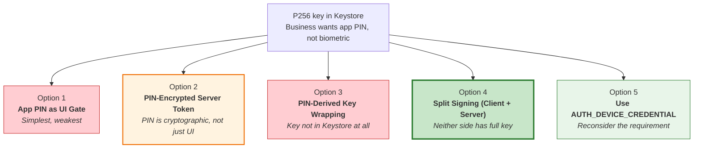
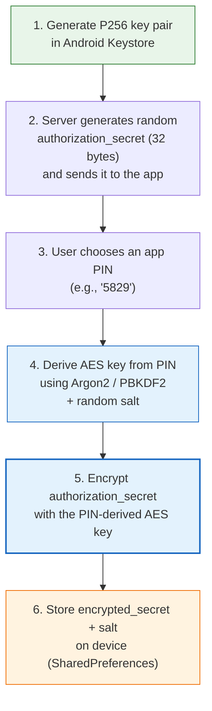
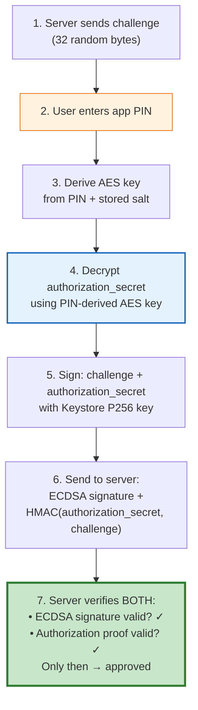
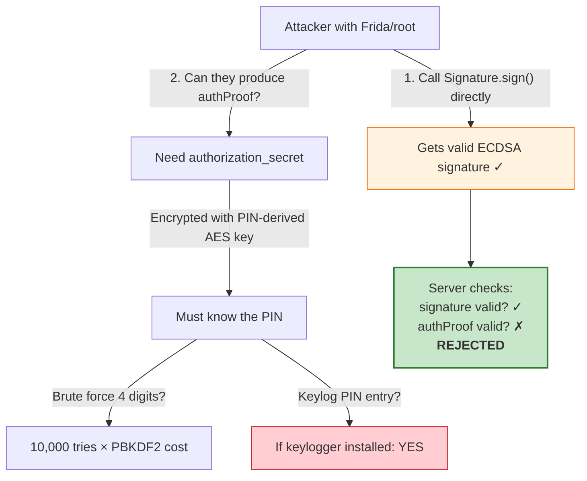
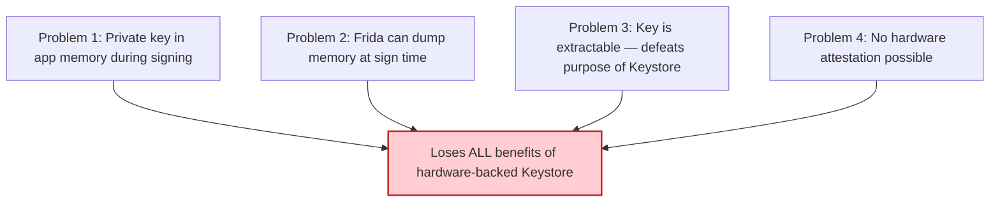
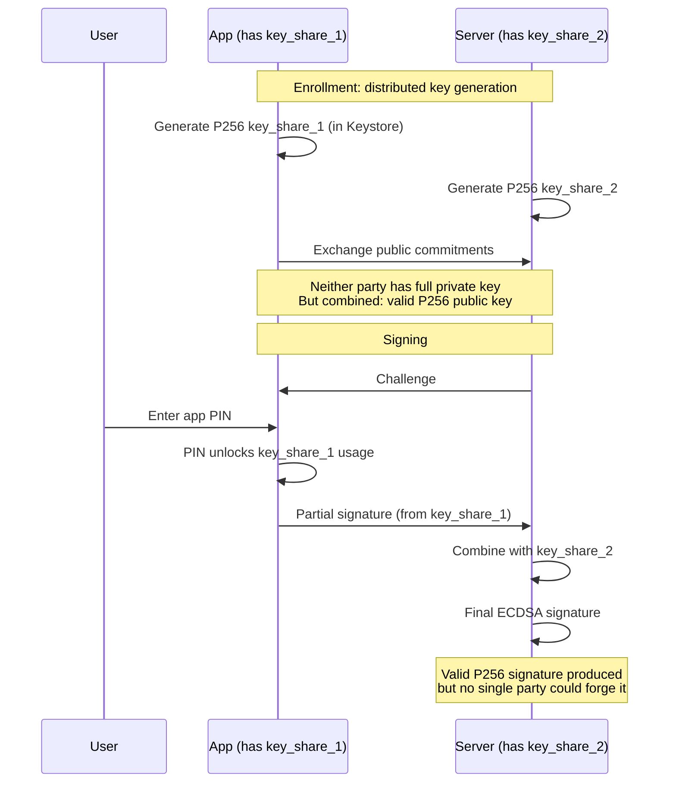
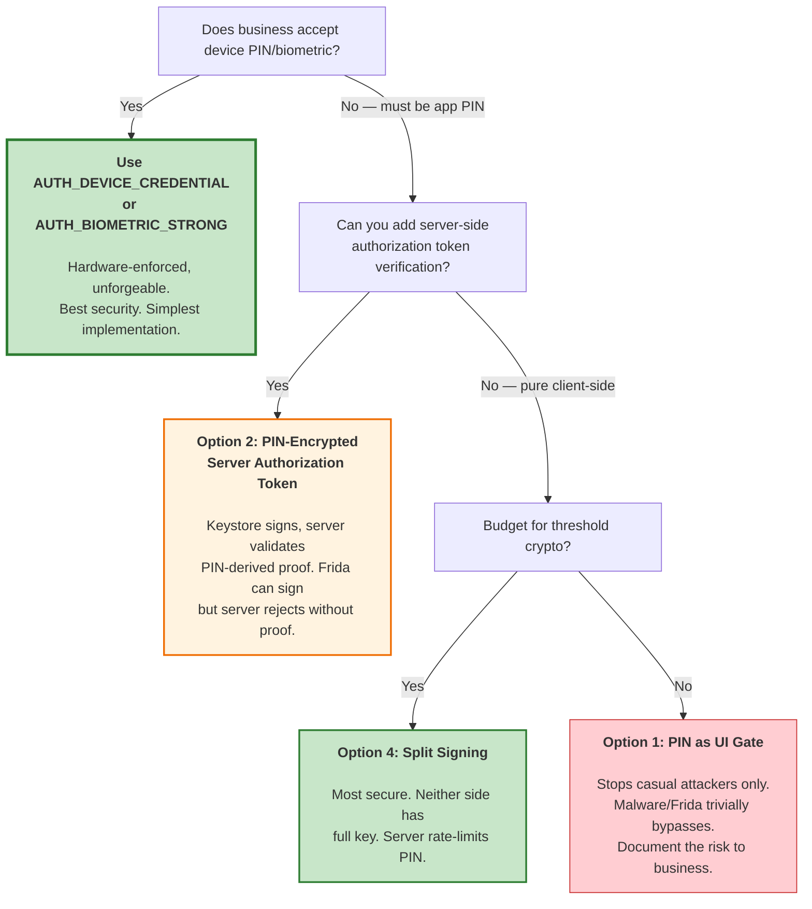

# Software App PIN vs Biometric for Keystore Signing Keys

## The Business Constraint

- P256 private key is generated during enrollment and stored in Android Keystore (hardware-backed, non-extractable)
- Business does **not** want to force biometric or device PIN/pattern
- Business wants a **custom app PIN** (4-6 digits chosen by the user inside the app)
- Question: what are the options and security tradeoffs?

## The Core Problem

Android Keystore supports only two types of user authentication:

```
┌──────────────────────────────────────────────────────┐
│  What Android Keystore understands:                  │
│                                                      │
│  AUTH_BIOMETRIC_STRONG  → fingerprint / face         │
│  AUTH_DEVICE_CREDENTIAL → device PIN / pattern       │
│                                                      │
│  What it does NOT understand:                        │
│                                                      │
│  ❌ Your app's custom PIN                            │
│  ❌ Your app's custom password                       │
│  ❌ Any app-level authentication                     │
└──────────────────────────────────────────────────────┘
```

The Keystore has no concept of "app PIN." You cannot tell the TEE "only allow signing after the user enters PIN 1234 in my app." The TEE doesn't know your app's PIN exists.

This means: **whatever software PIN scheme you build, the actual Keystore key will have no hardware-enforced authentication.** The PIN gate is purely in your app code.

---

## All Available Options



---

## Option 1: App PIN as UI Gate (Insecure)

### How It Works

Key is in Keystore with **no authentication requirement**. The app shows a PIN entry screen. If the PIN matches, the app calls `Signature.sign()`.

```kotlin
// Key generation — NO auth requirement
KeyGenParameterSpec.Builder("fido_key", PURPOSE_SIGN)
    .setAlgorithmParameterSpec(ECGenParameterSpec("secp256r1"))
    .setDigests(DIGEST_SHA256)
    // No setUserAuthenticationRequired — key is always usable
    .build()

// Signing — app checks PIN, then signs
fun signWithPin(pin: String, challenge: ByteArray): ByteArray? {
    if (!verifyPin(pin)) return null  // ← App-level check only

    val keyStore = KeyStore.getInstance("AndroidKeyStore").apply { load(null) }
    val key = keyStore.getKey("fido_key", null) as PrivateKey
    val sig = Signature.getInstance("SHA256withECDSA")
    sig.initSign(key)        // ← Works WITHOUT PIN, Frida skips to here
    sig.update(challenge)
    return sig.sign()
}
```

### Security


| Threat | Protected? | Why |
|---|---|---|
| Casual physical access (friend/thief) | **YES** | They see a PIN screen and stop |
| Malware in app process | **NO** | Calls `sign()` directly, ignores PIN |
| Frida / root | **NO** | Hooks past `verifyPin()`, calls `sign()` |

**Verdict:** The PIN is a screen door lock. It stops honest people. A Frida one-liner bypasses it.

---

## Option 2: PIN-Encrypted Server Authorization Token (Recommended if no biometric)

### How It Works

The PIN isn't just a UI check — it's used to **decrypt a secret that the server requires** as part of the signing protocol. Without the correct PIN, the app can produce a valid Keystore signature but the server won't accept it.

#### Enrollment Flow (once, during setup)



#### Signing Flow (each authentication)



### Implementation

```kotlin
// ══════════════════════════════════════════════
// ENROLLMENT
// ══════════════════════════════════════════════

fun enroll(pin: String): EnrollmentData {
    // 1. Generate P256 key in Keystore (no auth requirement)
    val keyGen = KeyPairGenerator.getInstance("EC", "AndroidKeyStore")
    keyGen.initialize(
        KeyGenParameterSpec.Builder("fido_key", KeyProperties.PURPOSE_SIGN)
            .setAlgorithmParameterSpec(ECGenParameterSpec("secp256r1"))
            .setDigests(KeyProperties.DIGEST_SHA256)
            .build()
    )
    val publicKey = keyGen.generateKeyPair().public

    // 2. Server gives us a random authorization secret
    val authorizationSecret = serverApi.getAuthorizationSecret()  // 32 random bytes

    // 3. Derive AES key from PIN
    val salt = ByteArray(32).also { SecureRandom().nextBytes(it) }
    val pinDerivedKey = deriveKeyFromPin(pin, salt)

    // 4. Encrypt authorization secret with PIN-derived key
    val cipher = Cipher.getInstance("AES/GCM/NoPadding")
    cipher.init(Cipher.ENCRYPT_MODE, pinDerivedKey)
    val iv = cipher.iv
    val encryptedSecret = cipher.doFinal(authorizationSecret)

    // 5. Store encrypted secret + salt locally
    saveToSecureStorage("encrypted_auth_secret", encryptedSecret)
    saveToSecureStorage("auth_secret_iv", iv)
    saveToSecureStorage("pin_salt", salt)
    saveToSecureStorage("pin_hash", hashPin(pin, salt))  // for quick verification

    return EnrollmentData(publicKey, authorizationSecret)
    // Send publicKey + authorizationSecret hash to server
}

private fun deriveKeyFromPin(pin: String, salt: ByteArray): SecretKey {
    val factory = SecretKeyFactory.getInstance("PBKDF2WithHmacSHA256")
    val spec = PBEKeySpec(pin.toCharArray(), salt, 210_000, 256)  // OWASP recommended iterations
    val keyBytes = factory.generateSecret(spec).encoded
    return SecretKeySpec(keyBytes, "AES")
}

// ══════════════════════════════════════════════
// SIGNING
// ══════════════════════════════════════════════

fun signChallenge(pin: String, challenge: ByteArray): SigningResult? {
    // 1. Quick PIN check (optional — for UX, not security)
    val salt = loadFromSecureStorage("pin_salt")
    if (hashPin(pin, salt) != loadFromSecureStorage("pin_hash")) {
        return null  // wrong PIN
    }

    // 2. Decrypt authorization secret with PIN
    val pinDerivedKey = deriveKeyFromPin(pin, salt)
    val decCipher = Cipher.getInstance("AES/GCM/NoPadding")
    val iv = loadFromSecureStorage("auth_secret_iv")
    decCipher.init(Cipher.DECRYPT_MODE, pinDerivedKey, GCMParameterSpec(128, iv))
    val authorizationSecret: ByteArray
    try {
        authorizationSecret = decCipher.doFinal(loadFromSecureStorage("encrypted_auth_secret"))
    } catch (e: AEADBadTagException) {
        return null  // wrong PIN — can't decrypt
    }

    // 3. Sign (challenge || authorization_secret) with Keystore key
    val keyStore = KeyStore.getInstance("AndroidKeyStore").apply { load(null) }
    val privateKey = keyStore.getKey("fido_key", null) as PrivateKey
    val sig = Signature.getInstance("SHA256withECDSA")
    sig.initSign(privateKey)
    sig.update(challenge)
    sig.update(authorizationSecret)  // authorization secret mixed into signed data
    val signature = sig.sign()

    // 4. Server needs both the signature AND an authorization proof
    val authProof = computeHmac(authorizationSecret, challenge)

    return SigningResult(signature, authProof)
}

// Server verifies:
// 1. ECDSA signature is valid for the registered public key
// 2. authProof matches HMAC(stored_authorization_secret, challenge)
// Both must pass — signature alone is not enough
```

### Security

| Threat | Protected? | Why |
|---|---|---|
| Other apps on same device | **YES** | UID isolation — other apps can't see or use the Keystore key (proven by attacker app test) |
| Casual physical access (thief opens your app) | **YES** | PIN required to decrypt secret |
| Malware — call `sign()` directly | **Partially** | Can produce ECDSA signature but **cannot produce `authProof`** without the decrypted authorization_secret. Server rejects. |
| Malware — keylog the PIN | **NO** | If malware captures the PIN keystrokes, it can decrypt the secret and produce everything |
| Frida — bypass PIN check | **NO for signing** | Can skip `hashPin()` check, but still can't decrypt the AES-encrypted authorization_secret without the actual PIN digits |
| Root — brute force PIN | **Possible** | 4-digit PIN = 10,000 combinations. With PBKDF2 at 210K iterations: ~hours. With Argon2id: days. With 6-digit PIN + Argon2id: infeasible. |



### Strengths and Weaknesses

**Strong against:**
- Casual theft (PIN required)
- Simple Frida bypass (can't produce server authorization without PIN)
- Offline attack if PIN is 6+ digits + Argon2id

**Weak against:**
- Keylogger capturing PIN input (malware sees the digits as user types)
- Brute force of 4-digit PIN (only 10,000 combinations — use 6+ digits and strong KDF)
- The Keystore key itself is still usable without PIN at the device level (but useless without the server accepting the authProof)

**The security boundary moves to the server**, not the device. The device can produce a valid ECDSA signature, but the server rejects it without the PIN-derived proof.

---

## Option 3: PIN-Derived Key Wrapping (Not Recommended)

### How It Works

Don't store the private key in Keystore at all. Instead, encrypt it with a PIN-derived key and store the encrypted blob in SharedPreferences. On use, decrypt the key into memory, sign, then wipe.

### Why Not Recommended



You lose the main advantage of Keystore (non-extractable keys). The key exists in RAM during signing. Frida can read it. Root can read it. The key can be **extracted and used on another device**. This is strictly worse than Options 1 and 2.

---

## Option 4: Split Signing / Threshold Signature (Most Secure, Most Complex)

### How It Works

Neither the client nor the server holds the full private key. The key is **split** during enrollment using a threshold signature scheme (e.g., 2-of-2 ECDSA). Both parties must cooperate to produce a valid signature.



### Security

| Threat | Protected? | Why |
|---|---|---|
| Malware on device | **YES** | Even with full device compromise, attacker has only share_1. Can't produce valid signature alone. |
| Server compromise | **YES** | Server has only share_2. Useless alone. |
| Root + Frida | **YES** | Key_share_1 in Keystore is non-extractable. Even if used, produces partial signature server won't complete without PIN proof. |
| Brute force PIN | **YES** | Server rate-limits signing requests. 3 wrong PINs → lock account. |

### Tradeoff

- **Complexity**: Requires threshold ECDSA implementation (libraries exist: [tss-lib](https://github.com/bnb-chain/tss-lib), [multi-party-sig](https://github.com/taurushq-io/multi-party-sig))
- **Network dependency**: Signing requires server round-trip (no offline signing)
- **Latency**: Additional network call per signature

**This is what major crypto wallets and some banks use.** It's the most secure option when you can't enforce biometric.

---

## Option 5: Reconsider — Use AUTH_DEVICE_CREDENTIAL

### The Business Concern

"We don't want to force biometric or device PIN."

### The Counter-Argument

**Every Android user already has a device PIN/pattern/password.** You can't use Android without one (required for Play Store, many apps, etc.). Using `AUTH_DEVICE_CREDENTIAL` doesn't "force" anything new — it reuses what the user already has.

```kotlin
KeyGenParameterSpec.Builder("fido_key", PURPOSE_SIGN)
    .setAlgorithmParameterSpec(ECGenParameterSpec("secp256r1"))
    .setDigests(DIGEST_SHA256)
    .setUserAuthenticationRequired(true)
    .setUserAuthenticationParameters(
        0,  // per-use
        KeyProperties.AUTH_DEVICE_CREDENTIAL  // device PIN only, no biometric
    )
    .build()
```

### Why This Is Better Than an App PIN

| Aspect | App PIN | Device Credential |
|---|---|---|
| Verified by | App code (bypassable) | **TEE hardware** (unbypassable) |
| Frida can bypass | **YES** | **NO** — Gatekeeper runs in TEE |
| Root can bypass | **YES** | **NO** — auth token HMAC in TEE |
| Brute force protection | App must implement rate limiting | **Hardware rate limiting** (30s lockout after 5 tries, 24h after 139) |
| User has to remember | App PIN + device PIN (two PINs!) | **Just their existing device PIN** |
| Cryptographic strength | PBKDF2/Argon2 in app (software) | **Hardware-enforced** by TrustZone |

The irony: an app PIN is **worse UX** (user remembers two PINs) AND **worse security** (software-enforced instead of hardware-enforced). The business concern may be based on a misunderstanding.

---

## Decision Matrix



---

## My Recommendation

**Push back on the "no device PIN" requirement.** Present this to the business:

1. **Users already have a device PIN.** There's no extra friction. They're not creating or remembering anything new.

2. **An app PIN is strictly worse** — it's both less secure (software-enforced, brute-forceable) AND worse UX (second PIN to remember).

3. **Hardware enforcement is the entire point** of using Android Keystore. A Keystore key with a software PIN gate is like putting cash in a bank vault but taping the vault code to the door.

**If the business truly refuses device PIN/biometric**, use **Option 2 (PIN-encrypted server authorization token)** with:
- 6-digit minimum PIN (1M combinations vs 10K for 4-digit)
- Argon2id key derivation (memory-hard, resists GPU brute force)
- Server-side rate limiting (3 wrong attempts → temporary lock)
- Server validates both ECDSA signature AND PIN-derived authorization proof

This shifts the security boundary to the server — the device alone can't produce a valid authentication even with root access and the Keystore key.

---

## Sources

- [Android Keystore System — developer.android.com](https://developer.android.com/privacy-and-security/keystore)
- [Android Keystore Features — source.android.com](https://source.android.com/docs/security/features/keystore/features)
- [Android Authentication Architecture — source.android.com](https://source.android.com/docs/security/features/authentication)
- [OWASP MASTG — Android KeyStore](https://mas.owasp.org/MASTG/knowledge/android/MASVS-STORAGE/MASTG-KNOW-0043/)
- [WithSecure — Android Keystore Authentication Security](https://labs.withsecure.com/publications/how-secure-is-your-android-keystore-authentication)
- [Guardsquare — Hardware-Backed Keys for Android](https://www.guardsquare.com/blog/android-keystore)
- [Android Developers Blog — Using Cryptography to Store Credentials Safely](https://android-developers.googleblog.com/2013/02/using-cryptography-to-store-credentials.html)
