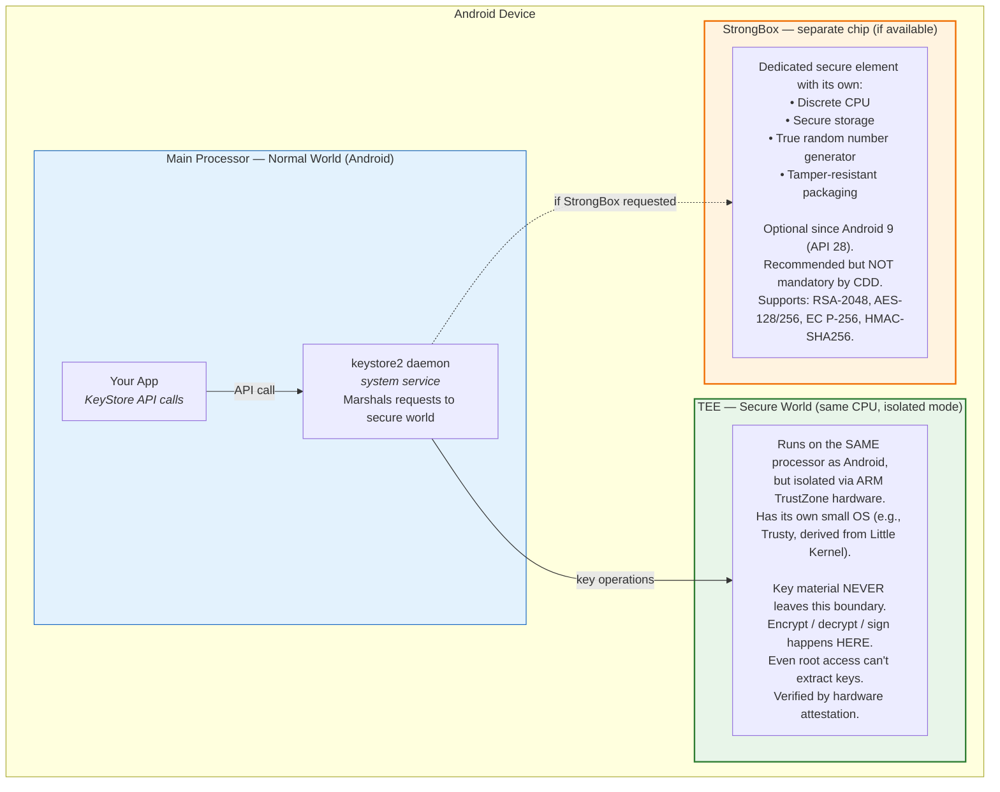
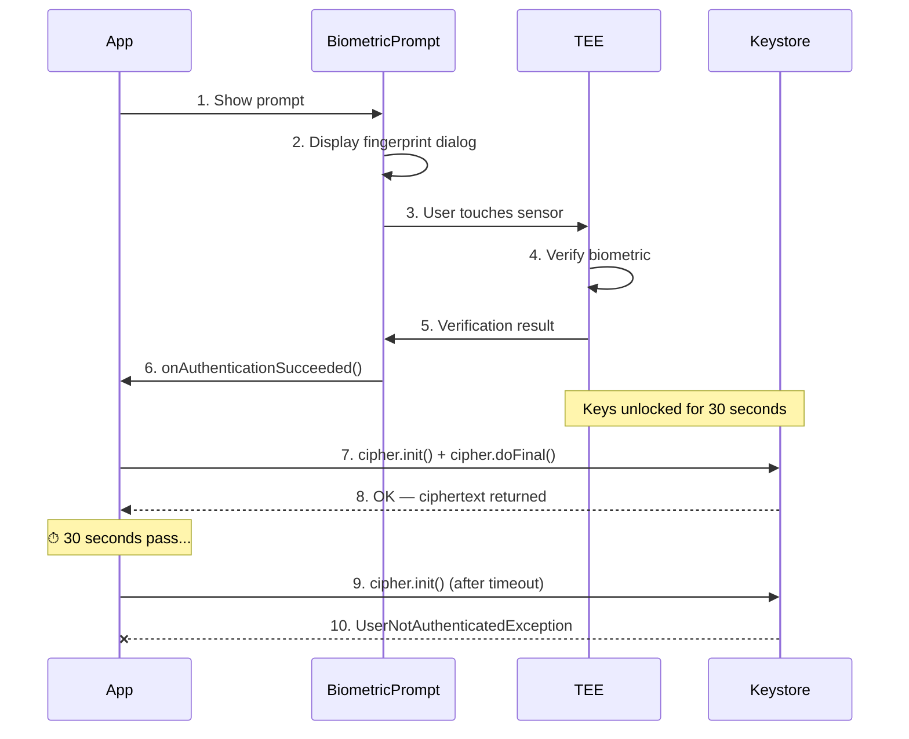
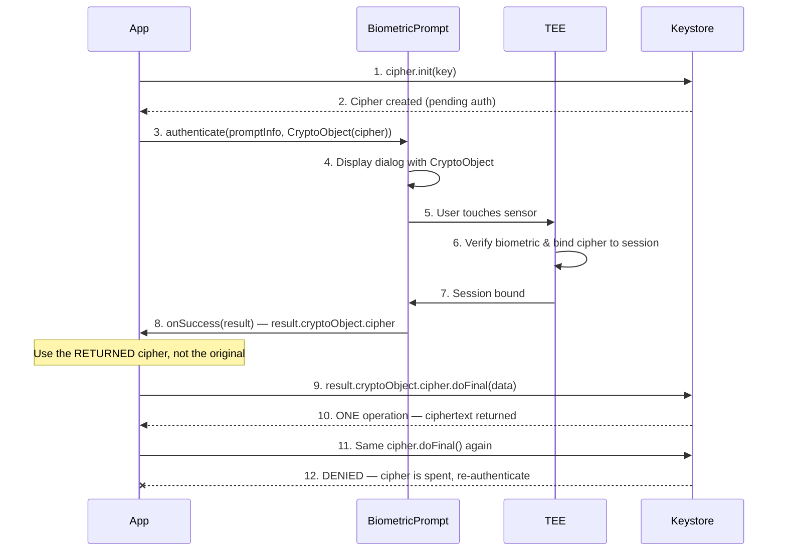
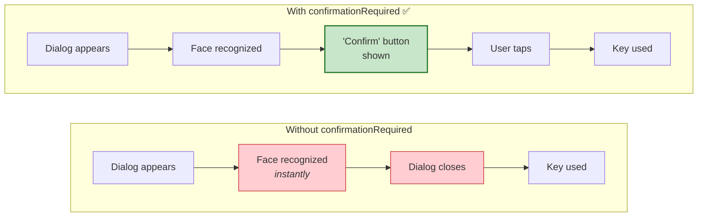
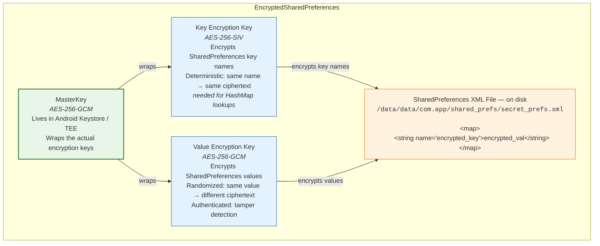
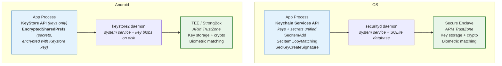

# Android Analogues to iOS Keychain: A Complete Practical Guide

## Introduction

If you're coming from iOS development, you know the Keychain as a unified, hardware-backed vault for both cryptographic keys and arbitrary secrets (passwords, tokens, certificates). Android doesn't have a single equivalent — it splits the responsibility across two complementary systems that together provide comparable security.

This article covers what those systems are, how they work internally, how to protect keys with biometric/PIN authentication, real-world pitfalls we encountered on actual hardware, and includes a working demo app tested on a Moto G86 5G (Android 16).

---

## The Two Pillars

| Responsibility | iOS | Android |
|---|---|---|
| Cryptographic keys | Keychain + Secure Enclave | **Android Keystore System** (TEE / StrongBox) |
| Arbitrary secrets | Keychain | **EncryptedSharedPreferences** (Jetpack Security) |

iOS Keychain is one API that handles both. Android requires two, but the underlying security model is comparable on modern hardware.

---

## Pillar 1: Android Keystore System

### What It Is

The Android Keystore System is a system-level service that stores cryptographic keys in a secure container. On modern devices, keys are bound to the **Trusted Execution Environment (TEE)** or **StrongBox** (a dedicated secure element) — the key material never exists in normal memory accessible to Android.

This is the direct analogue to storing keys in the **iOS Secure Enclave** via the Keychain.

### Hardware Security Architecture



> "The Trusty OS runs on the **same processor** as the Android OS, but Trusty is isolated from the rest of the system by both hardware and software."
> — [Trusty TEE, source.android.com](https://source.android.com/docs/security/features/trusty)

**Key insight**: The TEE is **not a separate chip** — it's a **separate execution mode** of the same CPU, isolated by ARM TrustZone (or Intel VT on x86). The CPU switches between "Normal World" (Android) and "Secure World" (TEE). The hardware physically prevents Normal World from reading Secure World memory. When your app calls `cipher.doFinal()`, the data is marshalled to the TEE, processed there, and only the result comes back. The plaintext key never enters Android's address space.

**StrongBox IS a separate chip** — a dedicated secure element with its own CPU, storage, and tamper resistance. It's optional (recommended by CDD but not mandatory) and available since Android 9 (API 28). StrongBox supports a **limited subset** of algorithms: RSA-2048, AES-128/256, EC P-256, HMAC-SHA256. It is slower than TEE but more resistant to side-channel attacks.

### Supported Key Types

| Algorithm | Purposes | Typical Use Case | TEE Key Size | StrongBox Key Size |
|---|---|---|---|---|
| **AES** | Encrypt / Decrypt | Encrypting local data, files | 128 or 256 bits | 128 or 256 bits |
| **RSA** | Encrypt / Decrypt / Sign / Verify | Asymmetric crypto, server communication | 2048 or 4096 bits | **2048 only** |
| **EC (ECDSA)** | Sign / Verify | Digital signatures, authentication | 224, 256, 384, 521 bits | **P-256 only** |
| **HMAC-SHA256** | Sign / Verify (MAC) | Message authentication codes | 8-64 bytes | 8-64 bytes |
| **3DES** | Encrypt / Decrypt (legacy) | Legacy compatibility | 168 bits | 168 bits |

### Android Version Support & Feature History

Hardware-backed Keystore evolved over multiple Android releases:

| Android Version | API | Keystore Feature | Significance |
|---|---|---|---|
| **4.3** (2013) | 18 | Keystore API introduced | Software-backed only |
| **6.0** (2015) | 23 | Keymaster 1.0 — AES, HMAC, access control | First hardware-backed symmetric keys |
| **7.0** (2016) | 24 | Keymaster 2.0 — key attestation | Server can verify key is in real hardware |
| **8.0** (2017) | 26 | Keymaster 3.0 — ID attestation, mandatory attestation | Attestation required on all new devices |
| **9.0** (2018) | 28 | **StrongBox**, `BiometricPrompt`, `setUserAuthenticationParameters` | Dedicated secure element support |
| **10.0** (2019) | 29 | `getSecurityLevel()`, `setUnlockedDeviceRequired` | Can verify TEE vs StrongBox at runtime |
| **12.0** (2021) | 31 | KeyMint 1.0 (replaces Keymaster HAL) | Updated hardware interface |

**Minimum for the features discussed in this article:** API 28 (Android 9.0) for full `BiometricPrompt` + `setUserAuthenticationParameters` + StrongBox support. API 23 (Android 6.0) for basic hardware-backed Keystore.

### Android Version Distribution (May 2026)

| Version | API | Market Share | Supports Hardware-Backed Keystore? |
|---|---|---|---|
| Android 16 | 36 | ~20% | Yes (full) |
| Android 15 | 35 | ~19% | Yes (full) |
| Android 14 | 34 | ~17% | Yes (full) |
| Android 13 | 33 | ~14% | Yes (full) |
| Android 12 | 31-32 | ~10% | Yes (full) |
| Android 11 | 30 | ~14% | Yes (full) |
| Android 10 | 29 | ~8% | Yes (full) |
| Android 9 | 28 | ~5% | Yes (BiometricPrompt, StrongBox) |
| Android 8.x and below | ≤27 | ~3% | Partial (no BiometricPrompt) |

**~97% of active Android devices support full hardware-backed Keystore with BiometricPrompt.** Targeting API 28+ (Android 9) covers ~95% of devices and gives access to all features.

Sources: [AppBrain Android SDK versions](https://www.appbrain.com/stats/top-android-sdk-versions), [StatCounter Android version share](https://gs.statcounter.com/android-version-market-share)

### Huawei / HarmonyOS Compatibility

Huawei devices fall into two categories:

**Older Huawei phones with EMUI (Android-based):** These run standard Android with Google Mobile Services (GMS) or Huawei Mobile Services (HMS). They use **ARM TrustZone** with Huawei's own TEE implementation called **iTrustee/TrustedCore**. The standard Android Keystore API works on these devices. A [USENIX security review of Huawei's TrustedCore](https://www.usenix.org/conference/woot20/presentation/busch) found it comparable to other TEE implementations.

**Newer Huawei devices with HarmonyOS (post-2021):** These do NOT run Android. HarmonyOS has its own equivalent called **Universal Keystore Kit**, which provides hardware-backed key storage using iTrustee (TrustZone-based). The API is different from Android Keystore — your Android app **will not run natively** on pure HarmonyOS devices. However, HarmonyOS NEXT can run some Android APKs via compatibility layers, and the underlying hardware security (Kirin chip + TrustZone) is comparable.

| Huawei Device Type | OS | Keystore API | TEE | Runs Android APKs? |
|---|---|---|---|---|
| Pre-2021 (P30, Mate 20, etc.) | EMUI (Android) | Android Keystore | iTrustee (TrustZone) | Yes (native) |
| 2021-2023 (P50, Mate 50) | HarmonyOS 2/3 (Android-compatible) | Android Keystore | iTrustee (TrustZone) | Yes (native) |
| 2024+ (Mate 60, Pura 70) | HarmonyOS NEXT (no Android) | Universal Keystore Kit | iTrustee (TrustZone) | Limited compatibility |

**For your 2FA authenticator:** If you target only Android (Google Play), Huawei EMUI and HarmonyOS 2/3 devices work with standard Android Keystore. Pure HarmonyOS NEXT devices require a separate HarmonyOS app using Universal Keystore Kit.

### Key Properties

- **Non-exportable**: Keys cannot be extracted from the Keystore. You perform operations *through* the Keystore API — the key never leaves the secure hardware.
- **Hardware-backed**: On devices with TEE or StrongBox, the key material lives in secure hardware. Operations (encrypt, sign) execute inside the secure processor. You can verify this at runtime via `KeyInfo.getSecurityLevel()`.
- **Auth-bound**: Keys can require user authentication (biometric or device credential) before each use.
- **Time-bound**: Auth validity can be scoped to a duration (e.g., "user authenticated within last 30 seconds").
- **Invalidation-safe**: Keys bound to biometrics are permanently invalidated if biometric enrollment changes (fingerprint added/removed). This prevents an attacker who gains physical access from enrolling their own biometric.

### Code: Generating Keys

```kotlin
// AES-256-GCM key in Android Keystore
val keyGen = KeyGenerator.getInstance(
    KeyProperties.KEY_ALGORITHM_AES,
    "AndroidKeyStore"
)
keyGen.init(
    KeyGenParameterSpec.Builder(
        "my_aes_key",
        KeyProperties.PURPOSE_ENCRYPT or KeyProperties.PURPOSE_DECRYPT
    )
    .setBlockModes(KeyProperties.BLOCK_MODE_GCM)
    .setEncryptionPaddings(KeyProperties.ENCRYPTION_PADDING_NONE)
    .setKeySize(256)
    .build()
)
val secretKey = keyGen.generateKey()
```

```kotlin
// RSA-2048 key pair — private key stays in Keystore
val keyPairGen = KeyPairGenerator.getInstance(
    KeyProperties.KEY_ALGORITHM_RSA,
    "AndroidKeyStore"
)
keyPairGen.initialize(
    KeyGenParameterSpec.Builder(
        "my_rsa_key",
        KeyProperties.PURPOSE_SIGN or KeyProperties.PURPOSE_VERIFY
    )
    .setDigests(KeyProperties.DIGEST_SHA256)
    .setSignaturePaddings(KeyProperties.SIGNATURE_PADDING_RSA_PKCS1)
    .setKeySize(2048)
    .build()
)
val keyPair = keyPairGen.generateKeyPair()
```

```kotlin
// EC P-256 key pair — compact signatures, ideal for mobile
val ecGen = KeyPairGenerator.getInstance(
    KeyProperties.KEY_ALGORITHM_EC,
    "AndroidKeyStore"
)
ecGen.initialize(
    KeyGenParameterSpec.Builder(
        "my_ec_key",
        KeyProperties.PURPOSE_SIGN or KeyProperties.PURPOSE_VERIFY
    )
    .setDigests(KeyProperties.DIGEST_SHA256)
    .setKeySize(256)
    .build()
)
val ecKeyPair = ecGen.generateKeyPair()
```

### Code: Using Keys

```kotlin
// Encrypt with AES-GCM (key never leaves Keystore)
val keyStore = KeyStore.getInstance("AndroidKeyStore").apply { load(null) }
val key = keyStore.getKey("my_aes_key", null) as SecretKey

val cipher = Cipher.getInstance("AES/GCM/NoPadding")
cipher.init(Cipher.ENCRYPT_MODE, key)
val iv = cipher.iv  // save this alongside ciphertext
val ciphertext = cipher.doFinal(plaintext.toByteArray())

// Decrypt — must use the same IV
cipher.init(Cipher.DECRYPT_MODE, key, GCMParameterSpec(128, iv))
val decrypted = cipher.doFinal(ciphertext)
```

```kotlin
// Sign with RSA — private key used inside TEE
val privateKey = keyStore.getKey("my_rsa_key", null) as PrivateKey
val signature = Signature.getInstance("SHA256withRSA")
signature.initSign(privateKey)
signature.update(data.toByteArray())
val sig = signature.sign()

// Verify — public key can be exported and used anywhere
val publicKey = keyStore.getCertificate("my_rsa_key").publicKey
signature.initVerify(publicKey)
signature.update(data.toByteArray())
val isValid = signature.verify(sig) // true if data hasn't been tampered
```

```kotlin
// Sign with ECDSA — smaller signatures, faster than RSA
val ecPrivate = keyStore.getKey("my_ec_key", null) as PrivateKey
val ecSig = Signature.getInstance("SHA256withECDSA")
ecSig.initSign(ecPrivate)
ecSig.update(data.toByteArray())
val ecSignature = ecSig.sign() // ~70 bytes vs ~256 for RSA
```

---

## Key Protection: Biometric, PIN, and Authentication Controls

This is the most important section for security-sensitive apps. Android Keystore keys can be **protected** so they're unusable until the user authenticates. The key material exists in hardware, but the TEE refuses to perform operations until it receives proof of user identity.

This is the Android equivalent of iOS Keychain access controls (`kSecAccessControl*`).

### Protection Modes Overview

| Mode | Android API | iOS Equivalent | Behavior |
|---|---|---|---|
| **No Auth** | (default) | `kSecAttrAccessibleAfterFirstUnlock` | Key usable anytime, no prompt |
| **Biometric Only** | `AUTH_BIOMETRIC_STRONG`, timeout=30s | `kSecAccessControlBiometryAny` | Requires fingerprint/face, valid for 30s after auth |
| **Device Credential** | `AUTH_DEVICE_CREDENTIAL`, timeout=30s | `kSecAccessControlDevicePasscode` | Requires PIN/pattern/password, valid for 30s |
| **Biometric OR Credential** | `AUTH_BIOMETRIC_STRONG \| AUTH_DEVICE_CREDENTIAL` | `kSecAccessControlUserPresence` | User chooses either method |
| **Per-Use Biometric** | `AUTH_BIOMETRIC_STRONG`, timeout=**0** | `kSecAccessControlBiometryCurrentSet` | Fresh biometric for EVERY single crypto operation |
| **Unlocked Device** | `setUnlockedDeviceRequired(true)` | `kSecAttrAccessibleWhenUnlocked` | Key usable only while device is unlocked, no prompt |

### Detailed Mode Descriptions

#### 1. No Authentication (Default)

```kotlin
KeyGenParameterSpec.Builder("unprotected_key", PURPOSE_ENCRYPT or PURPOSE_DECRYPT)
    .setBlockModes(BLOCK_MODE_GCM)
    .setEncryptionPaddings(ENCRYPTION_PADDING_NONE)
    .setKeySize(256)
    .build()
```

The key is usable immediately after generation. No user interaction required. Still hardware-backed (the key never leaves the TEE), but any code running in the app can use it.

**Use case**: Encrypting data that should be accessible whenever the app is open. Background sync encryption. Data-at-rest protection against filesystem access.

#### 2. Biometric Only

```kotlin
KeyGenParameterSpec.Builder("bio_key", PURPOSE_ENCRYPT or PURPOSE_DECRYPT)
    .setBlockModes(BLOCK_MODE_GCM)
    .setEncryptionPaddings(ENCRYPTION_PADDING_NONE)
    .setKeySize(256)
    .setUserAuthenticationRequired(true)
    .setUserAuthenticationParameters(30, KeyProperties.AUTH_BIOMETRIC_STRONG)
    .build()
```

After authentication, the key is usable for **30 seconds**. The timeout is configurable.

**`AUTH_BIOMETRIC_STRONG` vs `AUTH_BIOMETRIC_WEAK`**: Android classifies biometric sensors into strength tiers:
- **Class 3 (Strong)**: Fingerprint sensors on most modern phones, some face recognition systems. Required for `AUTH_BIOMETRIC_STRONG`.
- **Class 2 (Weak)**: Lower-security face recognition. Not accepted by `AUTH_BIOMETRIC_STRONG`.

You can check what's available at runtime:

```kotlin
val bioManager = BiometricManager.from(context)
val strongResult = bioManager.canAuthenticate(Authenticators.BIOMETRIC_STRONG)
// Returns: BIOMETRIC_SUCCESS, BIOMETRIC_ERROR_NO_HARDWARE,
//          BIOMETRIC_ERROR_NONE_ENROLLED, etc.
```

**Important**: If you generate a key with `AUTH_BIOMETRIC_STRONG` but the device only has weak biometrics, the key becomes **permanently unusable** — you can generate it, but never authenticate to use it. Always check `canAuthenticate()` first.

**Use case**: Protecting sensitive operations like viewing saved passwords, authorizing payments, accessing health data.

#### 3. Device Credential (PIN / Pattern / Password)

```kotlin
KeyGenParameterSpec.Builder("pin_key", PURPOSE_ENCRYPT or PURPOSE_DECRYPT)
    .setBlockModes(BLOCK_MODE_GCM)
    .setEncryptionPaddings(ENCRYPTION_PADDING_NONE)
    .setKeySize(256)
    .setUserAuthenticationRequired(true)
    .setUserAuthenticationParameters(30, KeyProperties.AUTH_DEVICE_CREDENTIAL)
    .build()
```

Works on all devices that have a screen lock set. No biometric hardware required. The system shows its standard lock screen (PIN pad, pattern grid, or password field).

**Use case**: Apps that need to work on all devices, including those without biometric sensors. Lower-friction than biometric for some users.

#### 4. Biometric OR Credential (Most Flexible)

```kotlin
KeyGenParameterSpec.Builder("flex_key", PURPOSE_ENCRYPT or PURPOSE_DECRYPT)
    .setBlockModes(BLOCK_MODE_GCM)
    .setEncryptionPaddings(ENCRYPTION_PADDING_NONE)
    .setKeySize(256)
    .setUserAuthenticationRequired(true)
    .setUserAuthenticationParameters(
        30,
        KeyProperties.AUTH_BIOMETRIC_STRONG or KeyProperties.AUTH_DEVICE_CREDENTIAL
    )
    .build()
```

The BiometricPrompt shows biometric first, with a "Use PIN" fallback button. This is the **recommended mode for most apps** — it works on all devices with a screen lock and gives users maximum flexibility.

**iOS equivalent**: `kSecAccessControlUserPresence` — the most commonly used iOS Keychain access control.

**Use case**: General-purpose authentication for any sensitive operation. This is what most banking and finance apps use.

#### 5. Per-Use Biometric (Strongest Protection — Crypto-Bound)

```kotlin
KeyGenParameterSpec.Builder("strict_key", PURPOSE_ENCRYPT or PURPOSE_DECRYPT)
    .setBlockModes(BLOCK_MODE_GCM)
    .setEncryptionPaddings(ENCRYPTION_PADDING_NONE)
    .setKeySize(256)
    .setUserAuthenticationRequired(true)
    .setUserAuthenticationParameters(0, KeyProperties.AUTH_BIOMETRIC_STRONG) // 0 = per-use
    .build()
```

The `timeout = 0` is the key difference. This mode is fundamentally different from the others:

- With timeout > 0: User authenticates once, then any code can use the key for N seconds.
- With timeout = 0: The `Cipher` object must be passed into `BiometricPrompt.CryptoObject`. The TEE binds the authenticated session to that **specific Cipher instance**. Only that exact Cipher can perform one operation. Next operation needs a new authentication.

This is the strongest protection: even if malware gains code execution inside your app, it cannot use the key without the user physically placing their finger on the sensor for that specific operation.

**Use case**: High-value transactions, wire transfers, signing legal documents, anything where you need proof that the user was physically present for each individual operation.

#### 6. Unlocked Device Required

```kotlin
KeyGenParameterSpec.Builder("unlock_key", PURPOSE_ENCRYPT or PURPOSE_DECRYPT)
    .setBlockModes(BLOCK_MODE_GCM)
    .setEncryptionPaddings(ENCRYPTION_PADDING_NONE)
    .setKeySize(256)
    .setUnlockedDeviceRequired(true)
    .build()
```

No prompt is shown. The key is simply usable when the device is unlocked and unusable when locked. The system tracks unlock state internally.

**Use case**: Background services that should only process sensitive data while the user is actively using the device. Prevents data processing on a stolen locked phone.

### How Authentication Actually Works

There are two fundamentally different flows:

#### Flow 1: Time-Based Authentication (timeout > 0)



**Code**:

```kotlin
val executor = ContextCompat.getMainExecutor(context)

val callback = object : BiometricPrompt.AuthenticationCallback() {
    override fun onAuthenticationSucceeded(result: BiometricPrompt.AuthenticationResult) {
        // Key is now usable for 30 seconds
        val cipher = Cipher.getInstance("AES/GCM/NoPadding")
        cipher.init(Cipher.ENCRYPT_MODE, key)  // succeeds!
        val ciphertext = cipher.doFinal(data)
    }

    override fun onAuthenticationError(errorCode: Int, errString: CharSequence) {
        // User cancelled, too many attempts, or hardware error
        when (errorCode) {
            BiometricPrompt.ERROR_USER_CANCELED -> { /* user tapped "Cancel" */ }
            BiometricPrompt.ERROR_LOCKOUT -> { /* too many failed attempts, wait 30s */ }
            BiometricPrompt.ERROR_LOCKOUT_PERMANENT -> { /* must use device credential */ }
        }
    }

    override fun onAuthenticationFailed() {
        // Biometric recognized but didn't match — user can try again
        // (the dialog stays open)
    }
}

val biometricPrompt = BiometricPrompt(activity, executor, callback)

val promptInfo = BiometricPrompt.PromptInfo.Builder()
    .setTitle("Authenticate")
    .setSubtitle("Verify your identity to access sensitive data")
    .setConfirmationRequired(true)  // Important! See "Face Recognition Gotcha" below
    .setAllowedAuthenticators(BIOMETRIC_STRONG or DEVICE_CREDENTIAL)
    .build()

biometricPrompt.authenticate(promptInfo)
```

#### Flow 2: Per-Use / Crypto-Bound Authentication (timeout = 0)



**Code**:

```kotlin
// Step 1: Initialize cipher (may throw UserNotAuthenticatedException on some devices)
val cipher = Cipher.getInstance("AES/GCM/NoPadding")
cipher.init(Cipher.ENCRYPT_MODE, perUseKey)

// Step 2: Wrap in CryptoObject and authenticate
val promptInfo = BiometricPrompt.PromptInfo.Builder()
    .setTitle("Per-Use Authentication")
    .setSubtitle("Each operation requires a fresh biometric")
    .setNegativeButtonText("Cancel")
    .setConfirmationRequired(true)
    .setAllowedAuthenticators(BIOMETRIC_STRONG) // CryptoObject requires STRONG
    .build()

biometricPrompt.authenticate(
    promptInfo,
    BiometricPrompt.CryptoObject(cipher)  // Cipher bound to this auth session
)

// Step 3: In the callback, use the RETURNED cipher (not the original)
override fun onAuthenticationSucceeded(result: AuthenticationResult) {
    val authedCipher = result.cryptoObject!!.cipher!!  // THIS is the authenticated cipher
    val ciphertext = authedCipher.doFinal(sensitiveData)
    // This cipher is now spent — next operation needs new auth
}
```

**Important**: `CryptoObject` only works with `BIOMETRIC_STRONG`. If you try `BIOMETRIC_WEAK` or `DEVICE_CREDENTIAL` with a `CryptoObject`, it will fail.

### What Happens Without Authentication

```kotlin
try {
    val cipher = Cipher.getInstance("AES/GCM/NoPadding")
    cipher.init(Cipher.ENCRYPT_MODE, protectedKey)
    // This line THROWS if the user hasn't authenticated recently
} catch (e: UserNotAuthenticatedException) {
    // Key exists in hardware but is LOCKED
    // The TEE refuses to perform the operation
    // Must authenticate via BiometricPrompt first
} catch (e: KeyPermanentlyInvalidatedException) {
    // Biometric enrollment changed (fingerprint added/removed)
    // Key is PERMANENTLY destroyed — cannot be recovered
    // Must generate a new key and re-encrypt data
}
```

### Exception Reference

| Exception | When | Recovery |
|---|---|---|
| `UserNotAuthenticatedException` | Key requires auth, user hasn't authenticated recently | Show `BiometricPrompt`, then retry |
| `KeyPermanentlyInvalidatedException` | Biometric enrollment changed since key was created | Generate new key, re-encrypt data |
| `IllegalBlockSizeException` | Wrong cipher mode or key type mismatch | Check algorithm/block mode |
| `InvalidKeyException` | Key deleted, corrupted, or wrong purpose | Regenerate key |

### Real-World Gotcha: Face Recognition and `setConfirmationRequired`

**Problem we discovered**: On a Moto G86 5G with face unlock, the `BiometricPrompt` dialog appeared and dismissed in under 3 seconds — the face recognition was so fast that users didn't realize authentication happened. The dialog flashed briefly and auto-closed.

**Solution**: Always set `.setConfirmationRequired(true)` when using `BiometricPrompt`. This adds a "Confirm" button after face recognition succeeds, so the dialog stays visible:

```kotlin
val promptInfo = BiometricPrompt.PromptInfo.Builder()
    .setTitle("Authenticate")
    .setSubtitle("Verify your identity")
    .setConfirmationRequired(true)  // <-- CRITICAL for face unlock
    .setNegativeButtonText("Cancel")
    .setAllowedAuthenticators(BIOMETRIC_STRONG)
    .build()
```



**Note**: `confirmationRequired` has no effect on fingerprint — fingerprint is inherently intentional (user must physically touch sensor). It only matters for passive biometrics like face recognition.

### Checking Device Capabilities

Before generating auth-bound keys, always check what the device supports:

```kotlin
val bioManager = BiometricManager.from(context)

// Check each authenticator type
val strongBio = bioManager.canAuthenticate(Authenticators.BIOMETRIC_STRONG)
val weakBio = bioManager.canAuthenticate(Authenticators.BIOMETRIC_WEAK)
val credential = bioManager.canAuthenticate(Authenticators.DEVICE_CREDENTIAL)
val combined = bioManager.canAuthenticate(
    Authenticators.BIOMETRIC_STRONG or Authenticators.DEVICE_CREDENTIAL
)

// Possible return values:
// BIOMETRIC_SUCCESS                    — ready to use
// BIOMETRIC_ERROR_NO_HARDWARE          — device lacks the sensor
// BIOMETRIC_ERROR_HW_UNAVAILABLE      — sensor exists but is currently unavailable
// BIOMETRIC_ERROR_NONE_ENROLLED        — hardware exists but user hasn't set up biometrics
// BIOMETRIC_ERROR_SECURITY_UPDATE_REQUIRED — security patch needed
```

**Real device output (Moto G86 5G, Android 16)**:

```
BIOMETRIC_STRONG:    SUCCESS      (fingerprint sensor, Class 3)
BIOMETRIC_WEAK:      SUCCESS
DEVICE_CREDENTIAL:   SUCCESS      (PIN/pattern set)
STRONG|CREDENTIAL:   SUCCESS
```

### Biometric Strength Classes

Android classifies biometric sensors by security strength:

| Class | Level | Examples | Can use with `CryptoObject`? | Keystore `AUTH_` constant |
|---|---|---|---|---|
| **Class 3** (Strong) | Highest | Most fingerprint sensors, some face sensors | Yes | `AUTH_BIOMETRIC_STRONG` |
| **Class 2** (Weak) | Medium | Some older face recognition | No | N/A |
| **Class 1** (Convenience) | Low | Deprecated | No | N/A |

The manufacturer declares the strength class. You can query it via `BiometricManager.canAuthenticate(BIOMETRIC_STRONG)`.

**Important for the Keystore**: `KeyProperties.AUTH_BIOMETRIC_STRONG` in `KeyGenParameterSpec` requires that authentication happens via a Class 3 biometric. If the device only has Class 2, the key is generated but can never be authenticated — it's permanently locked. Always check `canAuthenticate()` before generating.

### The BiometricPrompt API in Detail

`BiometricPrompt` is part of AndroidX (`androidx.biometric:biometric`) and requires a `FragmentActivity`:

```kotlin
class MainActivity : FragmentActivity() {  // NOT ComponentActivity
    // ...
}
```

**Three callback methods**:

```kotlin
object : BiometricPrompt.AuthenticationCallback() {

    // Called when biometric matches (fingerprint/face recognized)
    // For CryptoObject flow: result.cryptoObject contains the authenticated cipher
    override fun onAuthenticationSucceeded(result: AuthenticationResult) { }

    // Called on non-recoverable errors
    // errorCode: BiometricPrompt.ERROR_* constants
    // The dialog is dismissed automatically
    override fun onAuthenticationError(errorCode: Int, errString: CharSequence) { }

    // Called when biometric doesn't match (wrong finger, face not recognized)
    // The dialog stays open — user can try again
    // This can be called multiple times before ERROR_LOCKOUT
    override fun onAuthenticationFailed() { }
}
```

**Error codes**:

| Code | Constant | Meaning |
|---|---|---|
| 5 | `ERROR_CANCELED` | Operation cancelled by system |
| 7 | `ERROR_LOCKOUT` | Too many failed attempts, wait 30 seconds |
| 9 | `ERROR_LOCKOUT_PERMANENT` | Too many lockouts, must use device credential |
| 10 | `ERROR_USER_CANCELED` | User tapped "Cancel" or "Use PIN" |
| 11 | `ERROR_NO_BIOMETRICS` | No biometrics enrolled |
| 12 | `ERROR_HW_NOT_PRESENT` | No biometric hardware |
| 13 | `ERROR_NEGATIVE_BUTTON` | User tapped the negative button |

**PromptInfo configuration**:

```kotlin
BiometricPrompt.PromptInfo.Builder()
    .setTitle("Required")              // Title shown in dialog (required)
    .setSubtitle("Optional")           // Subtitle (optional)
    .setDescription("Optional")        // Description text (optional)

    // EITHER set negativeButtonText (for biometric-only)
    .setNegativeButtonText("Cancel")

    // OR allow DEVICE_CREDENTIAL (which adds its own fallback button)
    // You CANNOT set both negativeButtonText and DEVICE_CREDENTIAL
    .setAllowedAuthenticators(BIOMETRIC_STRONG or DEVICE_CREDENTIAL)

    .setConfirmationRequired(true)     // Require tap after passive biometric
    .build()
```

### Inspecting Key Properties at Runtime

You can query any Keystore key's properties, including its authentication requirements:

```kotlin
val keyStore = KeyStore.getInstance("AndroidKeyStore").apply { load(null) }

for (alias in keyStore.aliases()) {
    val entry = keyStore.getEntry(alias, null)

    when (entry) {
        is KeyStore.SecretKeyEntry -> {
            val factory = SecretKeyFactory.getInstance(
                entry.secretKey.algorithm, "AndroidKeyStore"
            )
            val info = factory.getKeySpec(entry.secretKey, KeyInfo::class.java) as KeyInfo

            println("Key: $alias")
            println("  Algorithm: ${entry.secretKey.algorithm}")
            println("  Key size: ${info.keySize} bits")
            println("  Security level: ${info.securityLevel}")
            println("  Hardware-backed: ${
                info.securityLevel == KeyProperties.SECURITY_LEVEL_TRUSTED_ENVIRONMENT ||
                info.securityLevel == KeyProperties.SECURITY_LEVEL_STRONGBOX
            }")
            println("  Auth required: ${info.isUserAuthenticationRequired}")
            println("  Auth timeout: ${info.userAuthenticationValidityDurationSeconds}s")
            println("  Auth type: ${info.userAuthenticationType}")
        }
        is KeyStore.PrivateKeyEntry -> {
            // Same approach, but use KeyFactory instead of SecretKeyFactory
            val factory = KeyFactory.getInstance(
                entry.privateKey.algorithm, "AndroidKeyStore"
            )
            val info = factory.getKeySpec(entry.privateKey, KeyInfo::class.java) as KeyInfo
            // ... same properties
        }
    }
}
```

**`securityLevel` values**:

| Value | Constant | Meaning |
|---|---|---|
| 0 | `SECURITY_LEVEL_SOFTWARE` | Key in software (not hardware-backed) |
| 1 | `SECURITY_LEVEL_TRUSTED_ENVIRONMENT` | Key in TEE (TrustZone) |
| 2 | `SECURITY_LEVEL_STRONGBOX` | Key in StrongBox (dedicated secure element) |
| -1 | `SECURITY_LEVEL_UNKNOWN_SECURE` | Secure but level unknown |

---

## Pillar 2: EncryptedSharedPreferences

### What It Is

For the "store a password/token/API key securely" use case that iOS Keychain covers directly, the idiomatic Android approach is **EncryptedSharedPreferences** from Jetpack Security (`androidx.security:security-crypto`).

It works by creating a **MasterKey** in the Android Keystore, then using that key to encrypt both the keys and values of a SharedPreferences file:

- **Keys** encrypted with **AES-256-SIV** (deterministic encryption — same key name always maps to the same encrypted key, enabling lookups without decrypting all keys)
- **Values** encrypted with **AES-256-GCM** (authenticated encryption with random IV — same value encrypted twice produces different ciphertext)

The encrypted data lives in a regular SharedPreferences XML file on the app's internal storage. The encryption key lives in the Keystore (hardware-backed). Even if someone extracts the XML file (via root, backup, or filesystem exploit), they can't decrypt it without access to the Keystore key.

### How It Works Internally



### Code

```kotlin
// Create or retrieve the master key in Android Keystore
val masterKey = MasterKey.Builder(context)
    .setKeyScheme(MasterKey.KeyScheme.AES256_GCM)
    .build()

// Create encrypted SharedPreferences
val prefs = EncryptedSharedPreferences.create(
    context,
    "secret_prefs",           // file name
    masterKey,
    EncryptedSharedPreferences.PrefKeyEncryptionScheme.AES256_SIV,
    EncryptedSharedPreferences.PrefValueEncryptionScheme.AES256_GCM
)

// Use exactly like regular SharedPreferences
prefs.edit().putString("auth_token", "eyJhbGciOi...").apply()
prefs.edit().putString("api_key", "sk-live-abc123").apply()
prefs.edit().putString("refresh_token", "dGhpcyBpcyBhIHRva2Vu").apply()

// Read back — decryption is transparent
val token = prefs.getString("auth_token", null)

// Delete
prefs.edit().remove("api_key").apply()

// Clear all
prefs.edit().clear().apply()
```

### What Gets Stored on Disk

The actual SharedPreferences XML file looks like this — both keys and values are encrypted:

```xml
<?xml version='1.0' encoding='utf-8' standalone='yes' ?>
<map>
    <string name="__androidx_security_crypto_encrypted_prefs_key_keyset__">
        12a9...long base64...f8e1
    </string>
    <string name="__androidx_security_crypto_encrypted_prefs_value_keyset__">
        12a9...long base64...c3d2
    </string>
    <string name="AYd3k9x...F8mQ==">ATqx9pL...7bKw==</string>
    <string name="BPl2aHf...Nx1A==">ASmK4Re...qR3w==</string>
    <string name="CkM9vbN...Zt5w==">BRpx7Mn...hK2A==</string>
</map>
```

An attacker with file access sees:
- Two keyset entries (encrypted key material, wrapped by the Keystore master key)
- Encrypted key-value pairs (no way to know what `AYd3k9x...` originally was)

Without the Keystore master key (which is hardware-bound and non-exportable), the data is useless.

### EncryptedSharedPreferences vs Regular SharedPreferences

| Aspect | SharedPreferences | EncryptedSharedPreferences |
|---|---|---|
| Key names on disk | Plaintext | AES-256-SIV encrypted |
| Values on disk | Plaintext | AES-256-GCM encrypted |
| Performance | Faster | ~2-5x slower (crypto overhead) |
| Thread safety | Same (`apply()` is async) | Same |
| API | `SharedPreferences` interface | Same interface (drop-in replacement) |
| Backup | Keys visible in backup | Encrypted in backup (useless without device Keystore) |

---

## Full Comparison Table

| Feature | iOS Keychain | Android Keystore | EncryptedSharedPreferences |
|---|---|---|---|
| Store arbitrary strings | Yes | No (keys only) | Yes |
| Store crypto keys | Yes | Yes | No |
| Hardware-backed | Yes (Secure Enclave) | Yes (TEE / StrongBox) | Yes (via Keystore) |
| Biometric-gated access | Yes | Yes | Partial (via MasterKey config) |
| Per-use biometric | Yes (`kSecAccessControlBiometryCurrentSet`) | Yes (timeout=0 + CryptoObject) | No |
| PIN/pattern/password gate | Yes (`kSecAccessControlDevicePasscode`) | Yes (`AUTH_DEVICE_CREDENTIAL`) | No |
| Cross-app sharing | Yes (access groups) | No | No |
| iCloud/cloud sync | Yes (iCloud Keychain) | No | No |
| Key attestation | Yes (App Attest) | Yes (certificate chain) | N/A |
| Minimum API level | N/A | API 23+ (full features API 28+) | API 23+ |
| Data survives app reinstall | Yes (by default) | No | No |

---

## Security Architecture: iOS vs Android Side-by-Side



---

## Other Options Worth Knowing

### AccountManager
The `AccountManager` API stores account credentials tied to a sync account. It's older and more complex — primarily designed for account authenticator plugins (like Google account sync). Not recommended for new code; prefer EncryptedSharedPreferences.

### BiometricPrompt + Keystore
For gating secret access behind fingerprint or face authentication, combine `BiometricPrompt` with auth-bound Keystore keys. This is analogous to iOS Keychain's `kSecAccessControlBiometryAny` access control flag. The demo app's Key Protection screen shows this in action.

### Tink (Google)
[Tink](https://github.com/google/tink) is Google's higher-level cryptography library. It wraps Android Keystore with a simpler API and handles key rotation, versioning, and multi-platform support. Consider it for production apps where you want more crypto abstraction.

### CredentialManager (Android 14+)
The new `CredentialManager` API handles passkeys, passwords, and federated sign-in. It's the modern replacement for `AccountManager` and the Smart Lock API. For authentication flows (not raw secret storage), this is the future direction.

---

## Key Practical Differences from iOS

1. **Unified vs. Split API**: iOS Keychain is one API for everything. Android splits keys (Keystore) from secrets (EncryptedSharedPreferences). Both reach the same hardware.

2. **Cross-App Sharing**: iOS supports sharing secrets between apps via Keychain access groups. Android has no built-in equivalent — apps are sandboxed. You'd need a ContentProvider or shared UID (same signing key) for cross-app secret sharing.

3. **Cloud Sync**: iOS Keychain can sync via iCloud. Android Keystore keys are device-bound by design and cannot be exported or synced. For cross-device secrets, you need a server-side solution.

4. **Key Attestation**: Android supports key attestation — the device can prove to a remote server that a key was generated in genuine hardware (TEE/StrongBox). This is used for strong device integrity verification. iOS has a similar feature via DeviceCheck/App Attest.

5. **Data Persistence**: iOS Keychain data survives app uninstall/reinstall by default. Android Keystore keys are deleted when the app is uninstalled. This catches many iOS developers off-guard.

6. **Biometric Classification**: iOS has a simpler biometric model (Touch ID or Face ID, both high-security). Android has a strength classification system (Class 1/2/3) because the hardware ecosystem is more diverse. You must check capabilities at runtime.

7. **Migration from iOS**: If you're porting an iOS app that uses Keychain for tokens/passwords, use EncryptedSharedPreferences. If it uses Keychain for crypto keys (signing, encryption), use Android Keystore directly. If it uses `kSecAccessControlBiometryAny`, use `AUTH_BIOMETRIC_STRONG` with timeout=30.

---

## Demo App

The companion demo app (included in this project) demonstrates all of the above with interactive screens:

1. **Key Generation** — Create AES-256, RSA-2048, EC P-256, and HMAC-SHA256 keys in the Keystore. Each key is hardware-backed (TEE).

2. **Key Protection** — The centerpiece: demonstrates all 6 authentication modes (No Auth, Biometric Only, Device Credential, Biometric OR Credential, Per-Use Biometric, Unlocked Device). For each mode you can:
   - **Generate** a protected key
   - **Use (no auth)** to see the `UserNotAuthenticatedException` (key is locked!)
   - **Auth & Use** to trigger BiometricPrompt, authenticate, and then successfully use the key

3. **Encrypt / Decrypt** — AES-GCM symmetric encryption and RSA asymmetric encryption using Keystore keys. Shows the full flow: generate key → encrypt data → decrypt data.

4. **Sign / Verify** — RSA and ECDSA digital signatures. Includes a tamper detection demo that shows verification failing when data is modified.

5. **Secret Storage** — EncryptedSharedPreferences for storing tokens, passwords, and API keys. CRUD operations with a visual list of stored secrets.

6. **Key Attestation** — Generates a P-256 key with `setAttestationChallenge()`, retrieves the Google-signed certificate chain (5 certs on our test device: leaf → TEE batch → Droid CA3 → Droid CA2 → Key Attestation CA1 root), signs data and verifies using the certificate's public key, validates the chain signatures, and shows the attestation extension (OID 1.3.6.1.4.1.11129.2.1.17). Proved on real hardware that attestation is FREE, offline, and requires no Play Integrity API.

7. **Key Inspector** — Lists all Keystore keys with their algorithm, size, hardware-backing status, and authentication requirements (auth mode, timeout, biometric/credential flags).

### Build & Deploy

```bash
# Build
./gradlew assembleDebug

# Install on connected device
adb install -r app/build/outputs/apk/debug/app-debug.apk

# Launch
adb shell am start -n com.example.keystoredemo/.MainActivity
```

Tested on: **Moto G86 5G**, Android 16, API 36. Minimum SDK: Android 8.0 (API 26).

---

## Summary

| If you need to... | On iOS, use... | On Android, use... |
|---|---|---|
| Store a crypto key securely | Keychain + Secure Enclave | `KeyStore` + TEE/StrongBox |
| Store a password or token | Keychain | `EncryptedSharedPreferences` |
| Require biometric before access | `kSecAccessControlBiometryAny` | `setUserAuthenticationRequired(true)` + `BiometricPrompt` |
| Require PIN/password | `kSecAccessControlDevicePasscode` | `AUTH_DEVICE_CREDENTIAL` + `BiometricPrompt` |
| Biometric per-use (strongest) | `kSecAccessControlBiometryCurrentSet` | `timeout=0` + `CryptoObject` |
| Biometric OR PIN (flexible) | `kSecAccessControlUserPresence` | `AUTH_BIOMETRIC_STRONG \| AUTH_DEVICE_CREDENTIAL` |
| Sign data with a private key | `SecKeyCreateSignature` | `KeyStore` + `Signature` |
| Encrypt data for local storage | CommonCrypto + Keychain | `KeyStore` + `Cipher` or `EncryptedSharedPreferences` |
| Check biometric availability | `LAContext.canEvaluatePolicy` | `BiometricManager.canAuthenticate()` |

The security is comparable. The API surface is different. Both platforms protect your users' secrets with dedicated hardware — the key difference is that Android requires you to be explicit about the split between key storage and secret storage, while iOS unifies them.
