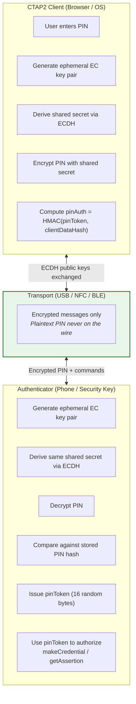
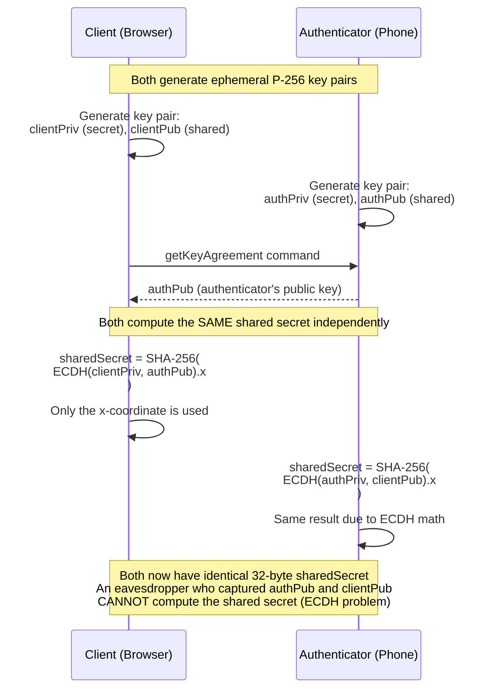
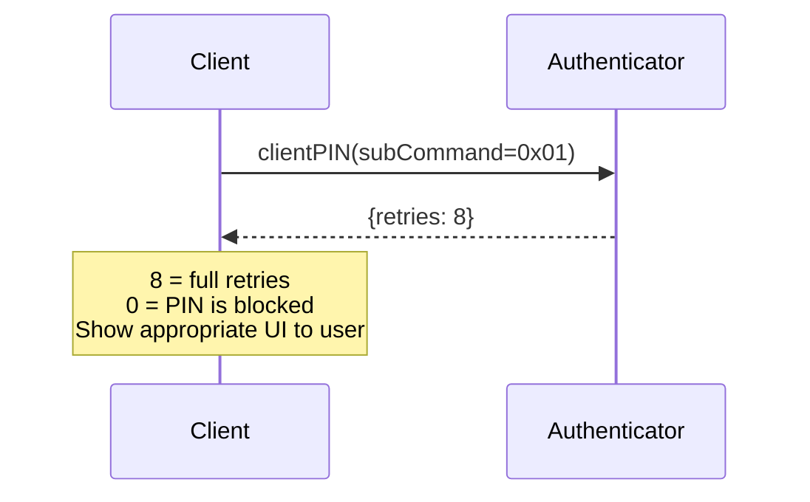
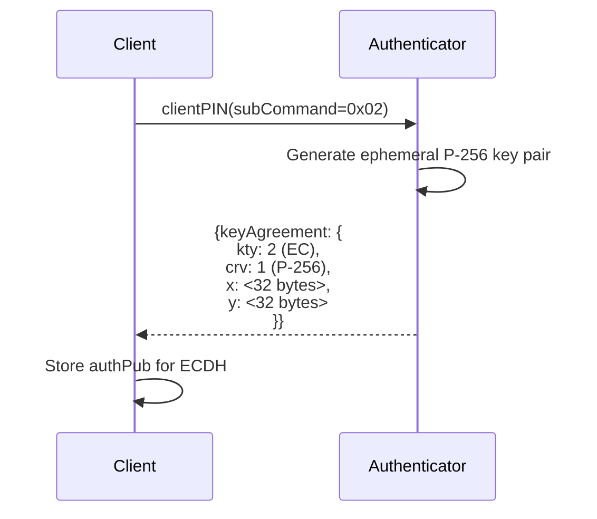
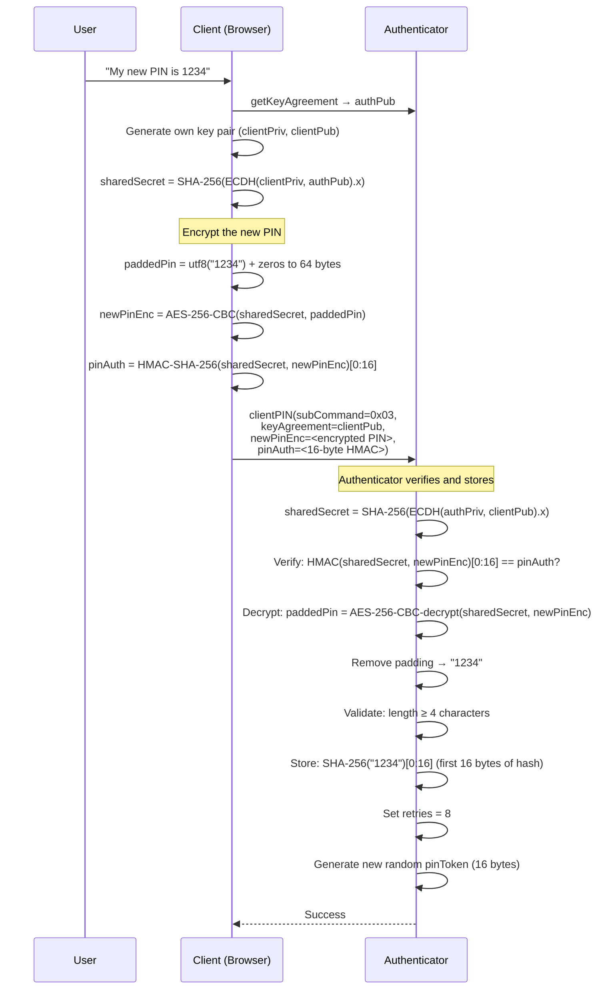
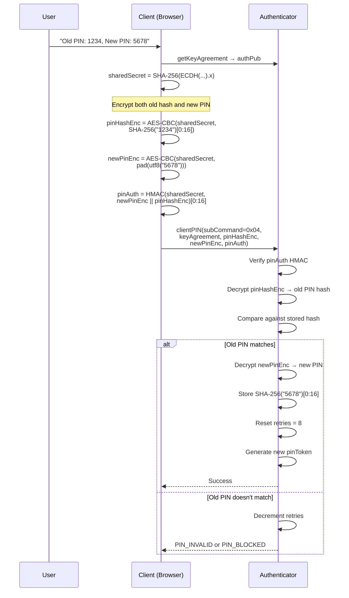
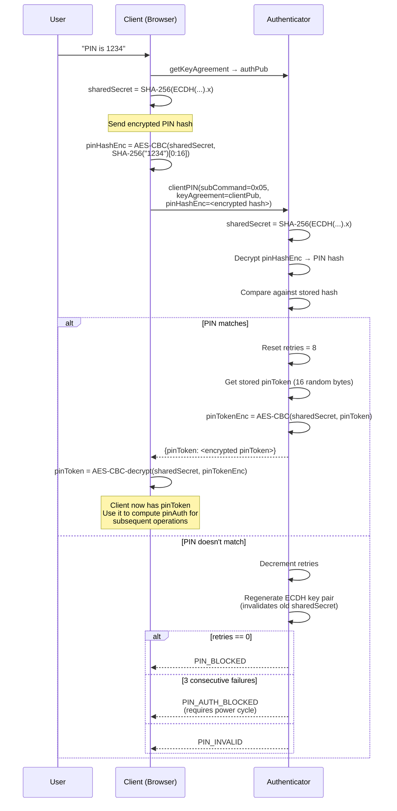
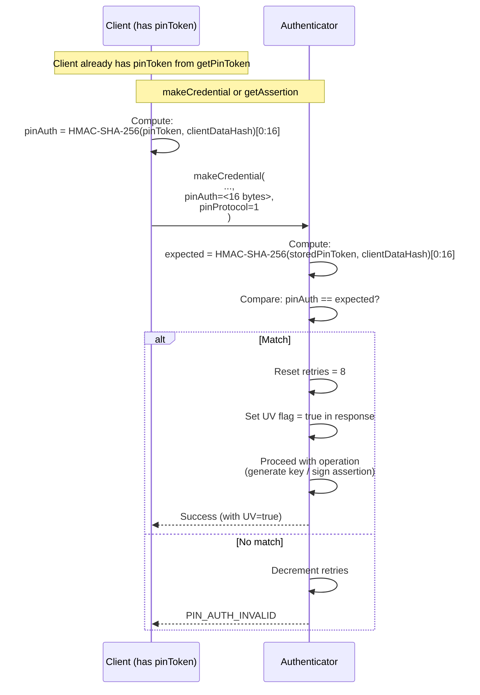
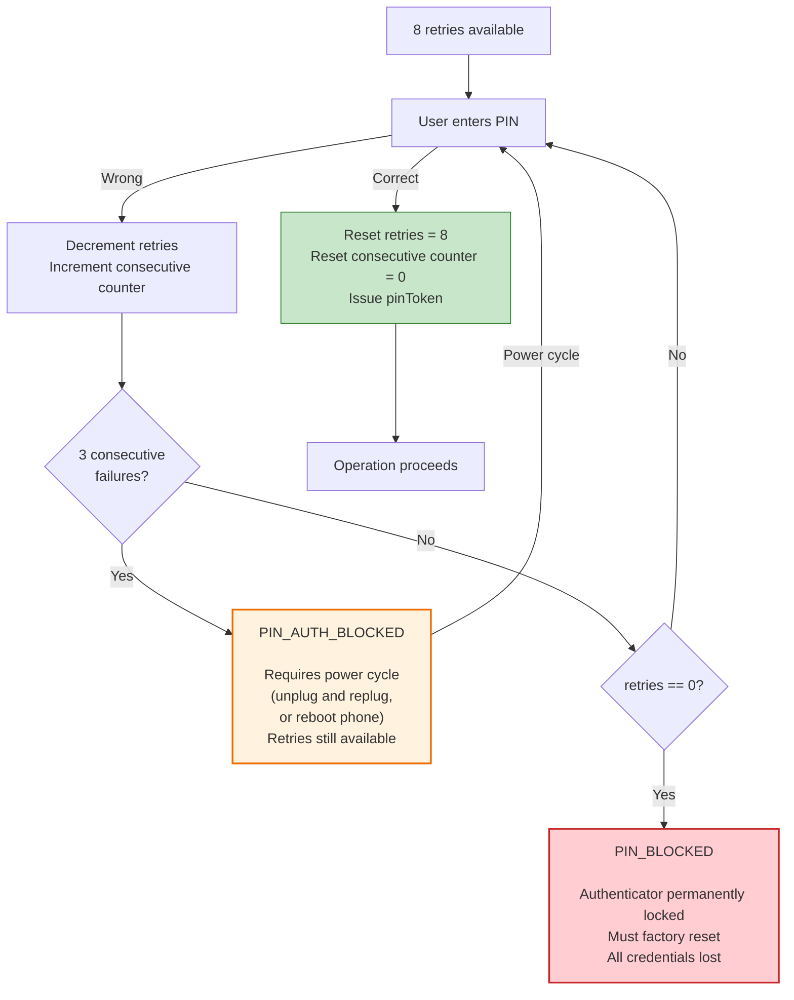
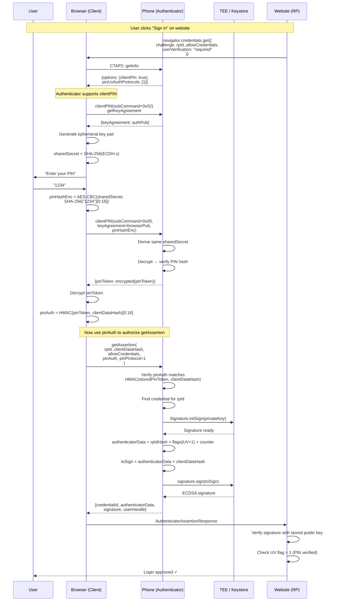

# CTAP2 ClientPIN Protocol: Complete Technical Description

## What Problem Does ClientPIN Solve?

FIDO2 authenticators (YubiKeys, phones) need a way to verify the user's identity. Biometrics (fingerprint, face) is one option, but not all devices have biometric hardware. ClientPIN provides a **software PIN alternative** — the user sets a 4-63 character PIN on the authenticator, and proves knowledge of it before each operation.

The challenge: the PIN must travel from the client (browser/OS) to the authenticator (phone/security key) — but the transport (USB, NFC, BLE) might be sniffable. **ClientPIN solves this with ECDH key agreement** — the PIN is encrypted in transit and never sent in plaintext.

---

## Protocol Architecture

---

## The ECDH Key Agreement

Before any PIN can be sent, the client and authenticator must establish a **shared secret** over the untrusted transport. This uses Elliptic Curve Diffie-Hellman (ECDH):

| Parameter | Value |
|---|---|
| Curve | NIST P-256 (secp256r1) |
| Key type | Ephemeral (new key pair each session) |
| Shared secret derivation | `SHA-256(ECDH(a, bG).x)` — hash of x-coordinate only |
| Shared secret size | 32 bytes |
| Encryption algorithm | AES-256-CBC (PIN protocol v1) |
| HMAC algorithm | HMAC-SHA-256 |

**Why ephemeral keys?** A new key pair is generated for each session. Even if an attacker records all traffic, they can't decrypt past sessions (forward secrecy). If a PIN verification fails, the authenticator generates a **new** key pair, invalidating the old shared secret.

---

## All Subcommands

The clientPIN command (`0x06`) has multiple subcommands:

| Sub-command | Code | Purpose | When used |
|---|---|---|---|
| **getPinRetries** | `0x01` | Get remaining PIN attempts | Before prompting user for PIN |
| **getKeyAgreement** | `0x02` | Get authenticator's ECDH public key | Before any PIN operation |
| **setPIN** | `0x03` | Set PIN for first time | First-time setup |
| **changePIN** | `0x04` | Change existing PIN | User wants new PIN |
| **getPinToken** | `0x05` | Get pinToken after proving PIN knowledge | Before every makeCredential/getAssertion |
| **getPinUvAuthTokenUsingPinWithPermissions** | `0x09` | Get scoped pinToken (CTAP 2.1) | Modern replacement for `0x05` |
| **getUvRetries** | `0x07` | Get remaining UV (biometric) attempts | For built-in biometric |
| **getPinUvAuthTokenUsingUvWithPermissions** | `0x06` | Get token via built-in biometric | Biometric alternative to PIN |

---

## Subcommand Flows in Detail

### getPinRetries (0x01) — Check Before Prompting

No authentication needed. Returns how many attempts remain. Starts at 8, decrements on each failed attempt.

### getKeyAgreement (0x02) — Establish Encrypted Channel

Returns the authenticator's ephemeral public key in COSE format. Client uses this with its own private key to compute the shared secret.

### setPIN (0x03) — First-Time PIN Setup

**What's stored on the authenticator:** NOT the raw PIN. Only the **first 16 bytes of SHA-256(PIN)**. This is enough for verification but can't be reversed to the original PIN.

### changePIN (0x04) — Update Existing PIN

### getPinToken (0x05) — The Critical Subcommand

This is used **before every makeCredential/getAssertion** to prove the user knows the PIN.

---

## How pinToken Gates Signing Operations

After obtaining `pinToken`, the client uses it to authenticate every subsequent `makeCredential` or `getAssertion` request:

**Key insight:** The actual PIN is never sent during `makeCredential`/`getAssertion`. Only the `pinAuth` (an HMAC) is sent. The authenticator verifies it using the stored `pinToken` — proving the client previously proved PIN knowledge via `getPinToken`.

---

## Retry and Lockout Mechanism

| Event | Effect |
|---|---|
| Correct PIN | Retries reset to 8, consecutive counter reset to 0 |
| Wrong PIN | Retries decremented, consecutive counter incremented |
| 3 consecutive wrong | `PIN_AUTH_BLOCKED` — requires power cycle, retries preserved |
| 0 retries remaining | `PIN_BLOCKED` — authenticator permanently locked, factory reset needed |
| ECDH key pair | Regenerated after every failed attempt (prevents replay of old shared secret) |

---

## PIN Protocol Versions

### Protocol v1 (CTAP 2.0)

| Operation | Algorithm |
|---|---|
| Shared secret | `SHA-256(ECDH(a, bG).x)` |
| PIN encryption | `AES-256-CBC(sharedSecret, paddedPIN)` — IV = 0 (all zeros) |
| pinAuth | `HMAC-SHA-256(pinToken, clientDataHash)[0:16]` — first 16 bytes |
| PIN hash storage | `SHA-256(PIN)[0:16]` — first 16 bytes |

**Weakness of v1:** AES-CBC with zero IV means identical PINs encrypted with the same shared secret produce identical ciphertext. The shared secret changes per session, so this is mostly theoretical.

### Protocol v2 (CTAP 2.1)

| Operation | Algorithm |
|---|---|
| Shared secret | `HKDF-SHA-256(ECDH(a, bG).x)` — proper key derivation |
| PIN encryption | `AES-256-CBC(key, paddedPIN)` — random IV prepended |
| pinAuth | `HMAC-SHA-256(pinToken, message)[0:32]` — full 32 bytes |
| Permissions | Scoped to specific operations (`mc`, `ga`, `cm`, etc.) |
| RP binding | pinToken can be bound to specific RP ID |

**v2 improvements:**
- Proper HKDF instead of raw SHA-256 for key derivation
- Random IV for AES-CBC (not all zeros)
- Full 32-byte HMAC (not truncated to 16)
- Permission scoping: pinToken can be limited to specific operations
- RP ID binding: pinToken only valid for a specific relying party

---

## Complete Flow: Login Using ClientPIN

---

## Security Properties

### What ClientPIN Protects Against

| Threat | Protected? | How |
|---|---|---|
| PIN sniffing on transport (USB/NFC/BLE) | **Yes** | ECDH encryption — PIN never in plaintext |
| Replay of old PIN exchange | **Yes** | Ephemeral ECDH keys — new shared secret each session |
| Brute force (remote) | **Yes** | 8 attempts max, then permanently blocked |
| Brute force (offline, extracted hash) | **Partially** | SHA-256 is fast to brute-force, but hash is inside TEE |
| Stolen pinToken | **Mitigated** | pinToken refreshed on each PIN set/change, scoped to RP in v2 |
| Malware on client | **No** | If malware captures PIN keystrokes, it has everything |

### What ClientPIN Does NOT Protect Against

- **Keylogging on the client side:** If malware captures the PIN as the user types it, the malware can replay the entire flow
- **TEE compromise:** If the authenticator's TEE is exploited, the stored PIN hash and pinToken can be extracted
- **Social engineering:** User can be tricked into entering PIN on a phishing client

### ClientPIN vs Biometric vs Device Credential

| Aspect | ClientPIN | Biometric (CryptoObject) | Device Credential |
|---|---|---|---|
| Verified by | Authenticator's app code | TEE hardware | TEE Gatekeeper |
| Frida can bypass | **Yes** (hook `isPinMatch`) | **No** (TEE-bound) | **No** (TEE-bound) |
| Root can bypass | **Yes** (extract pinToken) | **No** (HMAC in TEE) | **No** (HMAC in TEE) |
| Brute force protection | Software counter (8 attempts) | **Hardware** rate limiting | **Hardware** rate limiting |
| Works without biometric hardware | **Yes** | No | **Yes** |
| FIDO2 spec compliance | **Yes** (CTAP2) | Not part of CTAP2 | Not part of CTAP2 |

---

## Sources

- [CTAP 2.1 Specification — FIDO Alliance](https://fidoalliance.org/specs/fido-v2.1-ps-20210615/fido-client-to-authenticator-protocol-v2.1-ps-20210615.html)
- [CTAP 2.0 Specification — FIDO Alliance](https://fidoalliance.org/specs/fido-v2.0-rd-20180702/fido-client-to-authenticator-protocol-v2.0-rd-20180702.html)
- [CTAP2.1 Migration Guide — PIN Protocol v2](https://github.com/WebauthnWorks/CTAP2.1-Migration-Guide/blob/main/Protocol/PinUvAuthnProtocol2.md)
- [Provable Security Analysis of FIDO2 — Barbosa et al. 2020](https://eprint.iacr.org/2020/756.pdf)
- [FIDO2, CTAP 2.1, and WebAuthn 2 — Bindel et al. 2022](https://eprint.iacr.org/2022/1029.pdf)
- [python-fido2 CTAP2 PIN documentation — Yubico](https://developers.yubico.com/python-fido2/API_Documentation/autoapi/fido2/ctap2/pin/index.html)
- [WIOsense/rauth-android — GitHub (implementation reference)](https://github.com/WIOsense/rauth-android)
