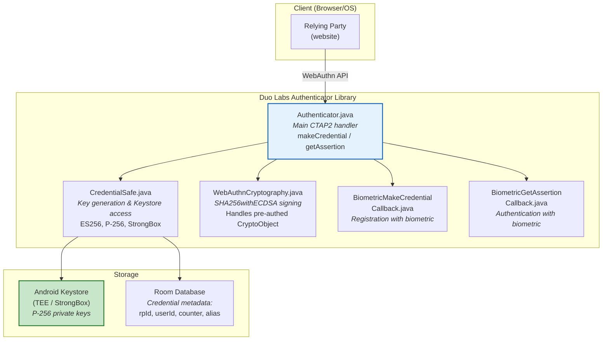
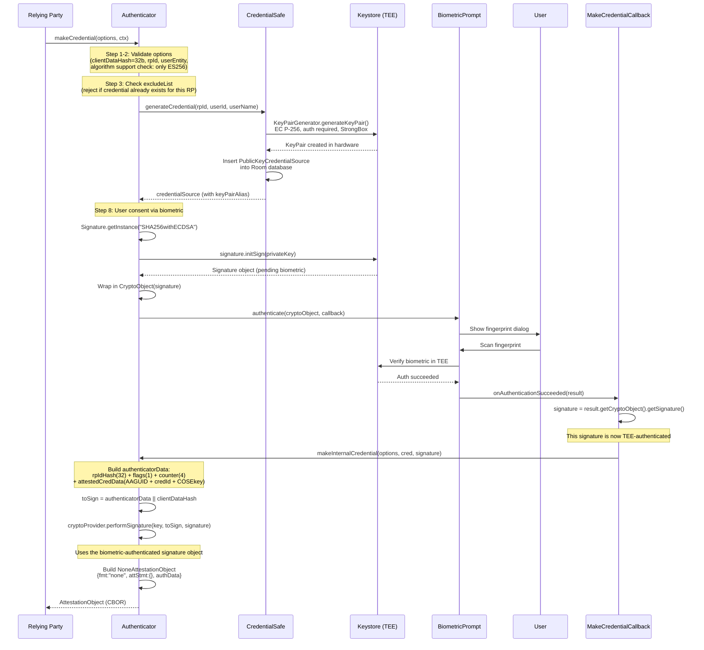
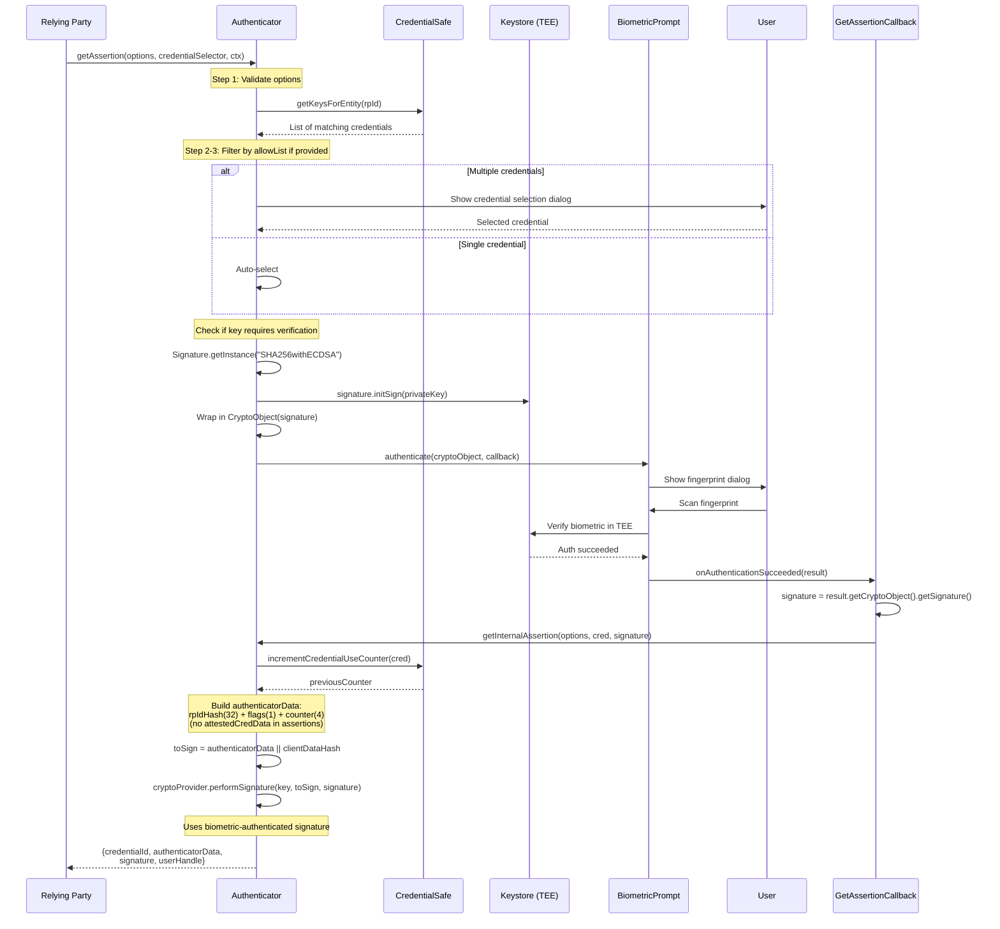
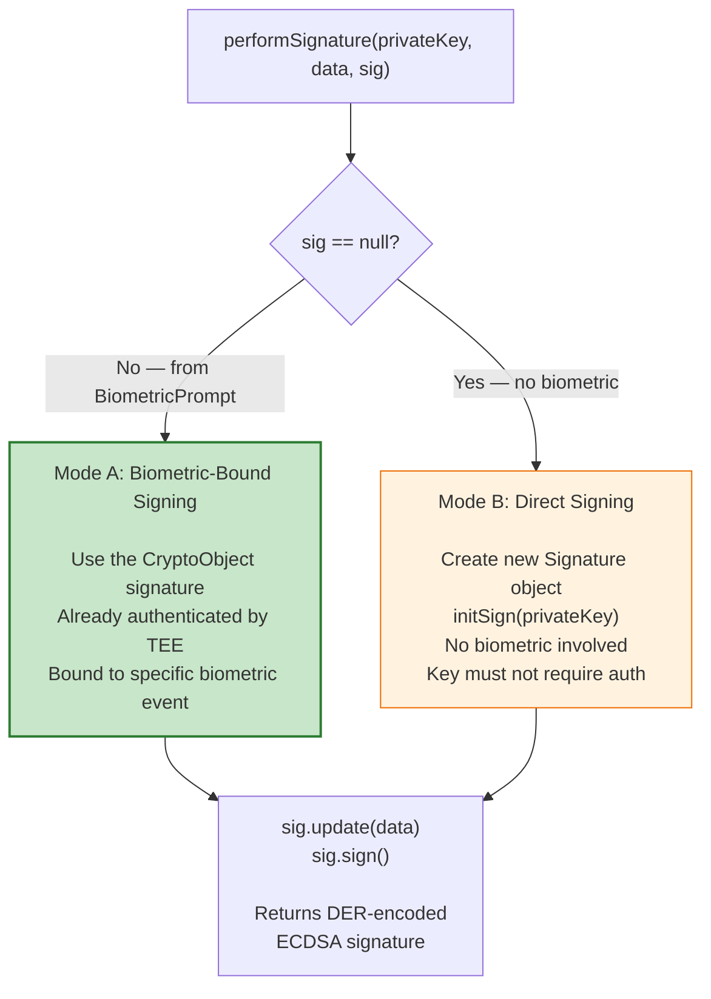
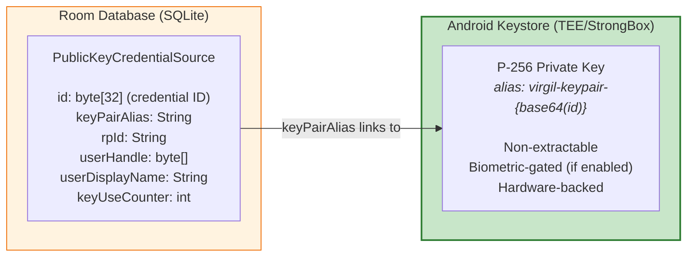
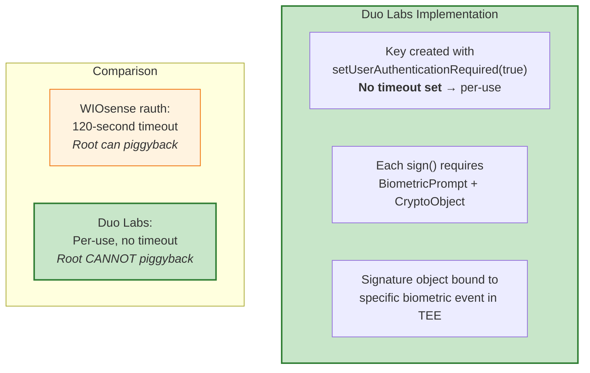
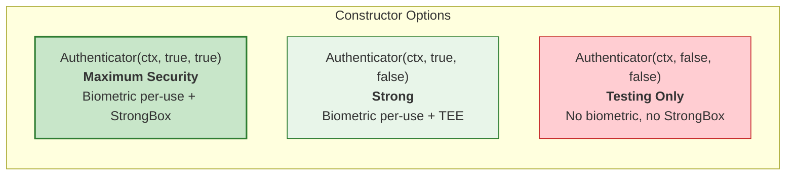
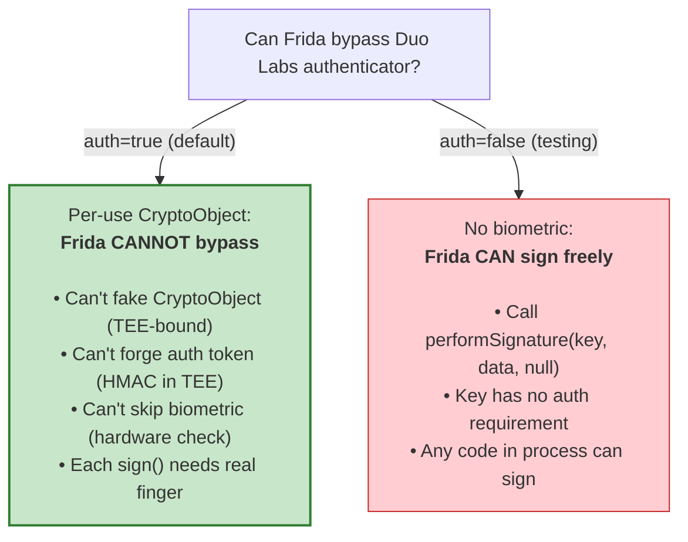

# Duo Labs (Cisco) Android WebAuthn Authenticator — Implementation Analysis

**Repo:** [duo-labs/android-webauthn-authenticator](https://github.com/duo-labs/android-webauthn-authenticator)

Duo Security (acquired by Cisco) built this open-source FIDO2/WebAuthn authenticator library for Android. It turns a phone into a WebAuthn authenticator — the same role as a YubiKey, but using the phone's hardware (TEE/StrongBox) instead of a USB dongle.

---

## Architecture Overview



### Source Files

| File | Purpose |
|---|---|
| `Authenticator.java` | Main entry point — implements `makeCredential()` and `getAssertion()` per WebAuthn spec |
| `CredentialSafe.java` | Android Keystore wrapper — key generation, COSE encoding, credential persistence |
| `WebAuthnCryptography.java` | Signing operations — handles both pre-authenticated (biometric) and direct signatures |
| `BiometricMakeCredentialCallback.java` | Extracts CryptoObject signature after biometric auth during registration |
| `BiometricGetAssertionCallback.java` | Extracts CryptoObject signature after biometric auth during authentication |
| `PublicKeyCredentialSource.java` | Room entity — credential metadata (rpId, userId, counter, Keystore alias) |
| `CredentialDatabase.java` | Room database singleton |
| `CredentialDao.java` | Data access — queries, insert, delete, counter increment |
| `NoneAttestationObject.java` | "none" attestation format (currently used) |
| `PackedSelfAttestationObject.java` | Self-signed packed attestation (implemented but disabled) |
| `SelectCredentialDialogFragment.java` | UI dialog for choosing between multiple credentials |

---

## Key Generation

**File:** `CredentialSafe.java`, lines 105-118

```java
KeyGenParameterSpec spec = new KeyGenParameterSpec.Builder(alias, KeyProperties.PURPOSE_SIGN)
    .setAlgorithmParameterSpec(new ECGenParameterSpec("secp256r1"))   // NIST P-256
    .setDigests(KeyProperties.DIGEST_SHA256)                          // SHA-256
    .setUserAuthenticationRequired(this.authenticationRequired)       // Per-use biometric
    .setUserConfirmationRequired(false)
    .setInvalidatedByBiometricEnrollment(false)                      // Survives new fingerprint
    .setIsStrongBoxBacked(this.strongboxRequired)                    // Optional HSM
    .build();
```

| Parameter | Value | Why |
|---|---|---|
| Algorithm | EC P-256 (secp256r1) | WebAuthn ES256 = COSE algorithm `-7` |
| Digest | SHA-256 | Required for SHA256withECDSA |
| Auth required | Configurable (`true`/`false`) | Per-use biometric gate when enabled |
| Biometric invalidation | `false` | Key survives fingerprint enrollment changes |
| StrongBox | Configurable | Dedicated HSM if available |
| Timeout | **Not set** (defaults to per-use) | No `setUserAuthenticationValidityDurationSeconds` = per-use |

**Key alias format:** `"virgil-keypair-" + Base64(credentialId)`

**Constructor variants:**
```java
new Authenticator(ctx);                           // auth=true, strongbox=true (most secure)
new Authenticator(ctx, true, true);               // same as above
new Authenticator(ctx, true, false);              // biometric, TEE only
new Authenticator(ctx, false, false);             // no biometric, TEE only (testing)
```

---

## Registration Flow (makeCredential)



---

## Authentication Flow (getAssertion)



---

## The Signing Mechanism: Two Modes

**File:** `WebAuthnCryptography.java`, lines 32-51

```java
public byte[] performSignature(PrivateKey privateKey, byte[] data, Signature sig)
        throws VirgilException {
    if (sig == null) {
        // Mode B: Create fresh signature (no biometric gate)
        sig = Signature.getInstance("SHA256withECDSA");
        sig.initSign(privateKey);
    }
    // Mode A: Use pre-authenticated signature from BiometricPrompt
    sig.update(data);
    return sig.sign();
}
```



**What gets signed (the exact bytes):**

```
toSign = authenticatorData || clientDataHash

authenticatorData (37 bytes for assertion, 141+ for registration):
┌──────────────────┬───────┬──────────┬─────────────────────────┐
│ SHA-256(rpId)    │ flags │ counter  │ attestedCredData (reg)  │
│ 32 bytes         │ 1 byte│ 4 bytes  │ variable (reg only)     │
└──────────────────┴───────┴──────────┴─────────────────────────┘

flags byte:
  bit 0 (0x01): User Present (UP) — always set
  bit 2 (0x04): User Verified (UV) — set if biometric auth used
  bit 6 (0x40): Attested Credential Data — set in registration only

clientDataHash: 32 bytes (SHA-256 of client data JSON)

Total toSign: 69 bytes (assertion) or 173+ bytes (registration)
```

---

## Credential Storage: Split Architecture



**What's secure:** The private key never leaves TEE hardware. Even if the Room database is compromised, the attacker gets metadata (which rpId, which userId) but cannot sign anything.

**What's not secure:** The Room database is unencrypted SQLite. An attacker with file access can see which sites the user has credentials for, and the userHandle. This is metadata leakage, not key compromise.

---

## COSE Public Key Encoding

**File:** `CredentialSafe.java`, lines 228-265

The public key is CBOR-encoded in COSE_Key format for transmission to the Relying Party:

```
COSE_Key = {
    1:  2,       // kty: EC2 (Elliptic Curve with x,y coordinates)
    3:  -7,      // alg: ES256 (ECDSA with SHA-256)
    -1: 1,       // crv: P-256 (NIST curve)
    -2: x,       // x-coordinate (32 bytes, unsigned big-endian)
    -3: y        // y-coordinate (32 bytes, unsigned big-endian)
}
```

The code handles a subtle issue: Java's `BigInteger.toByteArray()` returns signed two's complement, which may be 33 bytes (extra leading zero) or fewer than 32 bytes. The `toUnsignedFixedLength()` method normalizes to exactly 32 bytes.

---

## Security Analysis

### Biometric Binding: Per-Use, Not Time-Based

Duo Labs uses **the strongest biometric pattern**: per-use CryptoObject binding.



**Why this matters:** With WIOsense's 120-second timeout, a root attacker can wait for legitimate authentication and piggyback within the window. With Duo's per-use binding, **each signature requires its own biometric event** — there is no window.

### Configurable Security Levels



### Known Limitations

| Issue | Details | Impact |
|---|---|---|
| **Attestation is "none"** | No certificate chain to verify key origin | RP cannot prove keys are hardware-backed |
| **Key cleanup missing** | Deleting credential doesn't delete Keystore key | Orphaned keys accumulate |
| **Database unencrypted** | Room SQLite stores metadata in plaintext | Metadata leakage (which sites, userIds) |
| **Main-thread DB queries** | `allowMainThreadQueries()` enabled | ANR risk in production |
| **No PIN fallback** | Only biometric or nothing | Devices without biometric can't use auth mode |
| **Single algorithm** | Only ES256 supported | No RSA or EdDSA support |
| **`setInvalidatedByBiometricEnrollment(false)`** | Key survives new fingerprint enrollment | Attacker who enrolls their finger can use existing keys |

### Frida Resistance



---

## Duo Labs vs WIOsense: Side-by-Side

| Aspect | Duo Labs | WIOsense rauth |
|---|---|---|
| **Biometric model** | **Per-use** (no timeout) | Time-based (120s timeout) |
| **CryptoObject** | Always used when biometric enabled | Disabled by default (`biometricSigningSupported=false`) |
| **clientPIN** | Not supported | Full CTAP2 clientPIN protocol |
| **StrongBox** | Configurable | Configurable |
| **Attestation** | "none" only | "none", packed-self, packed-basic |
| **Key invalidation on biometric change** | No (`false`) | No (`false`) |
| **PIN fallback** | No — biometric or nothing | Yes — CTAP2 clientPIN |
| **Database encryption** | No (plain Room) | No (plain Room) |
| **Root resistance** | **Strong** (per-use CryptoObject) | **Medium** (120s window) |
| **Frida resistance** | **Strong** (can't forge CryptoObject) | **Weak** (PIN check bypassable, then 120s window) |

### Key Takeaway for Your 2FA Authenticator

Duo Labs demonstrates the **correct implementation pattern** for maximum security:

1. **Per-use biometric** — no `setUserAuthenticationValidityDurationSeconds`, so every signing operation requires fresh biometric
2. **CryptoObject binding** — the `Signature` object lives inside `CryptoObject`, so only a TEE-authenticated biometric can unlock it
3. **Dual-mode signing** — `performSignature(key, data, sig)` accepts either a pre-authenticated signature (from biometric) or `null` (for testing/no-auth mode)

If your business requires app PIN instead of biometric, Duo's pattern doesn't help directly — but combining it with WIOsense's clientPIN approach (PIN gates the request, per-use CryptoObject gates the signing) gives you both.

---

## Sources

- [duo-labs/android-webauthn-authenticator — GitHub](https://github.com/duo-labs/android-webauthn-authenticator)
- [WebAuthn Level 2 — W3C Specification](https://www.w3.org/TR/webauthn-2/)
- [Android Keystore System — developer.android.com](https://developer.android.com/privacy-and-security/keystore)
- [COSE Key Format — RFC 8152](https://datatracker.ietf.org/doc/html/rfc8152)
