# Duo Labs vs WIOsense: FIDO2 Authenticator Implementation Comparison

Two open-source Android FIDO2 authenticator libraries, both turning the phone into a security key. Same goal, different security tradeoffs.

| | **Duo Labs** | **WIOsense rauth** |
|---|---|---|
| **Repo** | [duo-labs/android-webauthn-authenticator](https://github.com/duo-labs/android-webauthn-authenticator) | [WIOsense/rauth-android](https://github.com/WIOsense/rauth-android) |
| **Company** | Cisco / Duo Security | WIOsense GmbH |
| **Purpose** | WebAuthn authenticator library | FIDO2 roaming authenticator (NFC/BLE) |

---

## 1. Key Generation

Both generate P-256 (secp256r1) keys in Android Keystore. The critical difference is how they configure authentication.

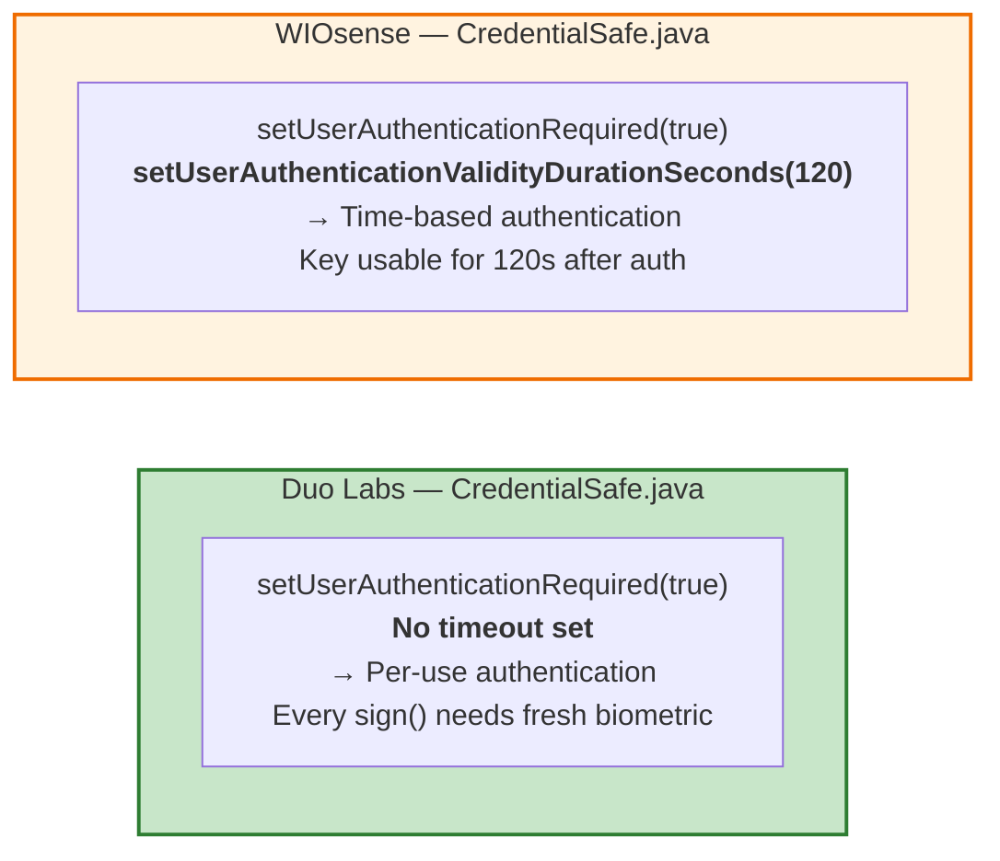

| Parameter | Duo Labs | WIOsense |
|---|---|---|
| Algorithm | EC P-256 (secp256r1) | EC P-256 (secp256r1) |
| COSE algorithm | -7 (ES256) | -7 (ES256) |
| Auth required | Configurable (default: `true`) | Always `true` |
| **Auth timeout** | **Not set → per-use** | **120 seconds** |
| StrongBox | Configurable (default: `true`) | Configurable |
| Invalidated by biometric enrollment | `false` | `false` |
| Key alias prefix | `virgil-keypair-` | `virgil-keypair-` |

**Impact of this single difference (timeout):**

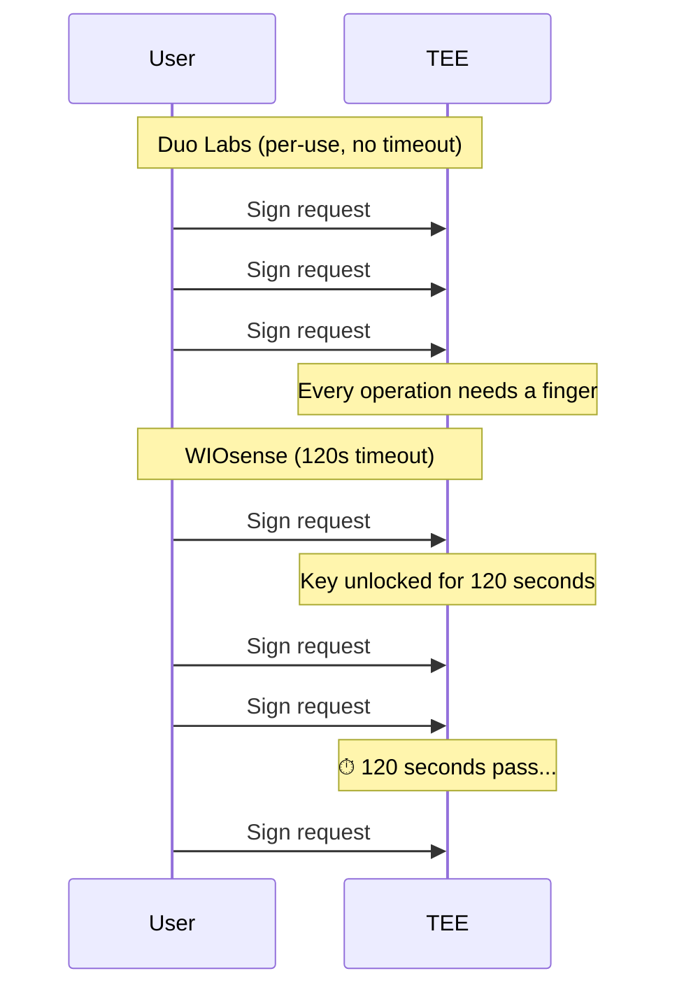

---

## 2. Biometric Integration

```mermaid
graph TD
    subgraph duo_bio["Duo Labs Biometric Flow"]
        D1["Signature.initSign(privateKey)"]
        D2["Wrap in CryptoObject(signature)"]
        D3["BiometricPrompt.authenticate(<br/>promptInfo, cryptoObject)"]
        D4["onAuthenticationSucceeded:<br/>sig = result.getCryptoObject()<br/>.getSignature()"]
        D5["performSignature(key, data, sig)<br/><i>Uses TEE-authenticated signature</i>"]

        D1 --> D2 --> D3 --> D4 --> D5
    end

    subgraph wio_bio["WIOsense Biometric Flow"]
        W1["biometricSigningSupported = false<br/><i>(hardcoded, line 74)</i>"]
        W2["CryptoObject set to null"]
        W3["BiometricPrompt.authenticate(<br/>promptInfo)<br/><i>No CryptoObject!</i>"]
        W4["onAuthenticationSucceeded:<br/>result.getCryptoObject() = null"]
        W5["performSignature(key, data, null)<br/><i>Creates new Signature, no binding</i>"]

        W1 --> W2 --> W3 --> W4 --> W5
    end

    style D5 fill:#c8e6c9,stroke:#2e7d32,stroke-width:2px
    style W5 fill:#ffcdd2,stroke:#c62828,stroke-width:2px
    style W1 fill:#ffcdd2,stroke:#c62828
```

| Aspect | Duo Labs | WIOsense |
|---|---|---|
| **CryptoObject used** | **Yes — always when auth enabled** | **No — disabled by design** |
| Signature source | From `result.getCryptoObject().getSignature()` | Created fresh via `Signature.getInstance()` |
| Biometric binding | Signature bound to specific biometric event in TEE | Biometric unlocks the key for 120s, signing is separate |
| BiometricPrompt type | `authenticate(promptInfo, cryptoObject)` | `authenticate(promptInfo)` (no crypto) |
| Device credential fallback | No — biometric only | Yes — `setDeviceCredentialAllowed(true)` |

**Why this matters:**

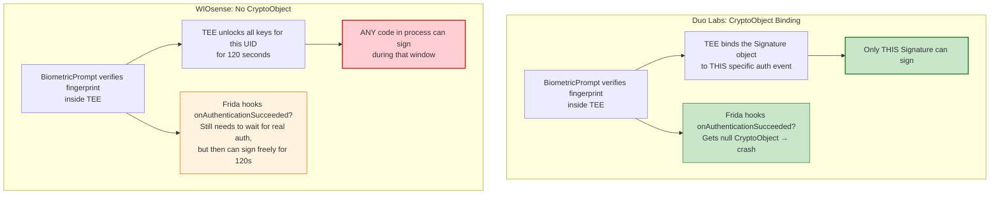

---

## 3. PIN Support

This is where WIOsense has a feature Duo Labs completely lacks.

| Aspect | Duo Labs | WIOsense |
|---|---|---|
| **App-level PIN** | Not supported | Full CTAP2 clientPIN protocol |
| PIN storage | N/A | EncryptedSharedPreferences (AES-256-GCM) |
| PIN hashing | N/A | SHA-256, first 16 bytes (no salt, no KDF) |
| PIN retry limit | N/A | 8 attempts, 3 consecutive → blocked |
| PIN token | N/A | 16-byte random, used as HMAC key for pinAuth |
| PIN-to-signing binding | N/A | pinAuth = HMAC(pinToken, clientDataHash) verified before sign |
| PIN channel encryption | N/A | ECDH key agreement + AES-256-CBC |
| **Can a device without biometric be used?** | **No** (auth=true requires biometric) | **Yes** (clientPIN as fallback) |

### WIOsense clientPIN Flow (Duo Labs has no equivalent)

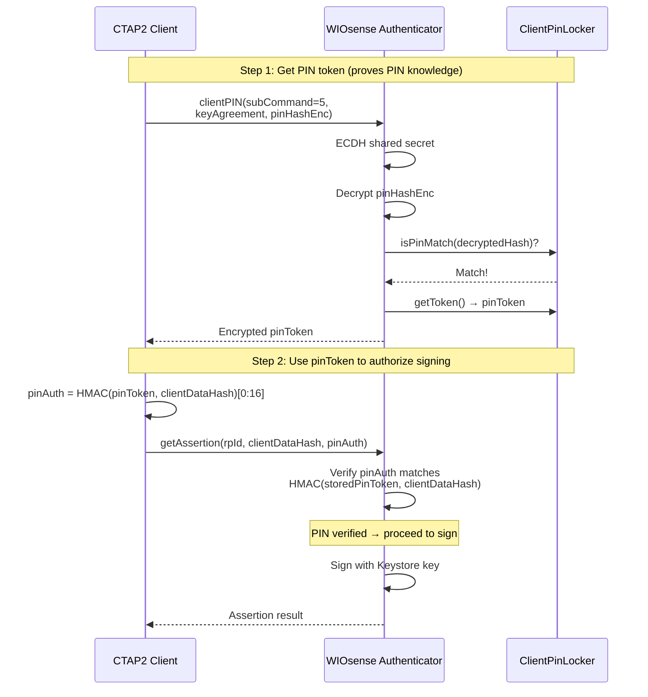

---

## 4. Attack Resistance

### Frida Attack

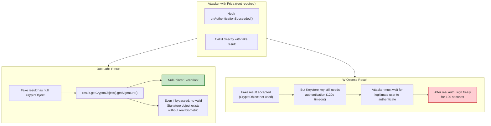

### Root Attack: Piggybacking Explained

"Piggybacking" means the attacker **doesn't authenticate themselves** — they wait for the **legitimate user** to authenticate for any reason, then ride on that authentication window to perform their own operations. Like following someone through a locked door before it closes.

#### How piggybacking works with a 120-second timeout

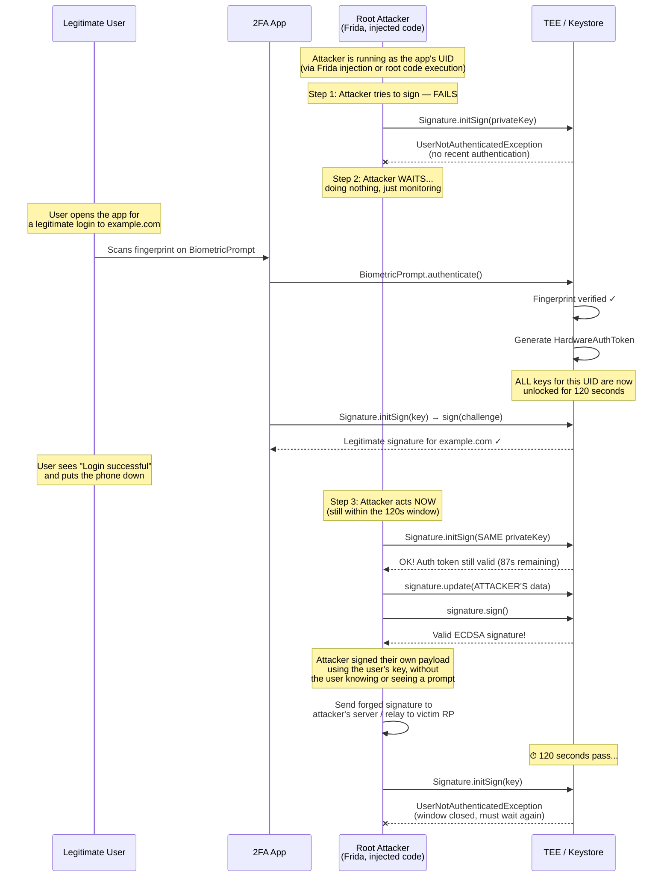

#### Why it's called "piggybacking"

The attacker **does not authenticate**. They don't need to — the TEE doesn't track *which code* triggered the biometric prompt. It only knows: "user with UID 10402 authenticated 87 seconds ago, timeout is 120 seconds, so any code running as UID 10402 can use the key."

The attacker **piggybacks on the user's legitimate authentication** — using the trust the user established with the TEE for their own malicious signing.

#### Why this DOESN'T work with Duo Labs (per-use CryptoObject)

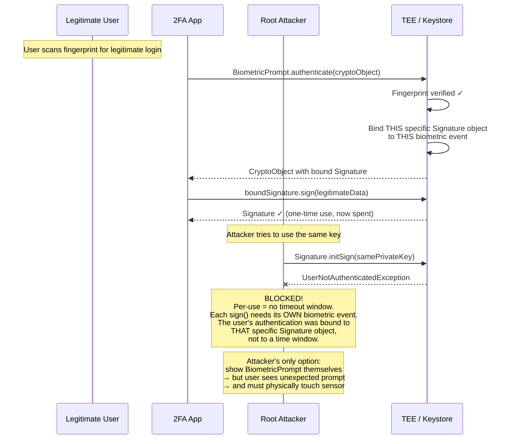

The difference: with per-use, the TEE doesn't say "keys unlocked for 120 seconds." It says "**this specific Signature object** is unlocked for **one operation**." There is no window. There is nothing to piggyback on.

#### Real-world piggybacking scenario

Think of a banking app with 120-second key timeout:

1. **9:00:00** — User opens app, scans fingerprint, approves a $50 transfer
2. **9:00:15** — Malware (running silently in the same process) signs a $5,000 transfer to the attacker's account
3. **9:00:16** — Malware sends the signed request to the bank's server
4. **9:00:17** — Bank verifies the ECDSA signature — it's valid (key was unlocked at 9:00:00)
5. **9:01:45** — User gets a notification: "$5,000 transferred"
6. **9:02:00** — 120-second window closes. Too late.

With per-use CryptoObject, step 2 fails immediately — the malware can't get a valid Signature object without triggering a new BiometricPrompt that the user would see.

### Root Attack Comparison Diagram

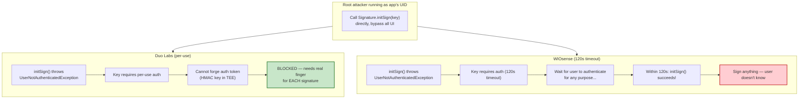

### Stolen Unlocked Phone (Thief Opens App)

| Scenario | Duo Labs | WIOsense |
|---|---|---|
| Thief opens app | Sees BiometricPrompt | May see PIN prompt or BiometricPrompt |
| Thief tries to sign | Must scan fingerprint — blocked | Must enter PIN or scan fingerprint — blocked |
| Thief knows/guesses PIN | N/A (no PIN support) | Can enter PIN, then sign |
| **Verdict** | **Protected** (biometric can't be guessed) | **Partially protected** (4-digit PIN is guessable, 8 attempts) |

### Full Comparison Matrix

| Attack Vector | Duo Labs (auth=true) | WIOsense (with PIN, 120s timeout) |
|---|---|---|
| **Other app** | Blocked (UID isolation) | Blocked (UID isolation) |
| **Frida: hook callback** | **Blocked** — null CryptoObject | Callback fires but key still locked |
| **Frida: call sign() directly** | **Blocked** — per-use auth needed | **Blocked** — auth needed |
| **Frida: bypass PIN** | N/A (no PIN) | **Possible** — hook `isPinMatch()` |
| **Root: piggyback after legit auth** | **Blocked** — per-use, no window | **120s window to sign freely** |
| **Root: forge auth token** | **Blocked** — HMAC in TEE | **Blocked** — HMAC in TEE |
| **Root: brute-force PIN** | N/A | **Possible** — SHA-256 no salt, 10K combos |
| **Stolen phone, thief has PIN** | N/A | **Compromised** |
| **Stolen phone, no PIN** | **Blocked** — biometric only | **Blocked** — PIN or biometric required |
| **Key extraction from TEE** | **Blocked** — hardware isolation | **Blocked** — hardware isolation |

---

## 5. Attestation

| Aspect | Duo Labs | WIOsense |
|---|---|---|
| Default format | `"none"` | `"none"` |
| Packed self-attestation | Implemented but **disabled** | Implemented, selectable |
| Packed basic attestation | Not implemented | Implemented (with external cert) |
| Key attestation | Not implemented | Not implemented |
| **Can server verify key is hardware-backed?** | **No** | **No** (unless basic attestation cert configured) |

Both libraries default to "none" attestation — the server cannot cryptographically verify the keys came from real hardware. This is a significant gap for high-security deployments.

---

## 6. Credential Storage

| Aspect | Duo Labs | WIOsense |
|---|---|---|
| Private keys | Android Keystore (TEE/StrongBox) | Android Keystore (TEE/StrongBox) |
| Metadata storage | Room database (unencrypted SQLite) | Room database (unencrypted SQLite) |
| PIN data | N/A | EncryptedSharedPreferences (AES-256-GCM) |
| Key alias format | `virgil-keypair-{base64(id)}` | `virgil-keypair-{base64(id)}` |
| Counter persistence | Room database | Room database |
| Key cleanup on credential delete | **No** — Keystore key orphaned | **No** — Keystore key orphaned |
| Database encryption | **No** | **No** |

Both share the same weakness: deleting a credential removes the Room record but **leaves the Keystore key behind**. Over time, orphaned keys accumulate.

---

## 7. Device Compatibility

| Requirement | Duo Labs | WIOsense |
|---|---|---|
| Minimum Android | 9.0 (API 28) — BiometricPrompt | 9.0 (API 28) — BiometricPrompt |
| Biometric hardware | **Required** when auth=true | Optional (clientPIN fallback) |
| StrongBox hardware | Optional (configurable) | Optional (configurable) |
| Screen lock required | Only if biometric enabled | Yes (BiometricPrompt requires it) |
| **Devices without biometric** | **Cannot use with auth=true** | **Can use via clientPIN** |
| NFC/BLE transport | Not implemented | Implemented (roaming authenticator) |

---

## 8. Verdict: Which to Use?

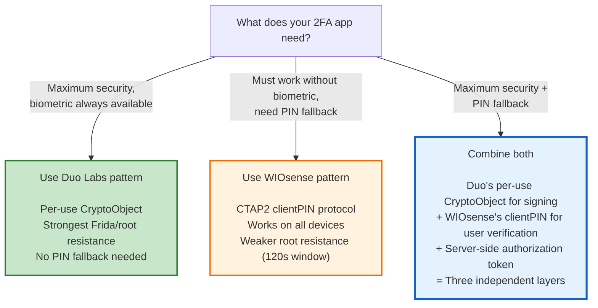

### For Your 2FA Authenticator

Your business wants app PIN instead of forcing biometric. Neither library does exactly what you need:

- **Duo Labs** has the strongest signing security (per-use CryptoObject) but no PIN support at all
- **WIOsense** has clientPIN but weaker signing security (120s timeout, no CryptoObject binding)

**The recommended hybrid:**

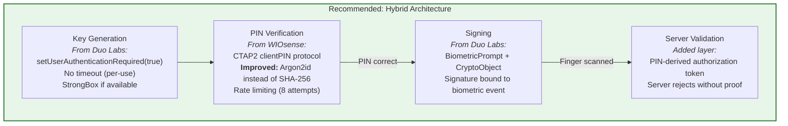

This gives three independent gates:
1. **PIN** — stops casual theft (CTAP2 protocol, retry-limited)
2. **Biometric** — stops Frida/root (TEE-enforced per-use CryptoObject)
3. **Server token** — stops any device-only attack (even if PIN + biometric somehow bypassed)

---

## Sources

- [duo-labs/android-webauthn-authenticator — GitHub](https://github.com/duo-labs/android-webauthn-authenticator)
- [WIOsense/rauth-android — GitHub](https://github.com/WIOsense/rauth-android)
- [FIDO CTAP2 Specification — fidoalliance.org](https://fidoalliance.org/specs/fido-v2.0-id-20180227/fido-client-to-authenticator-protocol-v2.0-id-20180227.html)
- [Android Keystore System — developer.android.com](https://developer.android.com/privacy-and-security/keystore)
- [Trusty TEE — source.android.com](https://source.android.com/docs/security/features/trusty)
