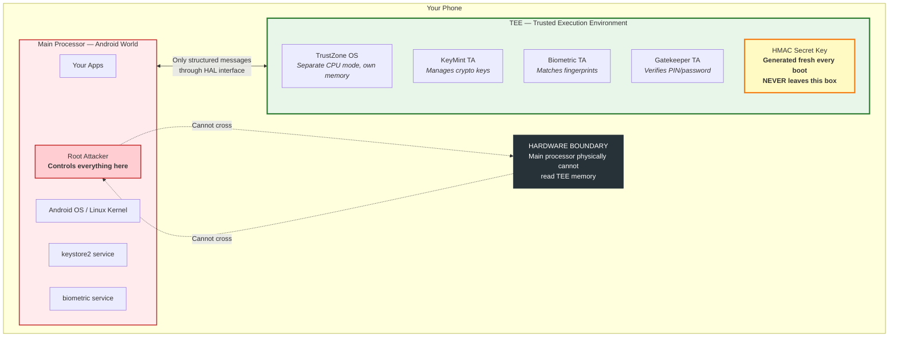
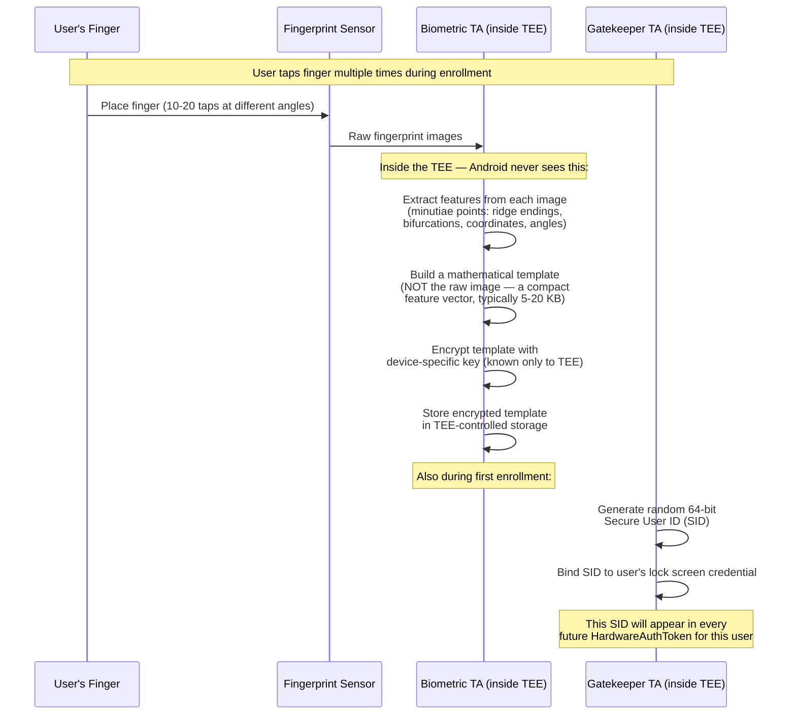
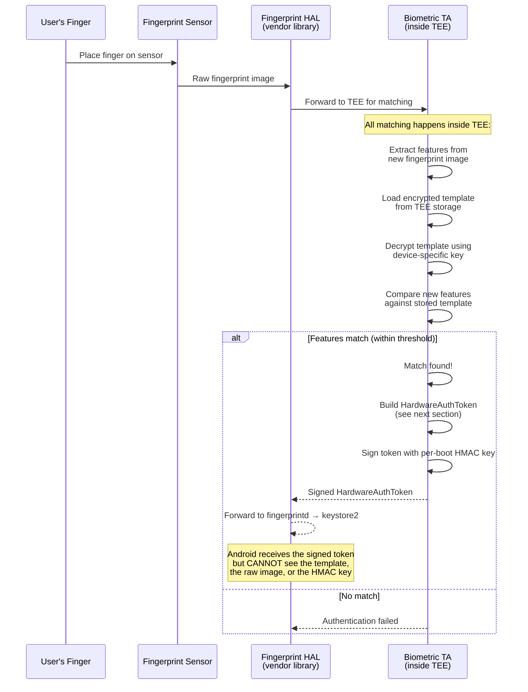
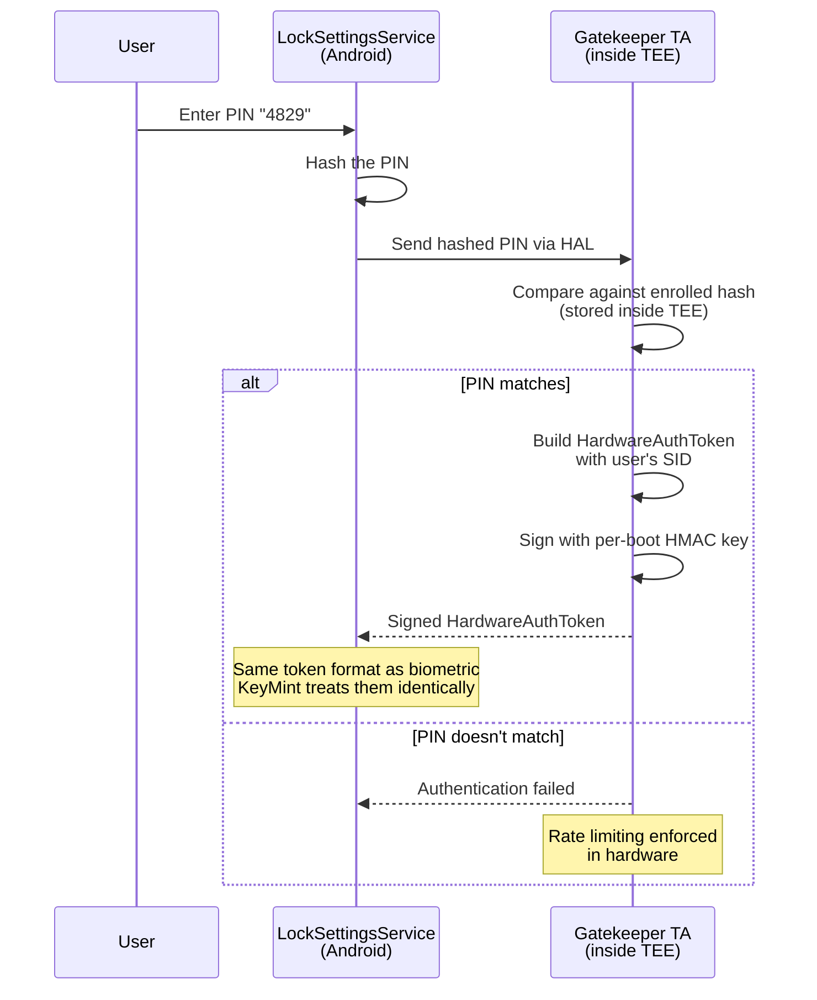
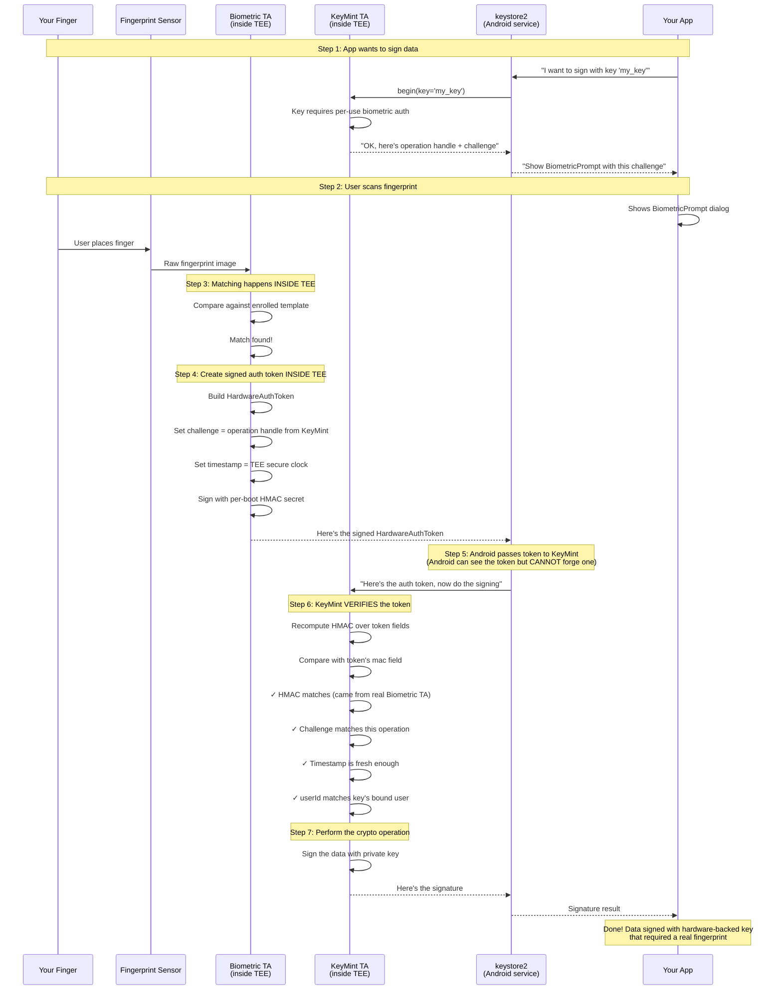
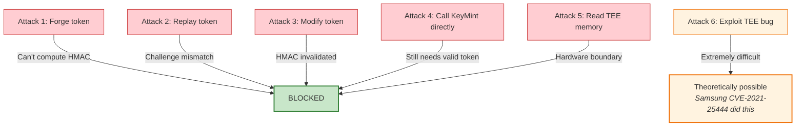
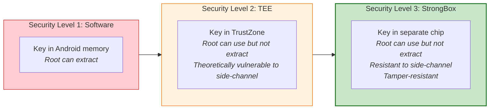

# How TEE Auth Tokens Work: Why Root Can't Forge a Fingerprint

## The One-Sentence Answer

Every time you scan your fingerprint, the **Biometric TA inside the TEE** verifies it against stored templates and produces a **HardwareAuthToken** — a small data structure that says "user X authenticated at time T." This token is **HMAC-signed with a per-boot secret key** that exists only inside the TEE — so even with full root access, you cannot forge one.

---

## What Is the TEE?

Your phone has **two separate computers** running independently:



The TEE (Trusted Execution Environment) is built on **ARM TrustZone** technology (or Intel VT on x86). It's not a separate chip (that's StrongBox) — it's a **separate execution mode of the same CPU** with its own isolated memory that the main OS physically cannot access. It runs its own small OS (e.g., Google's Trusty, derived from Little Kernel). Think of it as a vault built into the processor silicon itself.

> "The Trusty OS runs on the **same processor** as the Android OS, but Trusty is isolated from the rest of the system by both hardware and software."
> — [source.android.com](https://source.android.com/docs/security/features/trusty)

---

## What Is the HMAC Secret?

HMAC stands for **Hash-based Message Authentication Code**. It's a way to prove a message is authentic — like a wax seal on a letter.

The HMAC secret is a **random key** with these properties:

| Property | Detail |
|---|---|
| **Generated when?** | Fresh random key on every device boot |
| **Generated where?** | Inside the TEE (KeyMint Trusted Application) |
| **Who has it?** | Only TEE components: KeyMint, Biometric TA, Gatekeeper TA |
| **Who does NOT have it?** | Android OS, Linux kernel, root, any app, keystore2 service |
| **What happens if phone reboots?** | Old key destroyed, new one generated |
| **Can it be read from outside TEE?** | No — TEE memory is hardware-isolated |
| **Can it be extracted by root?** | No — root controls Android, not TrustZone |

> "The HMAC key must **never** be made available outside the TEE."
> — [Android Authentication Architecture, source.android.com](https://source.android.com/docs/security/features/authentication)

---

## How a Fingerprint Becomes an Auth Token

This is the step-by-step process from physical finger on the sensor to a cryptographic proof.

### Step 1: Enrollment (Once, During Setup)

When the user first registers a fingerprint in Android Settings:



**What is the "template"?** It's NOT a photo of your fingerprint. It's a **mathematical model** — a set of feature points (called minutiae) extracted from the fingerprint ridges:

- **Ridge endings**: where a ridge line stops
- **Bifurcations**: where a ridge splits into two
- Each point stored as: (x, y, angle, type)
- Typically 20-80 minutiae points per finger
- Total template size: ~5-20 KB

The raw fingerprint image is **discarded immediately** after feature extraction. Only the template remains, encrypted with a device-specific key.

> "Raw fingerprint data or derivatives (such as templates) must never be accessible from outside the sensor driver or TEE. All such biometric data needs to be secured within sensor hardware or trusted memory. All stored data must be encrypted with a device-specific key known only to the TEE."
> — [Fingerprint HIDL, source.android.com](https://source.android.com/docs/security/features/authentication/fingerprint-hal)

### Step 2: Authentication (Each Time)

When the user scans their finger to unlock or sign:



### Face ID / Face Authentication — Same Pattern

Face recognition follows the **exact same architecture**, just with different sensor data:

| Step | Fingerprint | Face |
|---|---|---|
| Sensor | Capacitive/optical/ultrasonic scanner | IR camera + dot projector |
| Raw data | 2D fingerprint image | 3D depth map of face |
| Feature extraction | Minutiae points (ridge endings, bifurcations) | Facial geometry (eye spacing, nose shape, jawline) |
| Template | ~20-80 minutiae points, 5-20 KB | ~30,000+ facial feature points |
| Where matching happens | **Inside TEE** | **Inside TEE** (Class 3) or Android (Class 2) |
| Auth token produced by | Biometric TA in TEE | Biometric TA in TEE (Class 3 only) |
| Android sees raw data? | **Never** | **Never** (for Class 3) |

**Class 2 (Weak) face recognition** may run matching in Android, not TEE — which is why it can't be used with CryptoObject and is considered less secure.

### PIN / Pattern / Password — Gatekeeper

Device credentials follow the same token architecture but through **Gatekeeper TA** instead of Biometric TA:



All three methods (fingerprint, face, PIN) produce the **same HardwareAuthToken format**. KeyMint doesn't care how the user authenticated — it only verifies the HMAC signature is valid and the token is fresh enough.

---

## What Is a HardwareAuthToken?

The HardwareAuthToken is the **end product** of any successful authentication — the proof that the user was verified. It's a small data structure produced **inside the TEE** containing:

```
HardwareAuthToken {
    challenge:         int64    // links to a specific KeyMint operation
                                // (prevents using one token for a different operation)

    userId:            int64    // Secure User ID (SID) — set during first enrollment,
                                // same for all auth methods (fingerprint, face, PIN)

    authenticatorId:   int64    // identifies WHICH authenticator produced this token
                                // (which fingerprint sensor, which face sensor)

    authenticatorType: int32    // HOW the user authenticated:
                                //   1 = PASSWORD (PIN/pattern/password via Gatekeeper)
                                //   2 = FINGERPRINT
                                //   4 = FACE (not present in all versions)

    timestamp:         int64    // WHEN authentication happened
                                // Uses TEE-internal secure clock, NOT Android clock
                                // (root can change Android clock but NOT TEE clock)

    mac:               byte[32] // HMAC-SHA256 over ALL fields above
                                // Signed with the per-boot HMAC secret key
                                // This is what makes forgery impossible
}
```

**What each field proves:**

| Field | What it proves | Why it matters |
|---|---|---|
| `challenge` | This token is for THIS specific crypto operation | Prevents replay: old token can't authorize new operation |
| `userId` | The user who enrolled originally | Prevents cross-user attacks |
| `authenticatorId` | Which sensor was used | Audit trail |
| `authenticatorType` | Fingerprint vs face vs PIN | Key can require specific type |
| `timestamp` | When auth happened (TEE clock) | Enforces timeout: "must auth within last 30s" |
| `mac` | Token was produced by real TEE, not forged | **The entire security guarantee** |

**What is NOT in the token:** The fingerprint image, the fingerprint template, any biometric data at all. The token only says "user X authenticated" — not "here's their fingerprint." The biometric data never leaves the TEE.

The **`mac` field** is the critical piece. It's a cryptographic signature over all the other fields, computed using the HMAC secret that only the TEE knows. If anyone changes any field (or creates a fake token), the `mac` won't match, and KeyMint will reject it.

---

## The Complete Flow: From Finger to Signed Data

Here's exactly what happens when you tap your fingerprint to sign something:



---

## Why a Root Attacker Can't Forge This

Let's walk through every attack a root attacker might try:

### Attack 1: "I'll create a fake HardwareAuthToken"

```
Root creates:
  HardwareAuthToken {
      challenge: <copied from legitimate operation>
      userId: <guessed>
      authenticatorType: FINGERPRINT
      timestamp: <current time>
      mac: ??? ← WHAT DO WE PUT HERE?
  }
```

**Problem:** The `mac` field must be `HMAC-SHA256(all_fields, secret_key)`. The `secret_key` is the per-boot HMAC key which **exists only inside the TEE**. Root controls Android but **cannot read TEE memory** — it's a hardware boundary in the CPU.

**Result:** KeyMint verifies the HMAC, finds it doesn't match → **token rejected**.

### Attack 2: "I'll intercept a real token and replay it"

```
Root captures a legitimate HardwareAuthToken from a previous authentication.
Root sends it to KeyMint for a new operation.
```

**Problem:** The token contains a `challenge` field that's bound to a **specific operation handle** created by KeyMint. Each `begin()` call creates a new random challenge. The old token's challenge doesn't match the new operation.

**Result:** KeyMint checks `challenge` → doesn't match → **token rejected**.

### Attack 3: "I'll modify a real token to change the challenge"

```
Root captures a real token, changes the challenge field to match
the new operation.
```

**Problem:** Changing any field invalidates the HMAC. The HMAC is computed over ALL fields. Change one byte → HMAC doesn't match.

**Result:** KeyMint verifies HMAC → **modified token rejected**.

### Attack 4: "I'll call KeyMint directly, bypassing keystore2"

```
Root uses kernel access to send messages directly to the TEE.
```

**Problem:** KeyMint still requires a valid HardwareAuthToken. The TEE doesn't care who sends the message — it only cares that the token's HMAC is valid. And you can't produce a valid HMAC without the secret.

**Result:** Same as Attack 1 → **no valid token, operation rejected**.

### Attack 5: "I'll extract the HMAC key from TEE memory"

```
Root tries to read the TEE's memory space.
```

**Problem:** ARM TrustZone enforces hardware-level memory isolation. The TEE's memory is in a region that the main processor **physically cannot address** when running in "Normal World" (Android). This is enforced by the **TrustZone Address Space Controller (TZASC)** — a hardware component that blocks memory access at the bus level.

**Result:** Memory access fault → **cannot read TEE memory**.

### Attack 6: "I'll compromise the TEE itself"

This is the only theoretical path. It requires:
- Finding a vulnerability in the TEE OS (e.g., a buffer overflow in the Biometric TA)
- Crafting an exploit that runs code inside the TEE
- Using that code to extract the HMAC key or directly call KeyMint operations

This is **extremely difficult** because:
- TEE OS is minimal (tiny attack surface)
- TEE firmware is signed and verified at boot (Secure Boot chain)
- TEE vulnerabilities are rare and patched quickly
- Requires physical access to the device + deep expertise

**This is the only attack that has ever worked in practice** — see the Samsung Keymaster CVEs where researchers found bugs in Samsung's TEE implementation.



---

## Analogy

Think of it like a **notary inside a bank vault**:

- **Your app** = a customer at the bank window
- **Android OS** = the bank teller (even a corrupt teller)
- **TEE** = the vault room behind blast-proof glass
- **HMAC key** = the notary's personal stamp (stored in the vault)
- **Auth token** = a notarized document
- **Root attacker** = someone who bribes/controls the teller

The corrupt teller can pass messages back and forth through the window, but **cannot enter the vault, cannot steal the stamp, and cannot forge notarized documents**. The notary (TEE) only stamps documents after personally verifying the customer's fingerprint through a scanner built into the vault wall.

---

## What About StrongBox?

StrongBox is **even more secure** than TEE. While TEE runs in a separate mode of the main CPU (sharing the same silicon), StrongBox is a **physically separate chip** with:

- Its own dedicated CPU
- Its own memory
- Its own power supply
- Tamper-resistant packaging

This makes it resistant even to sophisticated **side-channel attacks** (power analysis, electromagnetic emanation) that could theoretically leak information from TEE.



---

## Summary

| Question | Answer |
|---|---|
| What is the HMAC secret? | A random key generated inside the TEE at every boot, shared only between TEE components (KeyMint, Biometric TA, Gatekeeper) |
| What does it protect? | Auth tokens — the proof that "this user really scanned their fingerprint" |
| Why can't root forge tokens? | The HMAC key never leaves the TEE. Root controls Android, not TrustZone. Without the key, you can't sign valid tokens. |
| What verifies the token? | KeyMint (inside TEE) recomputes the HMAC and compares. Forged/modified tokens fail. |
| Can root replay old tokens? | No — tokens are bound to a specific operation via a `challenge` field that changes per operation. |
| Is this 100% unbreakable? | No — TEE bugs exist (Samsung CVE-2021-25444). But exploiting them requires finding a 0-day in TEE firmware, which is extremely rare and quickly patched. |

---

## Sources

- [Android Authentication Architecture — source.android.com](https://source.android.com/docs/security/features/authentication) — Auth token flow, HMAC key lifecycle, TEE verification
- [Android Keystore Features — source.android.com](https://source.android.com/docs/security/features/keystore/features) — Per-operation vs timeout auth, auth token types
- [Hardware-backed Keystore — source.android.com](https://source.android.com/docs/security/features/keystore) — TEE architecture, KeyMint/Gatekeeper interaction
- [Gatekeeper — source.android.com](https://source.android.com/docs/security/features/authentication/gatekeeper) — HMAC key sharing between Gatekeeper and KeyMint
- [ARM TrustZone Technology](https://developer.arm.com/ip-products/security-ip/trustzone) — Hardware isolation mechanism
