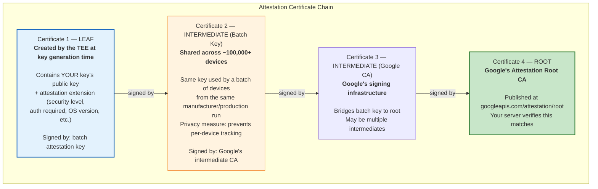
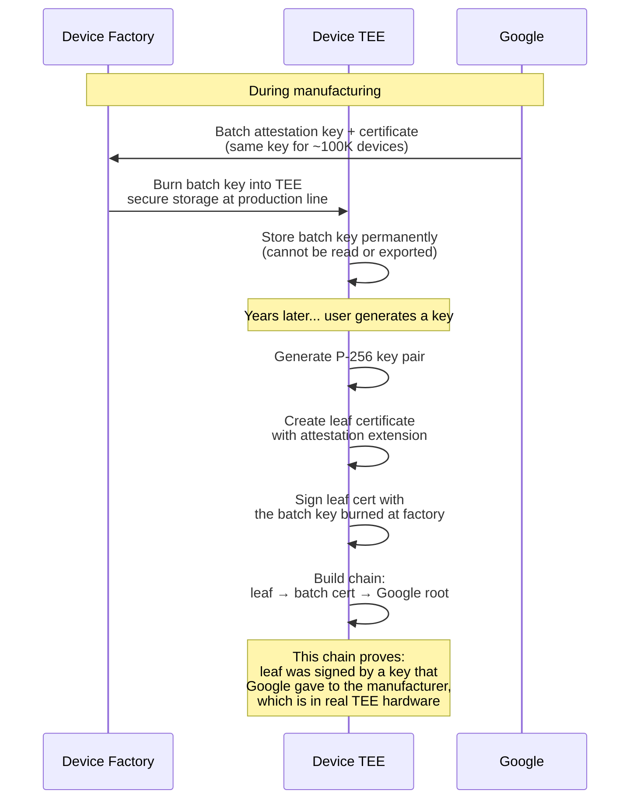
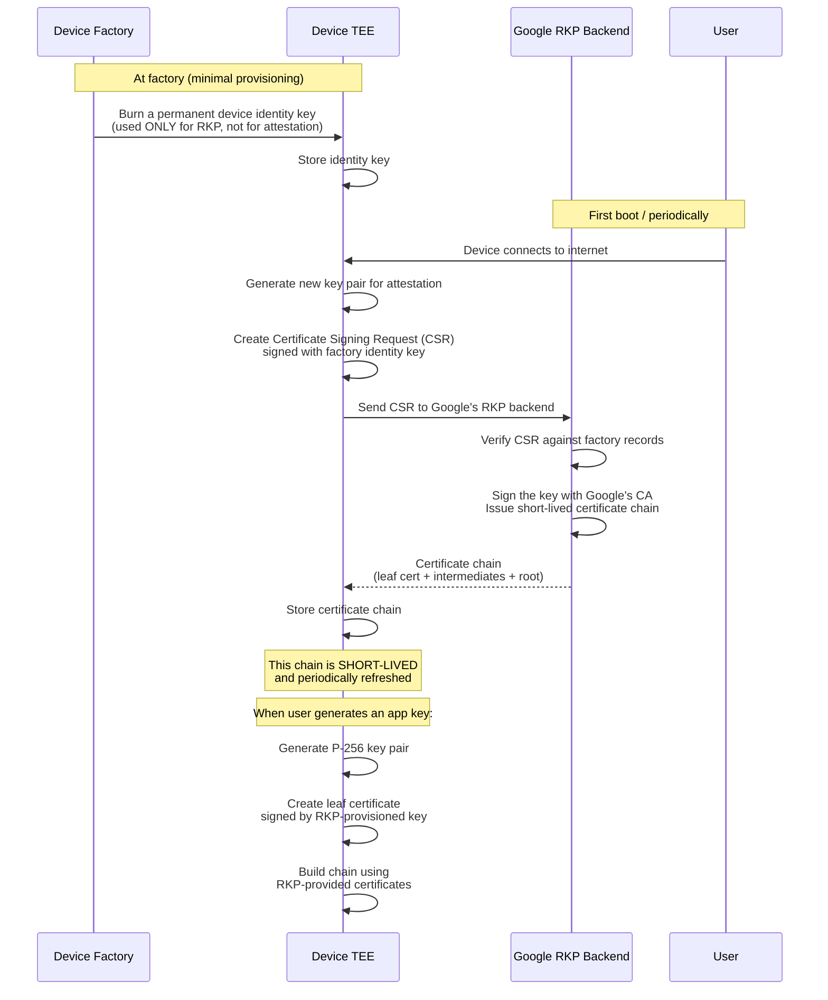
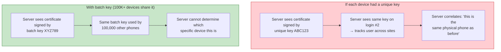
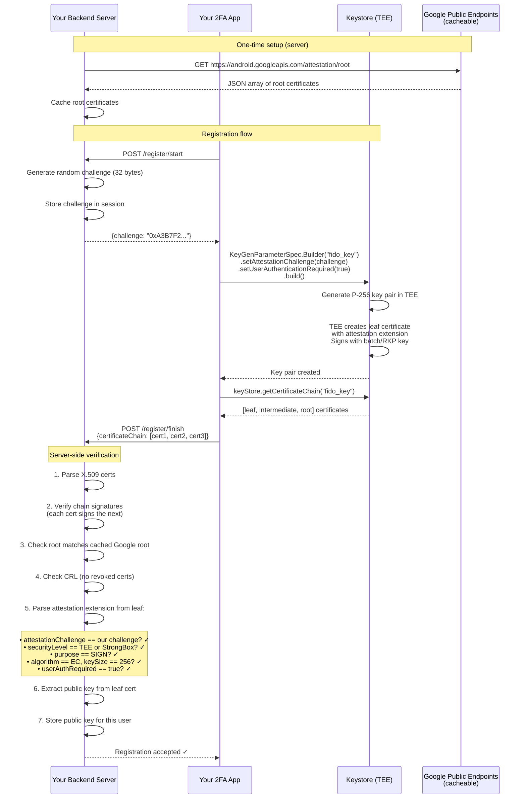

# How the Attestation Certificate Chain Actually Works + Open Source Backends

## The Question

When you call `setAttestationChallenge()` and `getCertificateChain()`, the TEE produces a certificate chain "signed by Google's root CA." But how? Does each device have its own CA? Is there an intermediate? How do keys get onto the device in the first place?

---

## How the Certificate Chain Is Formed

The chain has **3-4 certificates**. Each level is controlled by a different entity:



### Who Controls What

| Certificate | Created by | When | Unique to |
|---|---|---|---|
| **Leaf** | TEE on the device | Each time you call `setAttestationChallenge()` + generate key | This specific key |
| **Batch intermediate** | Manufacturer | At factory (or via RKP) | ~100,000+ devices in a production batch |
| **Google intermediate(s)** | Google | During provisioning | Google's infrastructure |
| **Root** | Google | Once (with rotation in 2026) | All Android devices globally |

---

## Two Provisioning Models

### Model 1: Factory Provisioning (Old — pre-Android 12)



**Problem:** If the batch key is compromised (leaked at factory, extracted via TEE exploit), Google can't rotate it — it's burned into hardware.

### Model 2: Remote Key Provisioning — RKP (New — Android 12+, mandatory since Android 13)



**Advantages of RKP:**
- **Rotatable:** If a key is compromised, Google revokes it and provisions new ones
- **Short-lived:** Certificates expire and get refreshed — limits damage window
- **No factory secret leaks:** The factory only extracts a public key, not a private key
- **Revocable per-device:** Google can revoke individual devices (not entire batches)

---

## What Is the Batch Key? Why Not Per-Device?

Google mandates that the **same attestation key is shared across at least 100,000 devices**. This is a **privacy requirement**:



The batch key is an **anonymity** measure — it proves the key is in real hardware without revealing which specific device.

---

## Open Source Projects That Use Key Attestation

### Backend Libraries (Server-Side Verification)

| Project | Language | What it does | setAttestationChallenge? |
|---|---|---|---|
| **[android/keyattestation](https://github.com/android/keyattestation)** | Kotlin | Official Google library — verifies attestation certificate chains, includes root certs, handles challenge matching and replay detection | Server verifies chains created with `setAttestationChallenge()` |
| **[a-sit-plus/warden](https://github.com/a-sit-plus/warden)** | Kotlin | Server-side library for key attestation on **both Android and iOS**. Unified API for both platforms. | Server verifies chains from both platforms |
| **[webauthn4j/webauthn4j](https://github.com/webauthn4j/webauthn4j)** | Java | WebAuthn server library — supports `"android-key"` attestation format. Passes FIDO Alliance Android Key attestation test cases. | Verifies WebAuthn `"android-key"` attestation (which uses `setAttestationChallenge()` internally) |
| **[cedarcode/android_key_attestation](https://github.com/bdewater/android_key_attestation)** | Ruby | Ruby gem to verify Android key attestation | Server-side chain verification |
| **[fido2-lib](https://github.com/webauthn-open-source/fido2-lib)** | Node.js | WebAuthn server — supports android-safetynet and packed attestation | Partial Android attestation support |

### Client Libraries (Android-Side Key Generation)

| Project | Uses `setAttestationChallenge()`? | Details |
|---|---|---|
| **Duo Labs** (android-webauthn-authenticator) | **No** | Uses WebAuthn "none" attestation — no hardware proof |
| **WIOsense** (rauth-android) | **No** | Uses "none" or "packed-self" — self-signed, no hardware proof |
| **Google Credential Manager** | **Yes** (internally) | System-level, uses hardware-backed key attestation since 2024 |
| **nodh/android-key-attestation-demo** | **Yes** (client-side demo) | Demonstrates `setAttestationChallenge()` and chain verification, but verifies on-device (not server) — for educational purposes only |

### Why Don't These Libraries Use `setAttestationChallenge()`?

This is **by design**, not a gap in those libraries. The reason is architectural — these libraries serve a different purpose than your 2FA app.

```mermaid
graph TD
    subgraph roaming["Duo Labs / WIOsense: Roaming Authenticator"]
        R1["Phone acts as a YubiKey"]
        R2["User physically taps phone<br/>against laptop via NFC"]
        R3["Physical presence = trust signal"]
        R4["Server trusts the authenticator<br/>because the user TAPPED it"]
        R5["No need to prove key is in TEE —<br/>physical interaction is the proof"]
        R1 --> R2 --> R3 --> R4 --> R5
    end

    subgraph platform["Your 2FA App: Platform Authenticator"]
        P1["App runs on user's phone"]
        P2["Server sends challenge over<br/>the internet (no physical contact)"]
        P3["No physical presence proof"]
        P4["Server has NO WAY to know if<br/>the key is in real TEE or software"]
        P5["MUST use setAttestationChallenge()<br/>to prove key is hardware-backed"]
        P1 --> P2 --> P3 --> P4 --> P5
    end

    style roaming fill:#e3f2fd,stroke:#1565c0,stroke-width:2px
    style platform fill:#fff3e0,stroke:#ef6c00,stroke-width:2px
    style R5 fill:#c8e6c9,stroke:#2e7d32
    style P5 fill:#c8e6c9,stroke:#2e7d32
```



**A YubiKey doesn't use Android key attestation either.** When you plug in a YubiKey and tap it, the server trusts it because:
1. The user physically had to touch the device
2. The YubiKey has its own attestation certificate (Yubico-signed, not Google-signed)
3. Trust comes from the physical transport (USB/NFC) + the manufacturer's attestation

Duo Labs and WIOsense are the same — they're phone-as-YubiKey. The NFC tap or BLE proximity IS the trust signal. WebAuthn attestation formats ("none", "packed") are sufficient because the server already knows a physical authenticator was involved.

**Your 2FA app is different.** There's no physical tap. The server sends a challenge over the internet, the app signs it, and sends it back. An attacker running your app on an emulator with a software key would look identical — **unless the server verifies the key attestation certificate chain** to prove the key is in real TEE hardware.

| | Roaming Authenticator (Duo/WIOsense) | Your 2FA Platform App |
|---|---|---|
| Physical presence | NFC tap / BLE proximity | None — internet only |
| How server trusts key | Physical transport + WebAuthn attestation | **Must use `setAttestationChallenge()`** |
| WebAuthn "none" attestation | Acceptable (physical presence is enough) | **Not acceptable** (no physical proof) |
| Risk without hardware attestation | Low (attacker needs physical access) | **High** (attacker can use emulator remotely) |

**Bottom line:** Duo Labs and WIOsense don't need `setAttestationChallenge()` because they have physical presence. You need it because you don't.

---

## Complete Flow: Client + Backend



### Server-Side Code (using android/keyattestation)

```kotlin
// build.gradle.kts
dependencies {
    implementation("com.android.attestation:keyattestation:0.1.0")
}
```

```kotlin
import com.android.attestation.Verifier
import com.android.attestation.challenge.ChallengeMatcher
import com.android.attestation.challenge.InMemoryLruCache

// Initialize verifier (once, at server startup)
val verifier = Verifier.Builder()
    .trustAnchors(loadGoogleRootCertificates())  // From googleapis.com/attestation/root
    .revocationData(loadCRL())                    // From googleapis.com/attestation/status
    .time { Instant.now() }
    .build()

// Verify attestation during registration
fun verifyRegistration(
    certificateChainDer: List<ByteArray>,
    expectedChallenge: ByteArray
): RegistrationResult {
    val certs = certificateChainDer.map { certBytes ->
        CertificateFactory.getInstance("X.509")
            .generateCertificate(ByteArrayInputStream(certBytes)) as X509Certificate
    }

    val result = verifier.verify(certs)

    return when (result) {
        is Verifier.Result.Success -> {
            val attestation = result.attestation

            // Verify challenge matches
            val challengeChecker = ChallengeMatcher(expectedChallenge)
            if (!challengeChecker.check(attestation)) {
                return RegistrationResult.Rejected("Challenge mismatch")
            }

            // Check security level
            if (attestation.attestationSecurityLevel != SecurityLevel.TRUSTED_ENVIRONMENT &&
                attestation.attestationSecurityLevel != SecurityLevel.STRONG_BOX) {
                return RegistrationResult.Rejected("Not hardware-backed")
            }

            // Extract and store public key
            RegistrationResult.Accepted(
                publicKey = certs[0].publicKey,
                securityLevel = attestation.attestationSecurityLevel
            )
        }
        is Verifier.Result.Failure -> {
            RegistrationResult.Rejected(result.reason.toString())
        }
    }
}
```

---

## What If You Don't Use Key Attestation?

```mermaid
graph TD
    subgraph without["Without setAttestationChallenge()"]
        W1["getCertificateChain() returns<br/>a SELF-SIGNED certificate"]
        W2["No attestation extension"]
        W3["No Google root CA in chain"]
        W4["Server cannot verify<br/>key is hardware-backed"]
        W5["Attacker can register a<br/>software key from emulator"]
        W1 --> W2 --> W3 --> W4 --> W5
    end

    subgraph with["With setAttestationChallenge()"]
        A1["getCertificateChain() returns<br/>Google-signed certificate chain"]
        A2["Leaf cert contains attestation extension"]
        A3["Chain roots to Google's CA"]
        A4["Server cryptographically proves<br/>key is in real TEE"]
        A5["Attacker cannot fake this<br/>(would need Google's private key)"]
        A1 --> A2 --> A3 --> A4 --> A5
    end

    style without fill:#ffcdd2,stroke:#c62828,stroke-width:2px
    style with fill:#c8e6c9,stroke:#2e7d32,stroke-width:2px
```



**Without `setAttestationChallenge()`:** `getCertificateChain()` returns a **self-signed certificate** containing just the public key. No attestation extension, no Google signature, no proof of anything. Useless for security verification.

**With `setAttestationChallenge(challenge)`:** The TEE generates a proper attestation certificate chain signed by the batch/RKP key, which chains up to Google's root. The leaf certificate contains the attestation extension with all the device and key properties.

---

## Sources

- [Key and ID Attestation — source.android.com](https://source.android.com/docs/security/features/keystore/attestation)
- [Verify hardware-backed key pairs — developer.android.com](https://developer.android.com/privacy-and-security/security-key-attestation)
- [Remote Key Provisioning — source.android.com](https://source.android.com/docs/core/ota/modular-system/remote-key-provisioning)
- [Upgrading Android Attestation: Remote Provisioning — Android Developers Blog](https://android-developers.googleblog.com/2022/03/upgrading-android-attestation-remote.html)
- [android/keyattestation — GitHub (official library)](https://github.com/android/keyattestation)
- [a-sit-plus/warden — GitHub (cross-platform attestation)](https://github.com/a-sit-plus/warden)
- [webauthn4j/webauthn4j — GitHub (WebAuthn server)](https://github.com/webauthn4j/webauthn4j)
- [Google's tightening key security — Android Police](https://www.androidpolice.com/android-attestation-key-provisioning-keystore-public-private/)
- [Android Keybox: Technical Guide — tryigit.dev](https://tryigit.dev/android-keybox-attestation-analysis)
