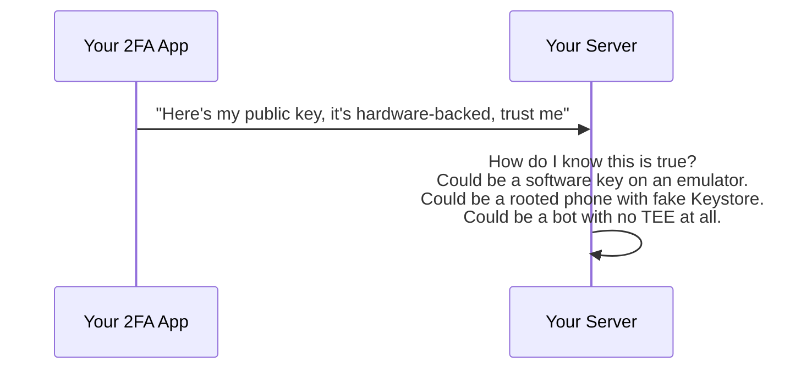
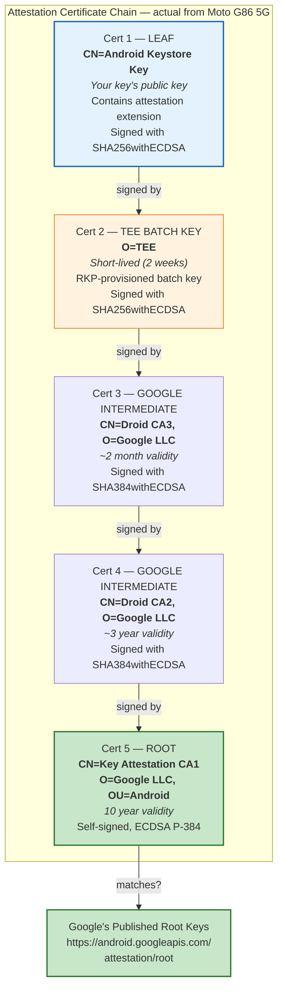
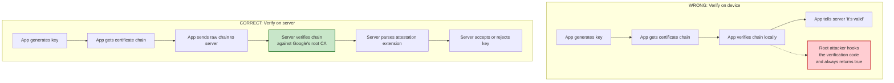
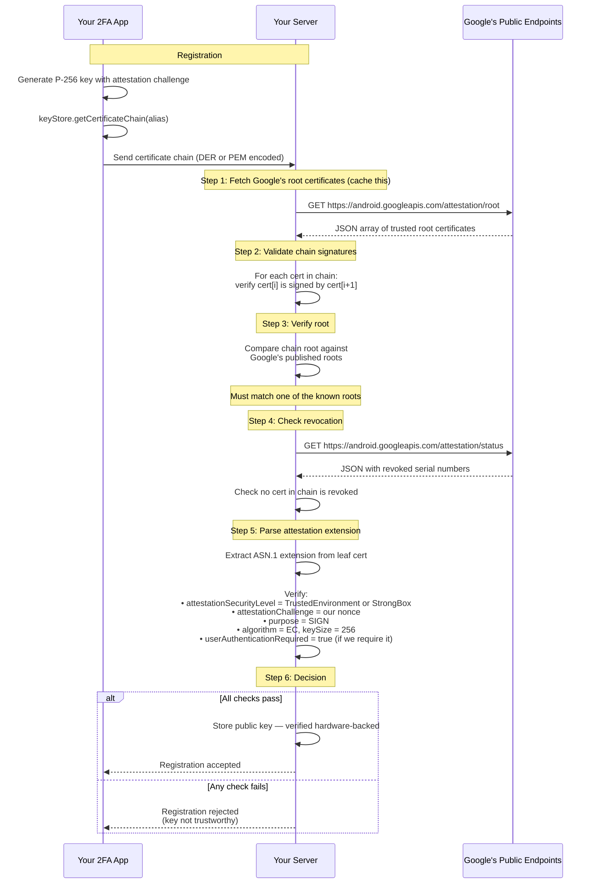
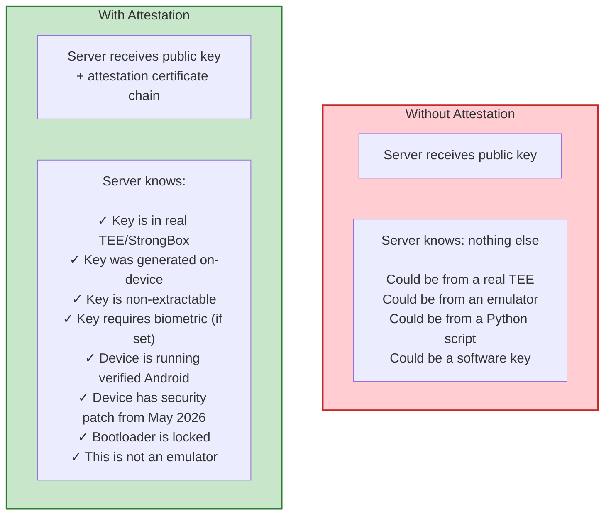
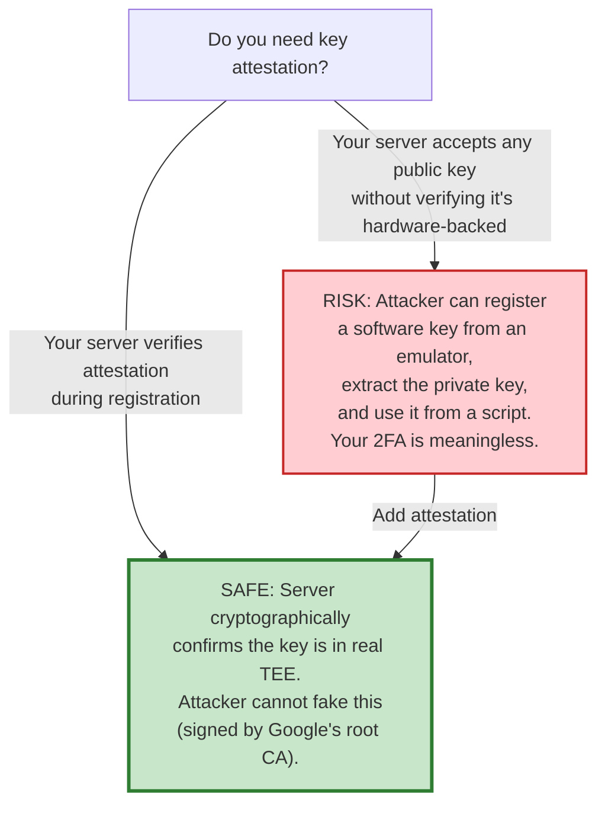

# Key Attestation: What It Is, Why You Need It, and How It Works

## What Problem Does It Solve?

Your 2FA app generates a P-256 key in Android Keystore and tells the server "this key is hardware-backed, in a real TEE." **But how does the server know you're not lying?**

Without attestation, the server has to trust the client blindly:



Key attestation solves this. The **device's TEE** produces a **certificate chain** signed by **Google's root CA** that cryptographically proves:

- The key was generated inside real TEE/StrongBox hardware
- The key has specific properties (auth required, non-exportable, etc.)
- The device is in a known-good state (verified boot, patch level)

---

## What Is the Attestation Certificate Chain?

When you call `keyStore.getCertificateChain(alias)`, Android returns a chain of certificates. On our Moto G86 5G test device (Android 16, RKP-provisioned), the chain had **5 certificates**:



**Note:** The number of certificates varies by device and provisioning method. Older factory-provisioned devices may have 3-4 certs. RKP-provisioned devices (Android 12+) typically have 4-5 certs with short-lived intermediates.

**The leaf certificate contains an attestation extension** with detailed information about the key:

| Field | What it tells the server | Example |
|---|---|---|
| `attestationSecurityLevel` | Where the key lives | `TrustedEnvironment` or `StrongBox` |
| `keymasterSecurityLevel` | Where crypto operations happen | `TrustedEnvironment` or `StrongBox` |
| `attestationChallenge` | Nonce from server (prevents replay) | Your server's random bytes |
| `purpose` | What the key can do | `SIGN` |
| `algorithm` | Key algorithm | `EC` |
| `keySize` | Key size | `256` |
| `digest` | Hash algorithm | `SHA-256` |
| `osVersion` | Android version | `160000` (Android 16) |
| `osPatchLevel` | Security patch date | `202605` (May 2026) |
| `vendorPatchLevel` | Vendor patch date | `20260501` |
| `bootPatchLevel` | Boot image patch date | `20260501` |
| `verifiedBootState` | Device boot integrity | `Verified` (not unlocked/compromised) |
| `userAuthenticationRequired` | Key requires biometric/PIN | `true` or `false` |

---

## Is It Free? Key Attestation vs Play Integrity vs Device Attestation

**These are three different things.** The confusion comes from mixing them up.

### The Three Mechanisms

```mermaid
graph TD
    subgraph ka["1. Key Attestation (what you need)"]
        KA1["KeyStore.getCertificateChain(alias)"]
        KA2["Proves: THIS specific key<br/>is in real TEE/StrongBox"]
        KA3["Cost: FREE, unlimited<br/>No API calls, no quota"]
        KA4["Network: Offline on device<br/>Server fetches root certs once (cacheable)"]
        KA1 --- KA2 --- KA3 --- KA4
    end

    subgraph pi["2. Play Integrity API (NOT what you need)"]
        PI1["PlayIntegrityClient.requestIntegrityToken()"]
        PI2["Proves: THIS device<br/>is genuine, not rooted/emulated"]
        PI3["Cost: 10,000 requests/day FREE<br/>then must request quota increase"]
        PI4["Network: REQUIRED every request<br/>Google servers evaluate device"]
        PI1 --- PI2 --- PI3 --- PI4
    end

    subgraph da["3. 'Device Attestation' (ambiguous term)"]
        DA1["Not a specific API"]
        DA2["People use this to mean<br/>either Key Attestation OR Play Integrity<br/>depending on context"]
        DA1 --- DA2
    end

    style ka fill:#c8e6c9,stroke:#2e7d32,stroke-width:3px
    style pi fill:#fff3e0,stroke:#ef6c00,stroke-width:2px
    style da fill:#ffcdd2,stroke:#c62828
```



### The Detailed Comparison

| | **Key Attestation** | **Play Integrity API** |
|---|---|---|
| **What it is** | Certificate chain from Keystore, signed by Google's root CA | Verdict token from Google's servers about device integrity |
| **What it proves** | "This specific P-256 key lives in real TEE hardware with these exact properties" | "This device is genuine, runs verified Android, has Play Store" |
| **Cost** | **FREE — unlimited, no quota** | **10,000 requests/day free**, then must request increase from Google |
| **Network on device** | **Not needed** — certificate generated locally by TEE | **Required** — device must contact Google's servers |
| **Network on server** | Fetch root certs once (cacheable JSON), fetch CRL periodically | Every verification decodes token or calls Google |
| **Google API call** | **None** — standard X.509 certificate verification | **Yes** — device calls `requestIntegrityToken()`, server may call Google to verify |
| **Works without Play Services** | **Yes** — pure Keystore API, works on AOSP, Huawei, etc. | **No** — requires Google Play Services |
| **Works on Huawei/HarmonyOS** | **Yes** (EMUI/HarmonyOS 2-3 with Android Keystore) | **No** (no Google Play Services) |
| **Per-key granularity** | **Yes** — proves specific key properties (algorithm, auth required, security level) | **No** — device-level verdict only |
| **Can prove key requires biometric** | **Yes** — `userAuthenticationRequired` field in attestation extension | **No** — doesn't know about individual keys |
| **Minimum Android** | API 24 (Android 7.0), mandatory since API 26 (Android 8.0) | Varies, requires Play Services |

### What You Need for Your 2FA Authenticator

**Key Attestation only.** It's free, unlimited, works offline, and proves exactly what you need: "this P-256 signing key is hardware-backed, non-extractable, and requires biometric authentication."

You do **NOT** need Play Integrity API for key verification. Play Integrity is for different use cases (anti-piracy, anti-fraud, detecting rooted devices in general).

### One Nuance: Remote Key Provisioning (RKP)

Modern Android devices (Android 12+) use **Remote Key Provisioning** — the device periodically contacts Google's servers to receive fresh attestation certificates. This happens in the background (not per-attestation) and is managed by the system, not your app. If the device has never been online, it may have pre-provisioned certificates from the factory, so key attestation still works — but the certificates may be older.

**This does NOT mean your app needs to call Google.** RKP is a system-level background process. Your app just calls `getCertificateChain()` and gets whatever certificates are available.

### Cost Summary

| What | Cost | Quota |
|---|---|---|
| `KeyGenParameterSpec.setAttestationChallenge()` | Free | Unlimited |
| `KeyStore.getCertificateChain()` | Free | Unlimited |
| Fetching Google's root certs (your server, once) | Free | No quota (public URL, cache it) |
| Fetching CRL (your server, periodically) | Free | No quota (public URL) |
| X.509 chain verification (your server) | Free | Your own compute |
| Google's verification library | Free | Open source |
| **Total** | **$0** | **Unlimited** |

---

## Do You Need to Do This on the Backend?

**Yes — attestation verification MUST happen on your server, never on the device.**



> "Perform this validation on a trusted server, NOT on the device. If you are running checks on the device, an attacker could potentially tamper with those checks."
> — [developer.android.com](https://developer.android.com/privacy-and-security/security-key-attestation)

---

## Server-Side Verification Steps



---

## Implementation

### Client Side (Android)

```kotlin
fun generateAttestableKey(alias: String, serverChallenge: ByteArray): List<Certificate> {
    val keyGen = KeyPairGenerator.getInstance("EC", "AndroidKeyStore")
    keyGen.initialize(
        KeyGenParameterSpec.Builder(alias, KeyProperties.PURPOSE_SIGN)
            .setAlgorithmParameterSpec(ECGenParameterSpec("secp256r1"))
            .setDigests(KeyProperties.DIGEST_SHA256)
            .setUserAuthenticationRequired(true)
            .setUserAuthenticationParameters(0, KeyProperties.AUTH_BIOMETRIC_STRONG)
            .setAttestationChallenge(serverChallenge)  // ← THIS enables attestation
            .build()
    )
    keyGen.generateKeyPair()

    val keyStore = KeyStore.getInstance("AndroidKeyStore").apply { load(null) }
    return keyStore.getCertificateChain(alias).toList()
    // Send this chain to your server
}
```

**The key line is `.setAttestationChallenge(serverChallenge)`** — without this, the certificate chain won't contain the attestation extension. The challenge is a random nonce from your server that prevents replay attacks (attacker can't reuse an old attestation).

### Server Side (using Google's Kotlin library)

Google provides an official verification library: [android/keyattestation](https://github.com/android/keyattestation)

```kotlin
// build.gradle
dependencies {
    implementation("com.google.android.attestation:key-attestation:1.1.0")
}
```

```kotlin
// Server-side verification
fun verifyAttestation(
    certChainPem: List<String>,
    expectedChallenge: ByteArray
): AttestationResult {

    // 1. Parse certificates
    val certFactory = CertificateFactory.getInstance("X.509")
    val certs = certChainPem.map { pem ->
        certFactory.generateCertificate(pem.byteInputStream()) as X509Certificate
    }

    // 2. Verify chain (Google's library handles root matching + revocation)
    val attestation = ParsedAttestationRecord.createParsedAttestationRecord(certs)

    // 3. Check attestation properties
    val teeEnforced = attestation.teeEnforced

    // Security level: must be TEE or StrongBox
    if (attestation.attestationSecurityLevel != SecurityLevel.TRUSTED_ENVIRONMENT &&
        attestation.attestationSecurityLevel != SecurityLevel.STRONG_BOX) {
        return AttestationResult.Rejected("Key is not hardware-backed")
    }

    // Challenge must match what we sent
    if (!attestation.attestationChallenge.contentEquals(expectedChallenge)) {
        return AttestationResult.Rejected("Challenge mismatch — possible replay")
    }

    // Key properties
    if (teeEnforced.algorithm != Algorithm.EC) {
        return AttestationResult.Rejected("Wrong algorithm")
    }
    if (teeEnforced.keySize != 256) {
        return AttestationResult.Rejected("Wrong key size")
    }

    // Optional: check boot state, OS version, patch level
    if (attestation.rootOfTrust?.verifiedBootState != VerifiedBootState.VERIFIED) {
        return AttestationResult.Rejected("Device bootloader unlocked")
    }

    return AttestationResult.Accepted(
        publicKey = certs[0].publicKey,
        securityLevel = attestation.attestationSecurityLevel,
        osVersion = teeEnforced.osVersion,
        patchLevel = teeEnforced.osPatchLevel
    )
}
```

---

## What the Server Learns from Attestation



---

## Important: Root Certificate Rotation (2026)

Google is rotating the root certificate used for key attestation. If you implement server-side verification, you must handle this:

| Date | What happens |
|---|---|
| Feb 1, 2026 | New ECDSA P-384 root certificate starts being used |
| Mar 31, 2026 | Deadline to add new root to your server's trust store |
| **Apr 10, 2026** | **Devices use ONLY the new root — old root stops working** |

**Action required:** Your server must trust **both** old and new roots. If you use Google's [official Kotlin library](https://github.com/android/keyattestation), it already includes the new roots — no action needed.

Fetch current roots from: `https://android.googleapis.com/attestation/root`

---

## Should You Implement This for Your 2FA?



**Yes.** For a 2FA authenticator, attestation is the difference between "we trust the client says the key is secure" and "we have cryptographic proof the key is secure." It's free, offline, and Google provides the verification library.

Without attestation, an attacker can:
1. Run your app on an emulator
2. Generate a software key (not TEE-backed)
3. Extract the private key from memory
4. Use it from a script to approve 2FA challenges automatically

With attestation, step 2 fails — the server rejects the registration because the certificate chain shows `attestationSecurityLevel = Software`, not `TrustedEnvironment`.

---

## Sources

- [Verify hardware-backed key pairs with key attestation — developer.android.com](https://developer.android.com/privacy-and-security/security-key-attestation)
- [Key and ID attestation — source.android.com](https://source.android.com/docs/security/features/keystore/attestation)
- [Google android-key-attestation library — GitHub](https://github.com/android/keyattestation)
- [Android Key Attestation server sample — android.googlesource.com](https://android.googlesource.com/platform/external/android-key-attestation/+/refs/heads/main/server/README.md)
- [Comparing Key Attestation and Play Integrity API — Mayrhofer 2024](https://www.mayrhofer.eu.org/courses/android-security/selected-paper/2024/Comparing_key_attestation_and_Play_Integrity_API.pdf)
- [Play Integrity API overview — developer.android.com](https://developer.android.com/google/play/integrity/overview)
- [Key attestation root certificate change — Jason Bayton](https://bayton.org/android/android-enterprise-faq/key-attestation-root-certificate-change/)
