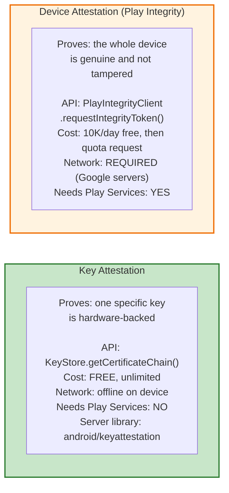
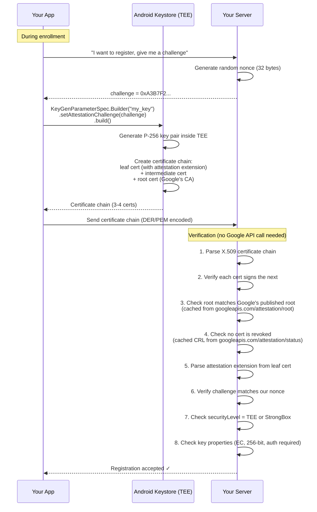
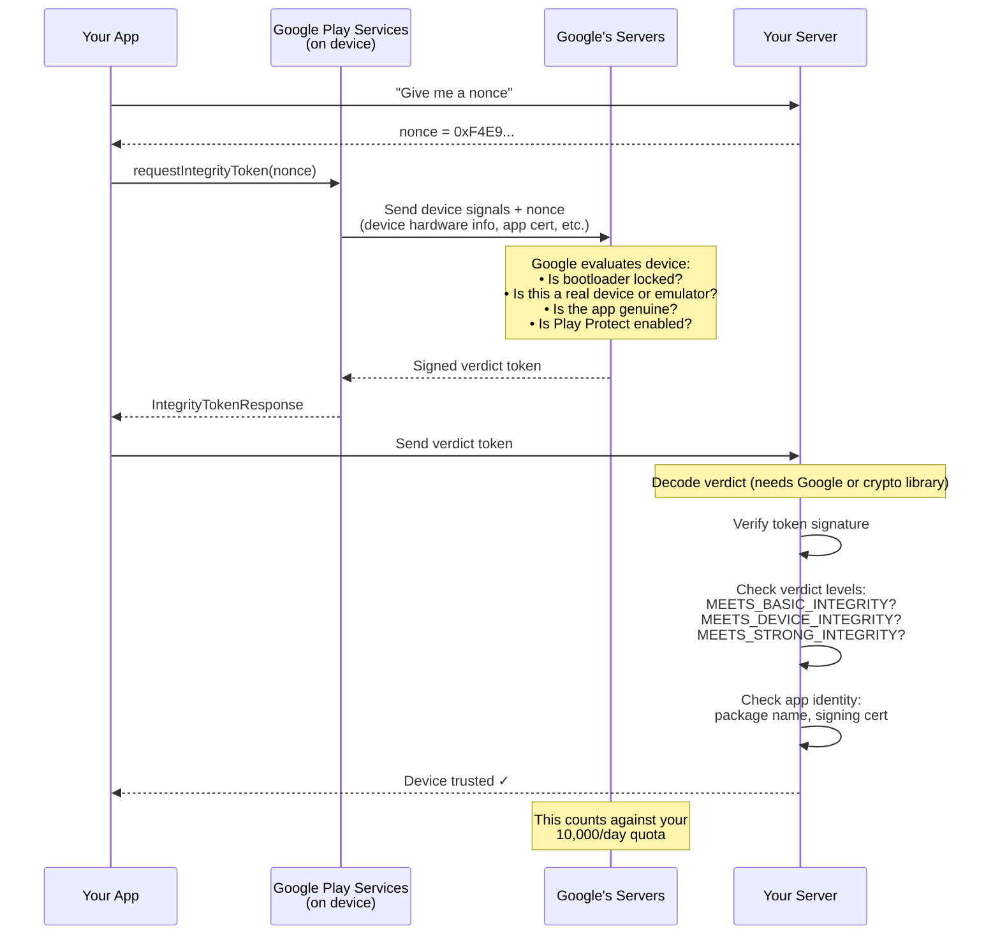
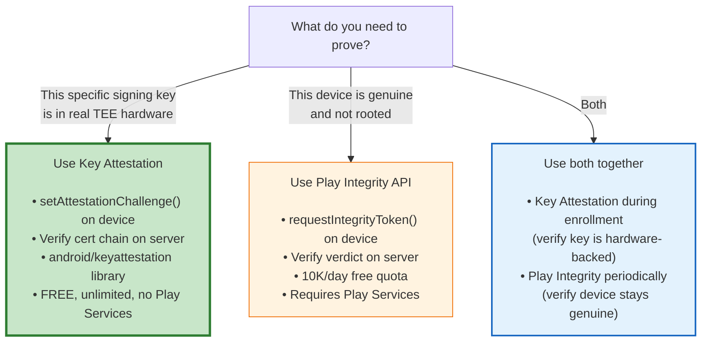

# Key Attestation vs Device Attestation: What's the Difference?

These two terms are often confused. They are **different mechanisms** that prove **different things**.

---

## One-Sentence Definitions

**Key Attestation:** "This specific cryptographic key was generated inside real TEE/StrongBox hardware and has these properties." — Proved by a certificate chain signed by Google's root CA.

**Device Attestation (Play Integrity):** "This device is genuine, not rooted, runs verified Android, and your app is the real one." — Proved by a verdict token from Google's servers.

---

## Side-by-Side Comparison



| Aspect | **Key Attestation** | **Device Attestation (Play Integrity)** |
|---|---|---|
| **What it proves** | This P-256 key is in real TEE, requires biometric, is non-extractable | This device runs verified Android, isn't rooted, has genuine Play Store |
| **Granularity** | **Per-key** — each key has its own attestation | **Per-device** — one verdict for the whole device |
| **Android API** | `KeyGenParameterSpec.setAttestationChallenge()` + `KeyStore.getCertificateChain()` | `PlayIntegrityClient.requestIntegrityToken()` |
| **Cost** | **Free, unlimited, no quota** | **10,000 requests/day free**, then must request quota increase from Google |
| **Network on device** | **Not needed** — certificate generated locally by TEE | **Required** — device must contact Google's servers |
| **Network on your server** | Fetch root certs once (cacheable), fetch CRL periodically | Verify verdict token (may call Google or verify locally) |
| **Needs Google Play Services** | **No** — pure Keystore API | **Yes** — requires Play Services |
| **Works on Huawei** | **Yes** (EMUI, HarmonyOS 2-3) | **No** (no Play Services) |
| **Works on AOSP/custom ROMs** | **Yes** (if TEE is provisioned) | **No** |
| **What server verifies** | X.509 certificate chain → standard crypto, no Google API | Signed verdict token → may need Google API to decode |
| **Can prove key requires biometric** | **Yes** — `userAuthenticationRequired` in attestation extension | **No** — knows nothing about individual keys |
| **Can prove device isn't rooted** | **Partially** — `verifiedBootState` field in extension | **Yes** — primary purpose |
| **Can prove app is genuine** | **No** | **Yes** — includes app signing certificate hash |
| **Minimum Android** | API 24 (7.0), mandatory since API 26 (8.0) | Varies, requires Play Services |
| **Server verification library** | [android/keyattestation](https://github.com/android/keyattestation) (Kotlin, official) | Google Play Integrity API client library |

---

## What Each One Tells Your Server

### Key Attestation — Per-Key Proof

When your server verifies a key attestation certificate chain, it learns:

```
About THIS specific key:
  ✓ Algorithm: EC P-256
  ✓ Security level: TrustedEnvironment (TEE) or StrongBox
  ✓ Key is non-exportable
  ✓ Key requires user authentication (biometric/PIN)
  ✓ Key was generated on-device (not imported)

About the device (from attestation extension):
  ✓ Android OS version (e.g., 16)
  ✓ Security patch level (e.g., May 2026)
  ✓ Verified boot state (locked bootloader = genuine)
  ✓ Device is not an emulator

NOT proven:
  ✗ Whether the app is genuine (could be repackaged)
  ✗ Whether Play Services is present
  ✗ Whether the user has screen lock enabled (beyond key's own auth requirement)
```

### Device Attestation (Play Integrity) — Device-Level Verdict

When your server decodes a Play Integrity verdict, it learns:

```
About the device:
  ✓ MEETS_BASIC_INTEGRITY — device passes basic checks
  ✓ MEETS_DEVICE_INTEGRITY — genuine device with verified Android
  ✓ MEETS_STRONG_INTEGRITY — hardware-backed security + recent patch

About the app:
  ✓ App package name matches
  ✓ App signing certificate matches (not repackaged)
  ✓ App was installed from Play Store (optional check)

NOT proven:
  ✗ Whether any specific key is hardware-backed
  ✗ Whether the key requires biometric
  ✗ Any per-key property at all
```

---

## How Key Attestation Works (The Free One)



**Zero Google API calls.** Your server does standard X.509 certificate verification using the [android/keyattestation](https://github.com/android/keyattestation) Kotlin library. The only network calls are fetching the root certificate list and CRL from Google's public endpoints — both cacheable.

---

## How Device Attestation (Play Integrity) Works (The Quota-Limited One)



**Requires Google Play Services on the device** and **counts against your quota** (10K/day free).

---

## Which Open-Source Projects Support Key Attestation?

| Project | Uses `setAttestationChallenge`? | Attestation type |
|---|---|---|
| **Duo Labs** (android-webauthn-authenticator) | **No** | WebAuthn "none" attestation (no hardware proof) |
| **WIOsense** (rauth-android) | **No** | WebAuthn "none" or "packed-self" (self-signed, no hardware proof) |
| **LINE** (webauthn-kotlin) | Not documented | Unknown |
| **Google Credential Manager** | **Yes** (internally) | Hardware-backed key attestation (since 2024) |

**None of the open-source FIDO2 authenticator libraries we analyzed use Android hardware key attestation.** They all use WebAuthn-level attestation ("none" or self-signed "packed"), which doesn't prove the key is hardware-backed.

This is a significant gap. For a production 2FA authenticator, you should add `setAttestationChallenge()` to the key generation and verify the certificate chain on your server.

---

## Server-Side Verification Libraries

| Library | Language | Purpose | Status |
|---|---|---|---|
| **[android/keyattestation](https://github.com/android/keyattestation)** | Kotlin | **Official** Google library for verifying key attestation certificate chains | **Current — recommended** |
| ~~[google/android-key-attestation](https://github.com/google/android-key-attestation)~~ | Java | Old Google sample for key attestation verification | **Deprecated** — use android/keyattestation instead |
| **[webauthn4j/webauthn4j](https://github.com/webauthn4j/webauthn4j)** | Java | WebAuthn server library — supports "android-key" attestation format | Active, passes FIDO Alliance tests |
| **[webauthn-open-source/fido2-lib](https://github.com/webauthn-open-source/fido2-lib)** | Node.js | WebAuthn server — supports android-safetynet and packed attestation | Active |
| **[lbuchs/WebAuthn](https://github.com/lbuchs/WebAuthn)** | PHP | Lightweight WebAuthn server | Active |

**For your 2FA backend, use [android/keyattestation](https://github.com/android/keyattestation)** — it's the current official Google library, written in Kotlin, includes the 2026 root certificates, and handles edge cases that custom verifiers miss.

---

## What Should You Use for Your 2FA Authenticator?



**For a 2FA authenticator:** Key Attestation is essential (prove the signing key is real). Play Integrity is optional (nice to have but not critical, and has quota limits).

---

## Sources

- [Verify hardware-backed key pairs with key attestation — developer.android.com](https://developer.android.com/privacy-and-security/security-key-attestation)
- [Key and ID attestation — source.android.com](https://source.android.com/docs/security/features/keystore/attestation)
- [android/keyattestation — GitHub (official Google library)](https://github.com/android/keyattestation)
- [Play Integrity API overview — developer.android.com](https://developer.android.com/google/play/integrity/overview)
- [Comparing Key Attestation and Play Integrity API — Mayrhofer 2024](https://www.mayrhofer.eu.org/courses/android-security/selected-paper/2024/Comparing_key_attestation_and_Play_Integrity_API.pdf)
- [Android Device Attestation — Scalefusion](https://blog.scalefusion.com/android-device-attestation/)
- [Device vs App Attestation — Approov](https://approov.io/knowledge/what-is-the-difference-between-device-attestation-and-app-attestation)
- [Google Play Integrity API limitations — Approov](https://approov.io/blog/limitations-of-google-play-integrity-api-ex-safetynet)
