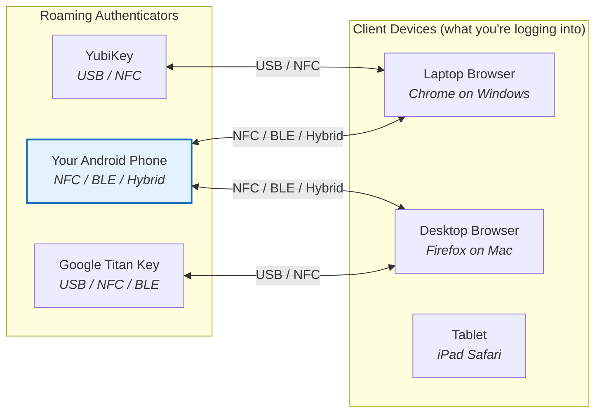
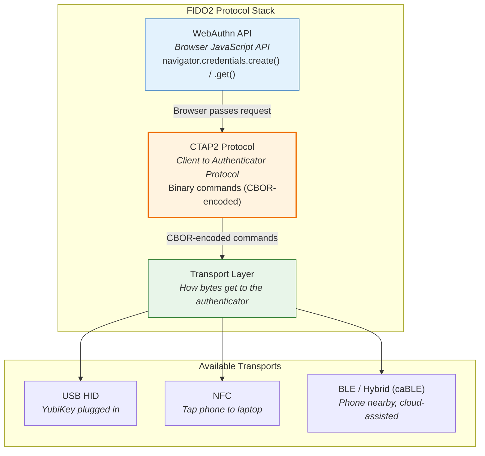
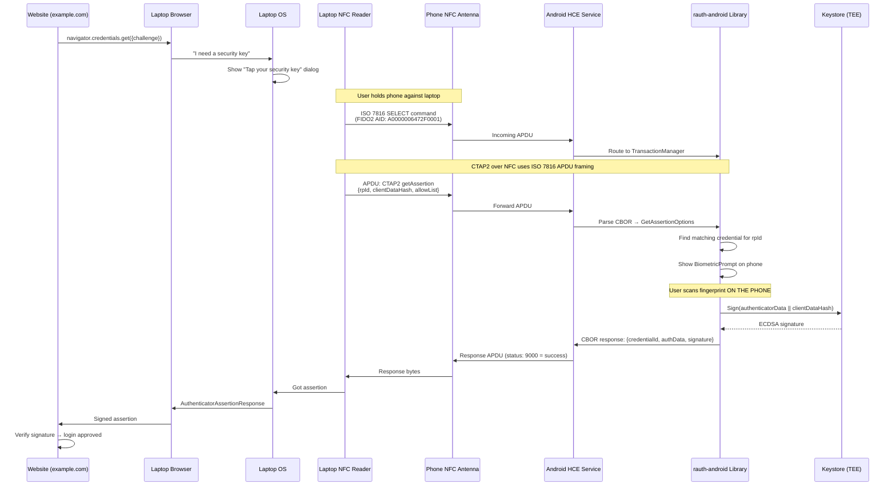
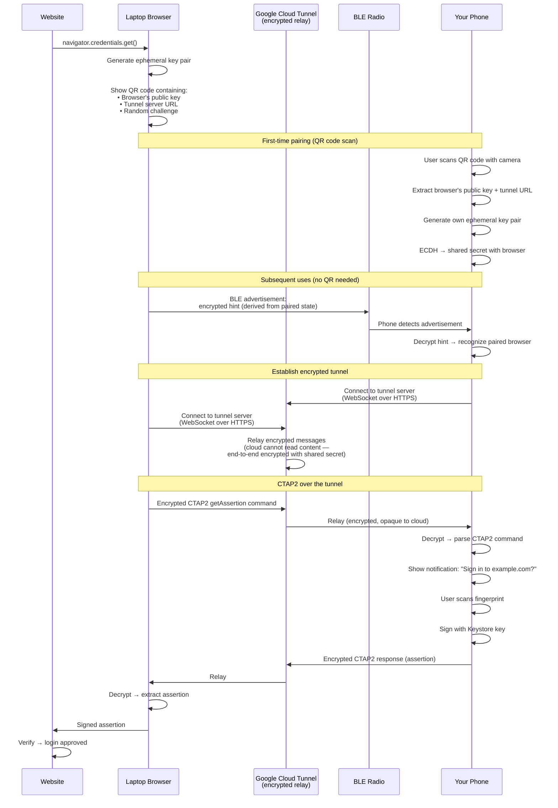
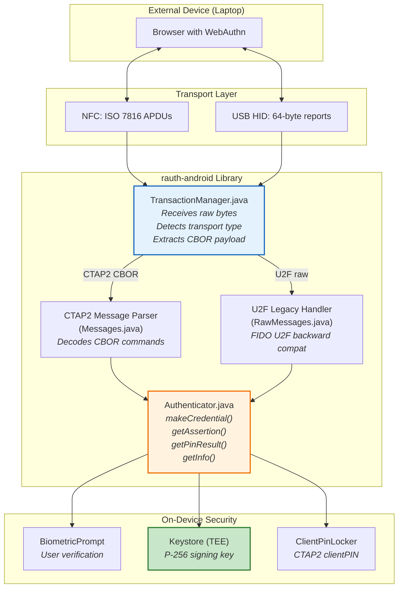
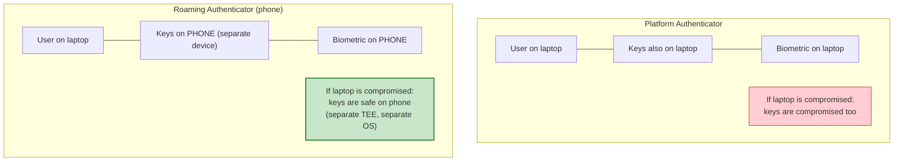

# How a Phone Becomes a Security Key: FIDO2 Roaming Authenticators Explained

## What Is a Roaming Authenticator?

A **roaming authenticator** is a security device that can connect to **multiple client devices** — it "roams" between your laptop, desktop, tablet, etc. You know it as a YubiKey, but your **phone** can be one too.



The contrast is a **platform authenticator** — built into the device you're logging in from (like Face ID on a Mac, or fingerprint on the same Android phone running the browser). A roaming authenticator is **external** — the keys live on a separate device.

---

## The Protocol Stack



**WebAuthn** is the browser-side JavaScript API (what the website calls).
**CTAP2** is the wire protocol between the browser/OS and the authenticator (what your phone speaks).
**Transport** is how CTAP2 messages physically travel (USB, NFC, or BLE).

---

## Transport 1: NFC (Tap to Authenticate)

The simplest transport. Phone acts as an **NFC smartcard** using Android's Host Card Emulation (HCE).

### How It Works



### NFC Message Format

NFC uses **ISO 7816 APDU** (Application Protocol Data Unit) framing — the same smartcard protocol used by credit cards and passports:

```
Command APDU (laptop → phone):
┌─────┬─────┬─────┬─────┬──────┬──────────────────────┬─────┐
│ CLA │ INS │ P1  │ P2  │ Lc   │ Data (CBOR payload)  │ Le  │
│ 1B  │ 1B  │ 1B  │ 1B  │ 1-3B │ variable             │ 0-3B│
└─────┴─────┴─────┴─────┴──────┴──────────────────────┴─────┘

INS = 0x10 → CTAP2 message (CBOR inside)
INS = 0x02 → U2F message (legacy FIDO U2F)

Response APDU (phone → laptop):
┌──────────────────────┬─────┬─────┐
│ Data (CBOR response) │ SW1 │ SW2 │
│ variable             │ 1B  │ 1B  │
└──────────────────────┴─────┴─────┘

SW1=90, SW2=00 → Success
SW1=69, SW2=85 → Conditions not satisfied (user denied)
```

The WIOsense rauth library handles this in `TransactionManager.java` — it receives raw APDUs, extracts the CBOR-encoded CTAP2 command, routes it to `Authenticator.makeCredential()` or `Authenticator.getAssertion()`, and wraps the CBOR response back into an APDU.

### NFC Limitations

- **Range:** ~4 cm — phone must physically touch the laptop
- **Speed:** Slow for large payloads (NFC bandwidth is limited)
- **Framing:** Large CTAP2 messages must be split into chained APDUs
- **Always-on:** No pairing needed, works instantly
- **One-shot:** Tap, authenticate, done. No persistent connection.

---

## Transport 2: BLE / Hybrid (caBLE)

The more complex transport. Used when you authenticate on a laptop by approving on your phone **nearby but not touching**.

### The Problem BLE Solves

NFC requires physical contact. USB requires a cable. What if you want to log in on a laptop and approve on your phone sitting on the desk? That's what BLE is for — but raw Bluetooth pairing is unreliable, so Google created **caBLE (Cloud-Assisted BLE)**, now standardized as the **hybrid transport** in CTAP 2.2.

### How Hybrid/caBLE Works

BLE is used **only for proximity discovery** — to prove your phone is physically nearby. The actual CTAP2 data travels over an **encrypted cloud tunnel** (via Google's servers), not over BLE itself.



### What Goes Where

| Data | Travels over | Why |
|---|---|---|
| QR code content (initial pairing) | Displayed on screen, scanned by camera | One-time setup, no network needed |
| BLE advertisement (subsequent uses) | Bluetooth Low Energy radio (~10m range) | Proves phone is physically nearby |
| CTAP2 commands and responses | **Encrypted cloud tunnel** (Google's relay) | Reliable, fast, handles large payloads |
| Biometric verification | Happens locally on phone (TEE) | Never leaves the phone |

**Key insight:** BLE is NOT used to transport the actual authentication data. It's only a **proximity signal** — proof that your phone is physically near the laptop. The actual crypto payload goes through an end-to-end encrypted tunnel that the cloud relay cannot read.

### Why Not Just Use BLE Directly?

1. **Bandwidth:** BLE is slow — CTAP2 responses can be hundreds of bytes, BLE maxes at ~20 bytes per characteristic
2. **Reliability:** BLE connections are flaky, drop frequently, have pairing issues
3. **Security:** Raw BLE pairing has known MITM vulnerabilities
4. **UX:** BLE pairing requires explicit user action on both devices; caBLE is seamless after first QR scan

---

## Transport 3: USB HID (Traditional Security Key)

Not relevant for phone-as-authenticator (phones don't normally act as USB HID devices), but included for completeness:

```
USB HID framing uses 64-byte reports.
Laptop sends CTAPHID_MSG containing CBOR.
Security key responds with CTAPHID_MSG containing CBOR response.
Standard for YubiKey, Titan, SoloKeys, etc.
```

---

## What WIOsense rauth Actually Implements

The rauth library implements the **authenticator side** — it receives CTAP2 commands (via NFC APDUs or HID frames) and produces responses.



### TransactionManager: The Transport Router

`TransactionManager.java` is the entry point. It receives raw bytes from whichever transport layer is active (NFC HCE service, or USB HID bridge) and:

1. **Detects protocol:** Is this a CTAP2 command (CBOR) or a legacy U2F command (raw bytes)?
2. **Handles HID framing:** For USB/BLE HID, reassembles multi-report messages (64-byte chunks) into complete CTAP2 commands
3. **Routes to authenticator:** Passes decoded options to `Authenticator.makeCredential()`, `getAssertion()`, `getPinResult()`, or `getInfo()`
4. **Packages response:** Wraps CBOR response back into APDUs or HID reports for transmission

---

## Complete End-to-End Example: Logging into a Website

### Scenario: User logs into `example.com` on laptop, authenticates on phone via NFC

```mermaid
sequenceDiagram
    participant User
    participant Website as example.com
    participant Browser as Laptop Chrome
    participant Phone as Android Phone<br/>(rauth-android)
    participant TEE as Phone TEE

    Note over User,TEE: STEP 1: Website initiates login

    User->>Website: Click "Sign in"
    Website->>Website: Generate random challenge (32 bytes)
    Website->>Browser: navigator.credentials.get({<br/>  publicKey: {<br/>    challenge: <32 bytes>,<br/>    rpId: "example.com",<br/>    allowCredentials: [{id: <credId>}],<br/>    userVerification: "required"<br/>  }<br/>})

    Note over User,TEE: STEP 2: Browser looks for authenticator

    Browser->>Browser: Show "Use your security key" dialog
    Browser->>Browser: Listen for NFC tap / BLE / USB

    Note over User,TEE: STEP 3: User taps phone to laptop

    User->>Phone: Hold phone against laptop NFC reader

    Note over User,TEE: STEP 4: CTAP2 over NFC

    Browser->>Phone: APDU: authenticatorGetAssertion<br/>{rpId: "example.com",<br/> clientDataHash: SHA256(clientData),<br/> allowList: [{id: <credId>}]}

    Phone->>Phone: TransactionManager receives APDU
    Phone->>Phone: Parse CBOR → GetAssertionOptions
    Phone->>Phone: Look up credential by rpId

    Note over User,TEE: STEP 5: User verification on phone

    Phone->>User: Show BiometricPrompt:<br/>"Sign in to example.com"
    User->>Phone: Scan fingerprint
    Phone->>TEE: Verify fingerprint in TEE
    TEE-->>Phone: Auth token (HardwareAuthToken)

    Note over User,TEE: STEP 6: Sign on phone

    Phone->>TEE: Signature.initSign(privateKey)
    TEE-->>Phone: Signature ready (auth token valid)
    Phone->>Phone: authenticatorData = SHA256("example.com")<br/>  + flags(UP=1, UV=1) + counter(4 bytes)
    Phone->>Phone: toSign = authenticatorData + clientDataHash
    Phone->>TEE: signature.update(toSign); signature.sign()
    TEE-->>Phone: ECDSA signature (DER encoded)

    Note over User,TEE: STEP 7: Response back via NFC

    Phone->>Browser: Response APDU:<br/>{credentialId, authenticatorData,<br/> signature, userHandle}

    Note over User,TEE: STEP 8: Browser forwards to website

    Browser->>Website: AuthenticatorAssertionResponse
    Website->>Website: Look up public key for credentialId
    Website->>Website: Verify ECDSA signature over<br/>(authenticatorData + clientDataHash)
    Website->>Website: Check counter > last seen counter
    Website->>Website: Check UV flag = 1 (user verified)
    Website->>Website: All checks pass → LOGIN APPROVED
    Website->>User: "Welcome back!"
```

---

## How This Differs from a YubiKey

| Aspect | YubiKey | Phone (rauth-android) |
|---|---|---|
| Key storage | Dedicated secure element (on the YubiKey chip) | Android Keystore (TEE or StrongBox) |
| User verification | Touch the metal contact (presence only) or PIN | Fingerprint / face / device PIN / CTAP2 clientPIN |
| Transport | USB HID + NFC | NFC + BLE/Hybrid |
| Battery | None (powered by USB/NFC) | Phone battery |
| Cost | $25-$75 per key | Free (use existing phone) |
| Attestation | Yubico-signed certificate (device-specific) | Android Key Attestation (Google-signed) or "none" |
| Cross-device | Works with any computer with USB/NFC | Works with any device with NFC/BLE |
| Lost device | Buy a new YubiKey, re-register | Factory reset phone, re-register |
| Side-channel resistance | Dedicated secure element (very high) | TEE (high) or StrongBox (very high) |

---

## Why Would You Use This Instead of a Platform Authenticator?

**Platform authenticator** = keys stored on the same device you're logging in from (e.g., fingerprint on your Android phone to log into a site in Chrome on that same phone).

**Roaming authenticator** = keys stored on a **different** device (e.g., keys on your phone, logging in on your laptop).



The security advantage: even if the laptop has malware, the signing key is on the phone's TEE. The laptop never sees the private key — it only receives the signed assertion. Malware on the laptop can't extract the key or forge signatures.

---

## Sources

- [CTAP2 Specification — FIDO Alliance](https://fidoalliance.org/specs/fido-v2.1-ps-20210615/fido-client-to-authenticator-protocol-v2.1-ps-20210615.html)
- [WIOsense/rauth-android — GitHub](https://github.com/WIOsense/rauth-android)
- [WebAuthn vs CTAP vs FIDO2: Key Differences — Corbado](https://www.corbado.com/blog/webauthn-vs-ctap-vs-fido2)
- [Smartphone as FIDO2 Roaming Authenticator via BLE — Chuni Lal Kukreja](https://medium.com/@chunilalkukreja/smartphone-as-a-fido2-roaming-authenticator-via-ble-8002d0209747)
- [What does caBLE have to do with passkeys — Good Sign-In](https://www.goodsignin.com/blog/what-does-cable-have-to-do-with-passkeys)
- [Chrome caBLE v2 preview — Matt Miller](https://blog.millerti.me/2021/06/18/previewing-chromes-cable-v2-support-for-webauthn/)
- [FIDO2 API for Android — Google Developers](https://developers.google.com/identity/fido/android/native-apps)
