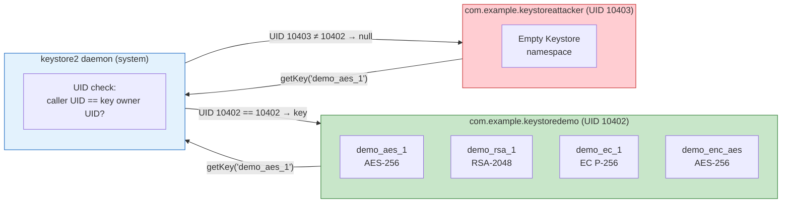
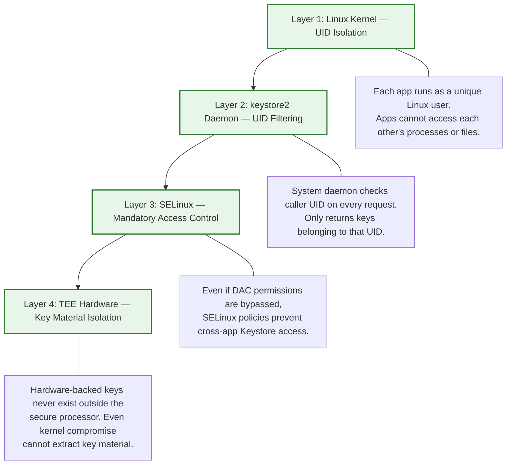
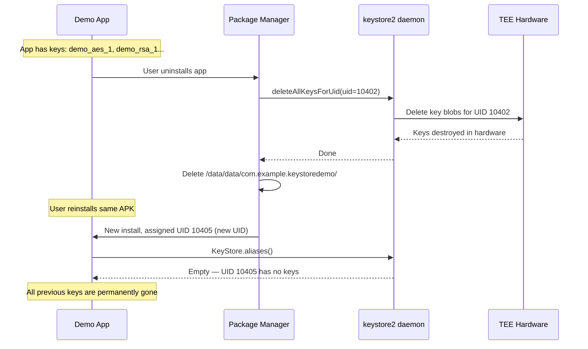
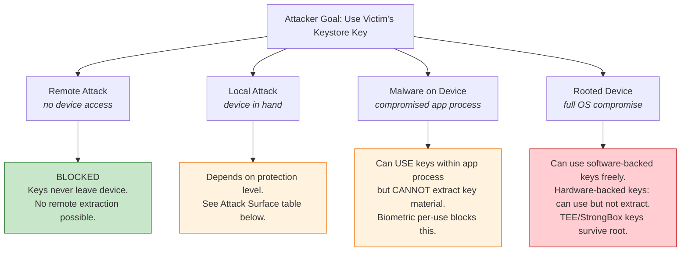
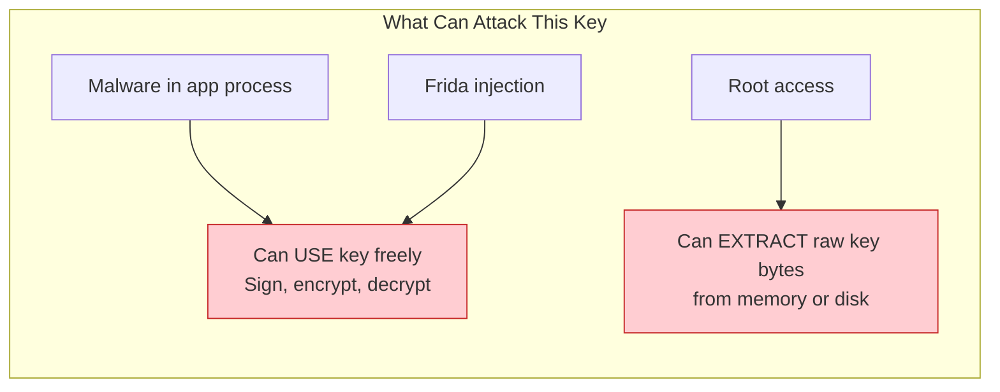
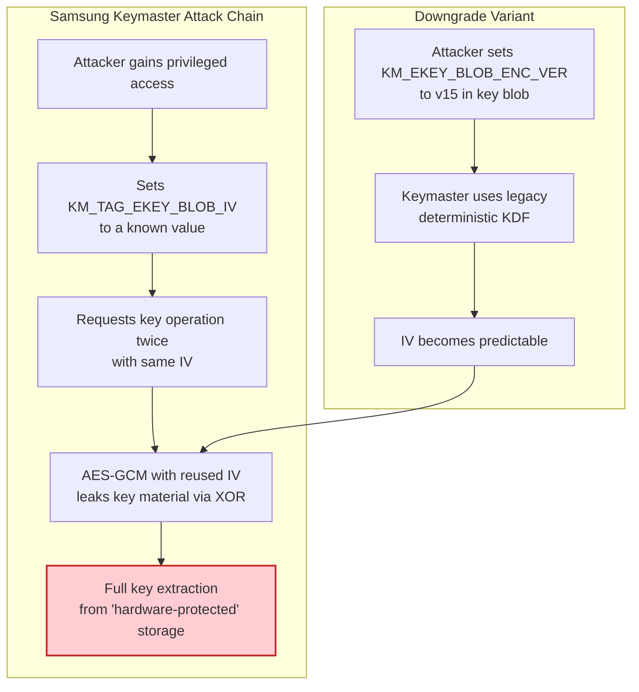
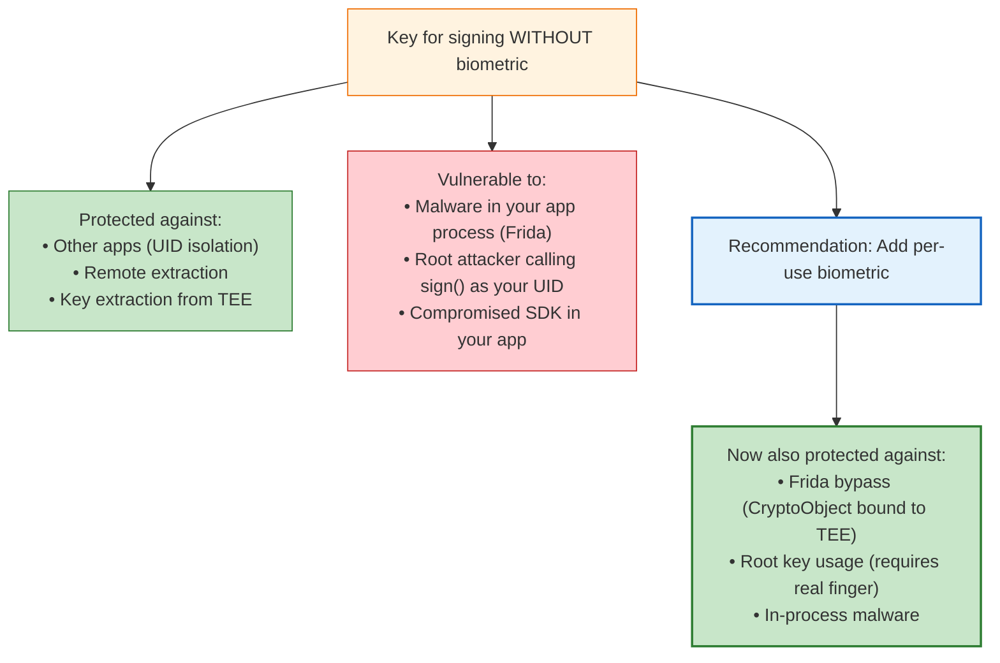

# Android Keystore Security Analysis: App Isolation, Attack Vectors & Key Protection

## Table of Contents

- [1. Can Another App Use Your Keys?](#1-can-another-app-use-your-keys)
- [2. What Happens on Uninstall/Reinstall?](#2-what-happens-on-uninstallreinstall)
- [3. Attack Vectors Against Android Keystore](#3-attack-vectors-against-android-keystore)
- [4. Attack Surface by Protection Level](#4-attack-surface-by-protection-level)
- [5. Real-World Vulnerabilities (CVEs)](#5-real-world-vulnerabilities-cves)
- [6. Defense Recommendations](#6-defense-recommendations)
- [7. Sources & References](#7-sources--references)

---

## 1. Can Another App Use Your Keys?

### Tested: No — Complete UID-Based Isolation

We built a second app (`com.example.keystoreattacker`) and ran 7 different attacks against keys created by the demo app (`com.example.keystoredemo`). Every attack failed.

### Test Results



| Attack | Technique | Result |
|---|---|---|
| **1. Enumerate aliases** | `KeyStore.aliases()` | **Empty list.** Victim's keys are invisible. Each app sees only its own namespace. |
| **2. Access by known alias** | `KeyStore.getEntry("demo_aes_1", null)` for 9 known aliases | **All returned `null`.** Even knowing exact alias names doesn't help — the `keystore2` daemon filters by caller UID. |
| **3. Use victim's AES key** | `KeyStore.getKey("demo_enc_aes", null)` + `Cipher.init()` | **`getKey()` returned `null`.** Cannot encrypt, decrypt, or use the key in any way. |
| **4. Sign with victim's RSA key** | `KeyStore.getKey("demo_sign_rsa", null)` + `Signature.initSign()` | **`getKey()` returned `null`.** Cannot sign anything. Even the public key certificate is inaccessible. |
| **5. Same alias collision** | Create own key named `demo_enc_aes` | **Creates a DIFFERENT key.** Same alias, different namespace. Our key cannot decrypt their data. |
| **6. Read SharedPreferences file** | `File("/data/data/com.example.keystoredemo/shared_prefs/...")` | **Permission denied.** Filesystem sandbox blocks access. Even if readable, values are AES-256-GCM encrypted with a key in the victim's Keystore namespace. |
| **7. Brute-force aliases** | Try 20 common alias patterns | **0 hits from victim.** Brute-forcing is useless — isolation is at UID level, not alias level. |

### Why It's Impossible

Isolation is enforced at **four layers**:



> "Key material never enters the application process. When an app performs cryptographic operations using an Android Keystore key, behind the scenes plaintext, ciphertext, and messages to be signed or verified are fed to a system process that carries out the cryptographic operations."
> — [Android Keystore system, developer.android.com](https://developer.android.com/privacy-and-security/keystore)

### Key Difference from iOS

iOS Keychain supports **cross-app sharing** via access groups — apps from the same developer can share secrets. Android has **no equivalent**. Each app is completely isolated, even from other apps signed with the same certificate.

---

## 2. What Happens on Uninstall/Reinstall?

### Tested: Keys Are Destroyed

We performed this test on the Moto G86 5G:

1. Generated 4 keys in Demo app (AES, RSA, EC, HMAC)
2. Verified they exist in Key Inspector
3. Uninstalled Demo app: `adb uninstall com.example.keystoredemo`
4. Reinstalled exact same APK: `adb install app-debug.apk`
5. Opened Key Inspector → **"No keys found"**



### Why Keys Don't Survive Reinstall

> "When uninstalling a package, the package manager informs the keystore of its UID so that it can delete keys belonging to it, which prevents the keystore from leaking keys owned by one app to another app that is installed later and coincidentally assigned the same UID."
> — [Android Keystore key leakage analysis, jbp.io](https://jbp.io/2014/04/07/android-keystore-leak.html)

### Could a Same-Package-Name App Read Old Keys?

**No.** Three reasons:

1. **Keys are deleted during uninstall.** The `keystore2` daemon actively destroys all key blobs for the uninstalled UID. There's nothing left to read.
2. **New UID on reinstall.** Android may assign a different UID on reinstall. Even if the same UID were reused, the keys were already deleted.
3. **Signing certificate check.** Android prevents installing a package with the same name but different signing certificate. So a malicious app can't impersonate another app's package name unless it has the same signing key.

### Implication for Attackers

An attacker who:
- Convinces the user to uninstall the legitimate app
- Installs a malicious app with the same package name (impossible without the same signing key)
- Even if they somehow achieve this: the keys were already destroyed during uninstall

**This is different from iOS**, where Keychain data survives uninstall by default.

---

## 3. Attack Vectors Against Android Keystore

This is the critical section. The Keystore **prevents key extraction**, but **not necessarily key usage**. The threat model depends heavily on the protection level applied to the key.

### Attack Taxonomy



### Attack Vector 1: Frida Hooking (Compromised App Process)

**Threat level: HIGH for unprotected keys, LOW for crypto-bound keys**

[Frida](https://frida.re/) is a dynamic instrumentation toolkit that can inject JavaScript into running processes. On a rooted device (or debuggable app), an attacker can hook into the app's process and manipulate Keystore operations.

**Attack on keys WITHOUT biometric protection:**

```javascript
// Frida script: use victim app's unprotected Keystore key
Java.perform(function() {
    var KeyStore = Java.use('java.security.KeyStore');
    var ks = KeyStore.getInstance('AndroidKeyStore');
    ks.load(null);

    // List all keys (within the app's own namespace)
    var aliases = ks.aliases();
    while (aliases.hasMoreElements()) {
        console.log("Found key: " + aliases.nextElement());
    }

    // Use the key for signing without any authentication
    var key = ks.getKey("signing_key", null);
    var Signature = Java.use('java.security.Signature');
    var sig = Signature.getInstance("SHA256withRSA");
    sig.initSign(key);  // Works! No auth required.
    sig.update(Java.array('byte', [0x41, 0x42, 0x43]));
    var signed = sig.sign();
    console.log("Signed data with victim's key!");
});
```

**Historical (2019):** WithSecure Labs found "70% of assessed apps were unlocked without a valid fingerprint" ([source](https://labs.withsecure.com/publications/how-secure-is-your-android-keystore-authentication)). **Current (2025):** A [KeyDroid study](https://arxiv.org/html/2507.07927v1) of 490,119 apps found 56.3% of apps collecting sensitive data still don't use trusted hardware. The Frida bypass still works if the app doesn't validate CryptoObject.

**Attack on keys WITH biometric (non-CryptoObject):**

If the app uses `BiometricPrompt` but doesn't use `CryptoObject`, the attacker can simply call the success callback:

```javascript
// Bypass biometric by directly calling onAuthenticationSucceeded
Java.perform(function() {
    var BiometricPrompt = Java.use('androidx.biometric.BiometricPrompt');
    BiometricPrompt.authenticate.overload(
        'androidx.biometric.BiometricPrompt$PromptInfo'
    ).implementation = function(info) {
        // Don't actually authenticate — just call the success callback
        // with a null CryptoObject
        this.mAuthenticationCallback.value.onAuthenticationSucceeded(
            /* fabricated result with null CryptoObject */
        );
    };
});
```

**This bypass FAILS against per-use CryptoObject keys (timeout=0):**

When the key requires `CryptoObject`, the `Cipher` object is bound to the biometric session inside the TEE. The attacker cannot fabricate a valid `CryptoObject` because the authentication happens in hardware. Calling `onAuthenticationSucceeded` with a null or fake `CryptoObject` means the cipher is unauthenticated and will throw an exception when used.

### Attack Vector 2: Root Access / Privileged Process

**Threat level: HIGH for software-backed keys, MEDIUM for TEE, LOW for StrongBox**

On a rooted device, the attacker has full access to the app's process memory and can interact with the Keystore daemon directly.

| Key Storage | Root Can Extract Key? | Root Can USE Key? |
|---|---|---|
| Software-backed (`SECURITY_LEVEL_SOFTWARE`) | **YES** — key material in `/data/misc/keystore/` or app memory | **YES** — freely |
| TEE-backed (`SECURITY_LEVEL_TRUSTED_ENVIRONMENT`) | **NO** — key material inside TrustZone | **YES** — can call Keystore APIs as the app's UID |
| StrongBox-backed (`SECURITY_LEVEL_STRONGBOX`) | **NO** — dedicated secure element | **YES** — but more resistant to side-channel attacks |

> "The Keystore prevents key extraction, not key usage."
> — [Guardsquare, "Hardware-Backed Keys for Android Apps"](https://www.guardsquare.com/blog/android-keystore)

**What root access enables:**

```
Root attacker with access to app's UID:
  1. Can enumerate all Keystore aliases for the app
  2. Can call Cipher.init() / Signature.initSign() with any unprotected key
  3. Can sign arbitrary data, decrypt stored data, generate MACs
  4. CANNOT extract hardware-backed key material
  5. CAN be blocked by biometric per-use auth (timeout=0)
```

### Attack Vector 3: Side-Channel Attacks on TEE

**Threat level: LOW (requires physical access + lab equipment)**

Academic researchers have demonstrated that TEE implementations can leak key material through:

- **Timing attacks**: Measuring operation duration to infer key bits
- **Power analysis**: Monitoring power consumption during crypto operations
- **Electromagnetic emanation**: Reading EM signals from the processor

StrongBox (dedicated secure element) is significantly more resistant to these attacks because it runs on a separate chip with its own power supply.

### Attack Vector 4: Vendor-Specific Implementation Flaws

**Threat level: CRITICAL when present, patched quickly**

The most severe real-world Keystore attacks exploited vendor implementation bugs, not the Keystore design itself. See [Section 5](#5-real-world-vulnerabilities-cves).

### Attack Vector 5: Backup & Restore

**Threat level: MEDIUM if auto-backup is enabled**

If an app enables `android:allowBackup="true"` (the default), the app's data can be backed up via `adb backup` or Google Cloud backup. However:

- Keystore keys are **NOT included** in backups — they are device-bound
- EncryptedSharedPreferences files may be backed up, but they're encrypted with a Keystore key that doesn't exist in the backup
- Restored data is unreadable without the original Keystore key

---

## 4. Attack Surface by Protection Level

This is the key table. It shows exactly what an attacker can do depending on how you configured the key.

### Key Without ANY Protection (No Auth, Software-Backed)



### Full Comparison

| Protection Level | Another App | Malware in Process | Frida Hook | Root (TEE key) | Root (Software key) | Physical + Lab |
|---|---|---|---|---|---|---|
| **No auth, software-backed** | Blocked (UID) | **USE + EXTRACT** | **USE + EXTRACT** | **USE + EXTRACT** | **USE + EXTRACT** | **EXTRACT** |
| **No auth, TEE-backed** | Blocked | **USE only** | **USE only** | **USE only** | N/A | Side-channel risk |
| **Biometric, timeout=30s** (no CryptoObject) | Blocked | **Bypassable** via Frida callback hook | **Bypassable** | **USE only** (after faking auth) | N/A | Side-channel risk |
| **Biometric, timeout=0 + CryptoObject** | Blocked | **BLOCKED** — cipher bound to TEE session | **BLOCKED** | **BLOCKED** — requires real biometric | N/A | Side-channel risk |
| **StrongBox + CryptoObject** | Blocked | **BLOCKED** | **BLOCKED** | **BLOCKED** | N/A | **Highly resistant** |

### The Critical Insight

> A key without biometric protection (or with time-based biometric that doesn't use CryptoObject) can be **used for signing by any code running in the app's process**. This includes malware that gains code execution via a WebView exploit, a compromised SDK, or a supply-chain attack.

> Only **per-use biometric with CryptoObject (timeout=0)** provides protection against in-process attackers, because the TEE itself verifies the biometric and binds the crypto operation to that specific authentication event.

---

## 5. Real-World Vulnerabilities (CVEs)

### Samsung TrustZone Keymaster Flaws (2022)

The most significant real-world attack on Android Keystore was discovered by researchers at Tel Aviv University, affecting **100 million Samsung Galaxy phones**.

**CVE-2021-25444 — IV Reuse Attack:**
- Affected: Galaxy S9, J3 Top, J7 Top, TabS4, A6 Plus, A9S
- The Samsung Keymaster Trusted Application (TA) used a predictable IV for AES-GCM encryption of key blobs
- An attacker with privileged access could set the IV, causing IV reuse which completely breaks AES-GCM
- Result: **full extraction of hardware-protected key material**

**CVE-2021-25490 — Downgrade Attack:**
- Affected: Galaxy S10, S20, S21
- Samsung patched the IV reuse bug but left legacy code (v15 encryption) in the Keymaster TA
- An attacker could force a downgrade to the vulnerable v15 scheme
- Result: **full extraction of hardware-protected keys even on patched devices**



> "An IV reuse attack on AES-GCM allows attackers to extract hardware-protected key material. A downgrade attack makes even the latest Samsung devices vulnerable."
> — [Shakevsky et al., "Trust Dies in Darkness: Shedding Light on Samsung's TrustZone Keymaster Design"](https://eprint.iacr.org/2022/208.pdf)

**Impact:**
- Working FIDO2 WebAuthn login bypass
- Compromise of Google's Secure Key Import
- Patched in Samsung security updates August 2021 and October 2021

**Tool:** [keybuster](https://github.com/shakevsky/keybuster) — research tool to reproduce the attacks.

### Qualcomm TEE Side-Channel (2019)

Researchers demonstrated ECDSA private key extraction from Qualcomm's TrustZone via cache-timing side channels during signature operations. Required physical access and sophisticated timing equipment.

### Key Takeaway from CVEs

The Keystore **design** is sound. All major CVEs were **vendor implementation bugs**:
- Samsung used AES-GCM incorrectly (IV reuse)
- Qualcomm had side-channel leaks in crypto routines
- The Android Keystore API and architecture itself were not at fault

These bugs were patched, but they demonstrate that "hardware-backed" is not a binary guarantee — it depends on the quality of the TEE implementation.

---

## 6. Defense Recommendations

### For Signing Keys (Your Original Question)

If you create a key for signing **without biometric protection**, here's what's at risk:



### Protection Level Decision Matrix

| Use Case | Recommended Protection | Why |
|---|---|---|
| Encrypting cached data | No auth, TEE-backed | Low-value, needs background access |
| Storing API tokens | EncryptedSharedPreferences | Not crypto keys, just secrets |
| User login token signing | Biometric OR Credential, timeout=30s | Balances security and UX |
| Payment authorization | **Per-use biometric + CryptoObject** | Prevents all in-process attacks |
| Document signing (legal) | **Per-use biometric + CryptoObject + StrongBox** | Maximum protection |
| FIDO2/WebAuthn | **Per-use biometric + CryptoObject** (standard requires it) | Spec mandates it |

### Code: Maximum Protection Signing Key

```kotlin
// Generate: StrongBox + per-use biometric
val keyGen = KeyPairGenerator.getInstance(
    KeyProperties.KEY_ALGORITHM_EC, "AndroidKeyStore"
)
keyGen.initialize(
    KeyGenParameterSpec.Builder("secure_signing_key",
        KeyProperties.PURPOSE_SIGN or KeyProperties.PURPOSE_VERIFY
    )
    .setDigests(KeyProperties.DIGEST_SHA256)
    .setKeySize(256)
    .setUserAuthenticationRequired(true)
    .setUserAuthenticationParameters(0, KeyProperties.AUTH_BIOMETRIC_STRONG)
    .setIsStrongBoxBacked(true)  // Dedicated secure element
    .setInvalidatedByBiometricEnrollment(true)  // Destroy if fingerprint changes
    .build()
)
val keyPair = keyGen.generateKeyPair()

// Use: must pass Cipher through BiometricPrompt.CryptoObject
val signature = Signature.getInstance("SHA256withECDSA")
signature.initSign(keyPair.private)

val cryptoObject = BiometricPrompt.CryptoObject(signature)
biometricPrompt.authenticate(promptInfo, cryptoObject)

// In callback — ONLY the authenticated signature can be used
override fun onAuthenticationSucceeded(result: AuthenticationResult) {
    val authedSig = result.cryptoObject!!.signature!!
    authedSig.update(documentToSign)
    val signatureBytes = authedSig.sign()  // One use only
}
```

### OWASP Recommendations Summary

From the [OWASP Mobile Application Security Testing Guide](https://mas.owasp.org/MASTG/knowledge/android/MASVS-STORAGE/MASTG-KNOW-0043/):

1. **Always use hardware-backed KeyStore** when available
2. **Bind sensitive keys to biometric authentication**
3. **Use `setInvalidatedByBiometricEnrollment(true)`** to destroy keys if biometrics change
4. **Use Key Attestation** to verify keys are genuinely hardware-backed
5. **Implement CryptoObject binding** for high-value operations
6. **Layer defenses**: Keystore + code obfuscation + runtime integrity checks (RASP)

---

## 7. Sources & References

### Official Documentation
- [Android Keystore system — developer.android.com](https://developer.android.com/privacy-and-security/keystore)
- [Hardware-backed Keystore — source.android.com](https://source.android.com/docs/security/features/keystore)
- [Keystore Features — source.android.com](https://source.android.com/docs/security/features/keystore/features)
- [Key and ID Attestation — source.android.com](https://source.android.com/docs/security/features/keystore/attestation)
- [Android Cryptography — developer.android.com](https://developer.android.com/privacy-and-security/cryptography)
- [Hardware Security Best Practices — source.android.com](https://source.android.com/docs/security/best-practices/hardware)

### Security Research & Attack Techniques
- [WithSecure Labs — "How Secure is your Android Keystore Authentication?" (2019)](https://labs.withsecure.com/publications/how-secure-is-your-android-keystore-authentication) — Frida bypass techniques
- [KeyDroid — Large-Scale Analysis of Secure Key Storage in Android Apps (2025)](https://arxiv.org/html/2507.07927v1) — 490K apps analyzed, 56.3% don't use trusted hardware
- [Guardsquare — "Hardware-Backed Keys for Android Apps"](https://www.guardsquare.com/blog/android-keystore) — Key extraction vs key usage attacks, protection levels
- [Shakevsky et al. — "Trust Dies in Darkness: Samsung TrustZone Keymaster Design"](https://eprint.iacr.org/2022/208.pdf) — CVE-2021-25444, CVE-2021-25490, 100M Samsung phones
- [keybuster — Samsung Keymaster exploit tool](https://github.com/shakevsky/keybuster)
- [WithSecure — android-keystore-audit Frida scripts](https://github.com/WithSecureLABS/android-keystore-audit)
- [KeyDroid — Large-Scale Analysis of Secure Key Storage in Android Apps](https://arxiv.org/html/2507.07927v1) — 490K apps analyzed, 56.3% don't use hardware-backed storage

### OWASP & Industry Standards
- [OWASP MASTG — Android KeyStore (MASTG-KNOW-0043)](https://mas.owasp.org/MASTG/knowledge/android/MASVS-STORAGE/MASTG-KNOW-0043/)
- [Kayssel — Securing Biometric Authentication: Defending Against Frida Bypass](https://www.kayssel.com/post/android-8/)
- [SEC Consult — Bypassing Android Biometric Authentication](https://sec-consult.com/blog/detail/bypassing-android-biometric-authentication/)

### CVEs Referenced
- **CVE-2021-25444** — Samsung Keymaster IV reuse (August 2021 patch)
- **CVE-2021-25490** — Samsung Keymaster downgrade attack (October 2021 patch)

### Vulnerability Disclosure & News
- [The Hacker News — 100 Million Samsung Galaxy Phones Affected](https://thehackernews.com/2022/02/100-million-samsung-galaxy-phones.html)
- [Android Keystore key leakage between security domains](https://jbp.io/2014/04/07/android-keystore-leak.html) — UID isolation and uninstall behavior
