# WIOsense rauth-android: ClientPIN Implementation Analysis

**Repo:** [WIOsense/rauth-android](https://github.com/WIOsense/rauth-android)

This is a FIDO2 roaming authenticator that turns an Android phone into a security key (via NFC/BLE). It implements the CTAP2 clientPIN protocol as an alternative to biometric authentication. This analysis traces how clientPIN works end-to-end and evaluates its security.

---

## Architecture Overview

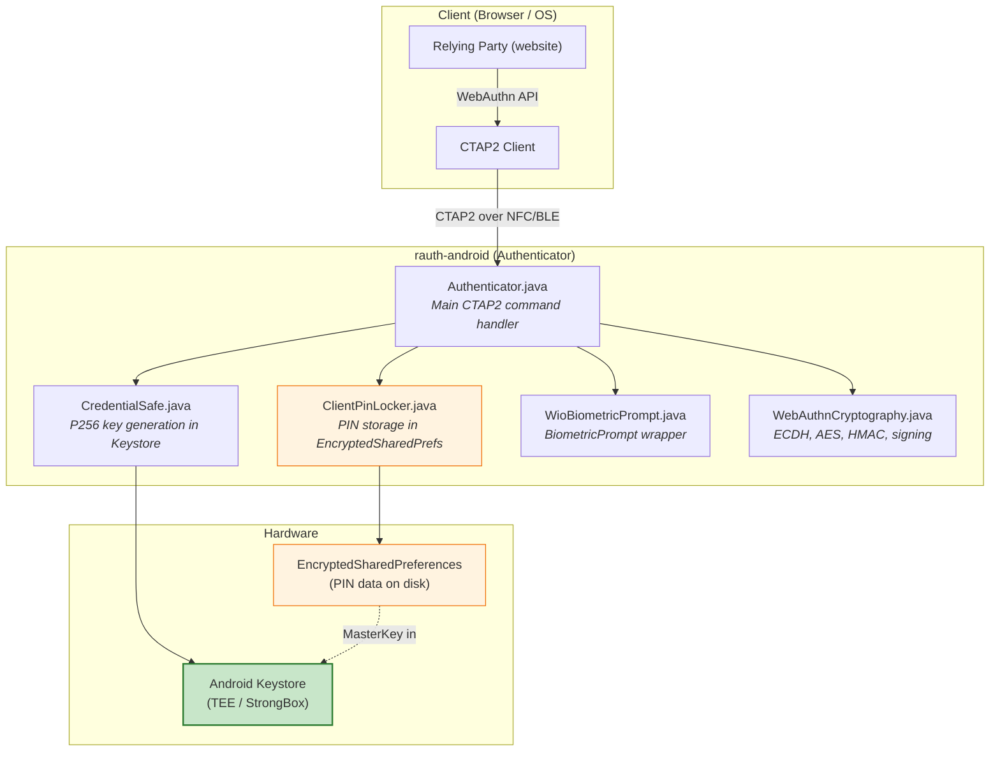

---

## 1. How ClientPIN Is Stored

**File:** `util/ClientPinLocker.java`

### Storage Architecture

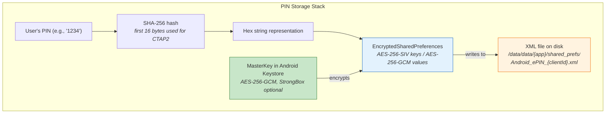

### What's Stored in EncryptedSharedPreferences

| Field | Key | Value | Purpose |
|---|---|---|---|
| PIN hash | `PIN-SHA256` | Hex-encoded first 16 bytes of SHA-256(PIN) | PIN verification |
| Retry counter | `RETRIES` | Long (0-8) | Brute-force protection |
| PIN token | `TOKEN` | Hex-encoded 16 random bytes | HMAC key for pinAuth |

### MasterKey Configuration

```java
// ClientPinLocker.java lines 71-82
KeyGenParameterSpec keySpec = new KeyGenParameterSpec.Builder(
        cpkAlias,
        KeyProperties.PURPOSE_ENCRYPT | KeyProperties.PURPOSE_DECRYPT)
    .setBlockModes(KeyProperties.BLOCK_MODE_GCM)
    .setKeySize(256)
    .setUserAuthenticationRequired(false)   // ← No biometric/PIN gate on the MasterKey itself
    .setRandomizedEncryptionRequired(true)
    .setEncryptionPaddings(KeyProperties.ENCRYPTION_PADDING_NONE)
    .setIsStrongBoxBacked(strongboxRequired)
    .setUnlockedDeviceRequired(true)        // ← Only works when device is unlocked
    .build();
```

**Key observation:** The MasterKey that protects the PIN storage is **not** protected by user authentication. Any code running in the app's process on an unlocked device can read the EncryptedSharedPreferences.

---

## 2. The CTAP2 ClientPIN Protocol: All 5 Subcommands

The clientPIN protocol establishes a secure channel between the CTAP2 client and the authenticator using ECDH key agreement, then uses that channel to exchange PINs and obtain a `pinToken` for subsequent operations.

**File:** `Authenticator.java`, method `getPinResult()` (lines 576-690)

### Subcommand 1: getRetries

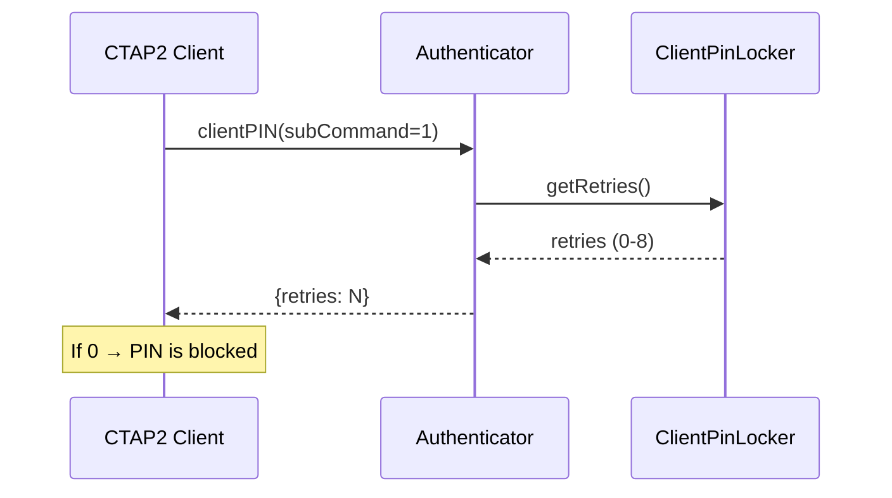

Returns current retry count. No authentication needed. Client checks if PIN is blocked before prompting user.

### Subcommand 2: getKeyAgreement

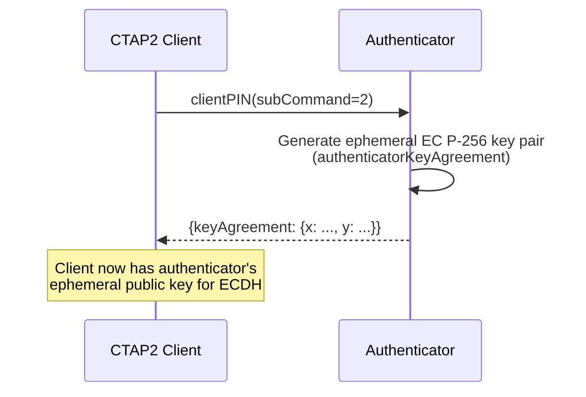

Returns the authenticator's ephemeral P-256 public key. Client will use this with its own ephemeral key to compute a shared secret via ECDH.

### Subcommand 3: setPIN (First-Time Setup)

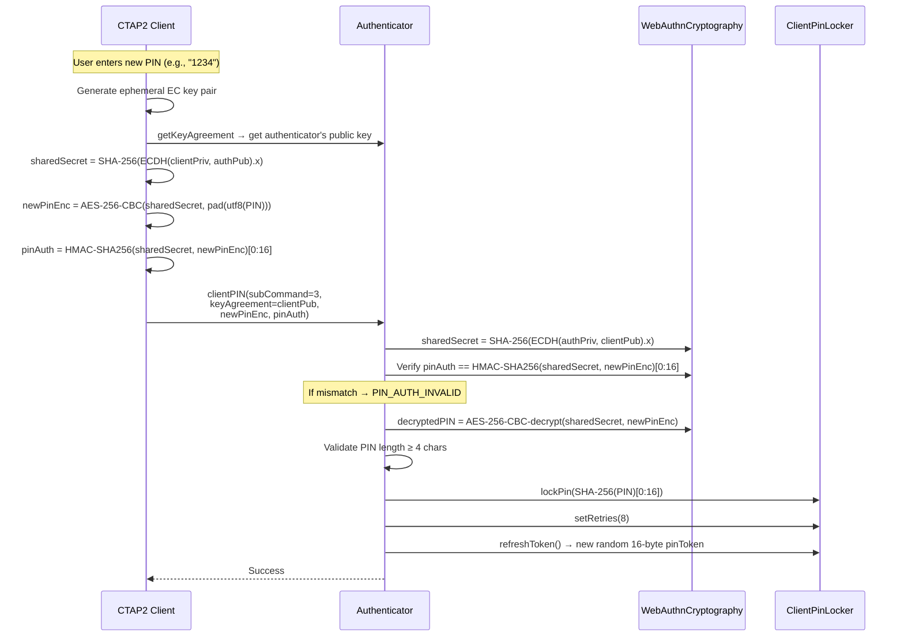

### Subcommand 4: changePIN

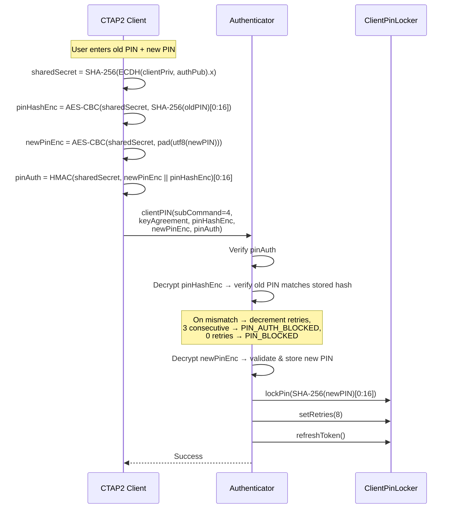

### Subcommand 5: getPinToken (The Critical One)

This is where the client proves PIN knowledge and gets a `pinToken` to use for subsequent operations:

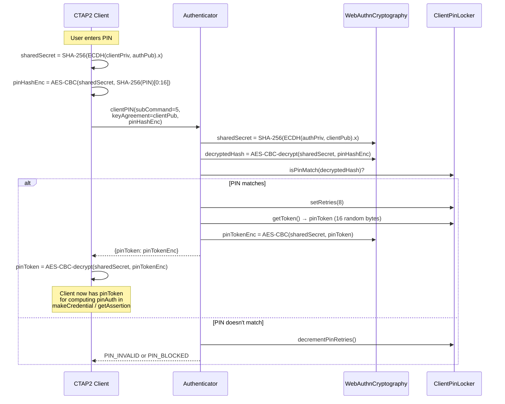

---

## 3. How pinToken Gates Signing Operations

After the client obtains `pinToken` via subcommand 5, it uses it to authenticate every subsequent makeCredential or getAssertion request:

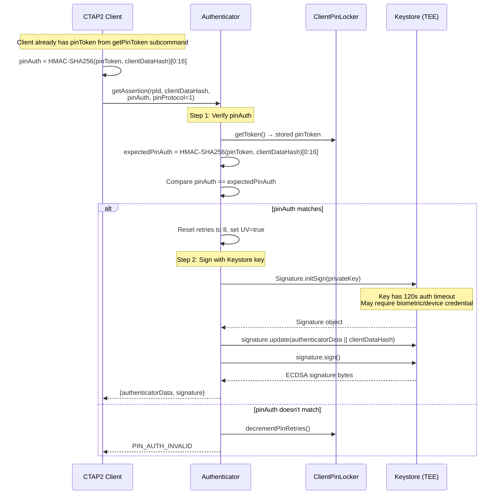

**Critical insight:** The pinAuth verification and the Keystore signing are **two independent checks**:

1. **pinAuth** — verified in app code (HMAC comparison in `PINverifyClientDataHash()`)
2. **Keystore signing** — verified in TEE hardware (key requires `setUserAuthenticationRequired(true)` with 120s timeout)

---

## 4. Signing Key Configuration

**File:** `util/CredentialSafe.java` (lines 106-115)

```java
KeyGenParameterSpec spec = new KeyGenParameterSpec.Builder(alias, KeyProperties.PURPOSE_SIGN)
    .setAlgorithmParameterSpec(new ECGenParameterSpec("secp256r1"))   // P-256
    .setDigests(KeyProperties.DIGEST_SHA256)                          // SHA-256
    .setUserAuthenticationRequired(true)                              // Auth required
    .setUserAuthenticationValidityDurationSeconds(120)                // 120s timeout
    .setUserConfirmationRequired(false)
    .setInvalidatedByBiometricEnrollment(false)
    .setIsStrongBoxBacked(this.strongboxRequired)                     // StrongBox optional
    .build();
```

| Parameter | Value | Implication |
|---|---|---|
| Algorithm | ECDSA P-256 (secp256r1) | Standard WebAuthn ES256 |
| Auth required | `true` | TEE won't sign without auth |
| Timeout | **120 seconds** | After one auth, key usable for 2 minutes |
| Per-use CryptoObject | **No** (timeout > 0) | Not bound to specific biometric event |
| StrongBox | Optional | Dedicated secure element if available |
| Biometric invalidation | `false` | Key survives fingerprint enrollment changes |

**Note:** `biometricSigningSupported` is hardcoded to `false` (line 74 of CredentialSafe), meaning CryptoObject signing is **disabled by design**. The library uses time-based authentication, not per-use.

---

## 5. BiometricPrompt Integration

**File:** `util/WioBiometricPrompt.java`

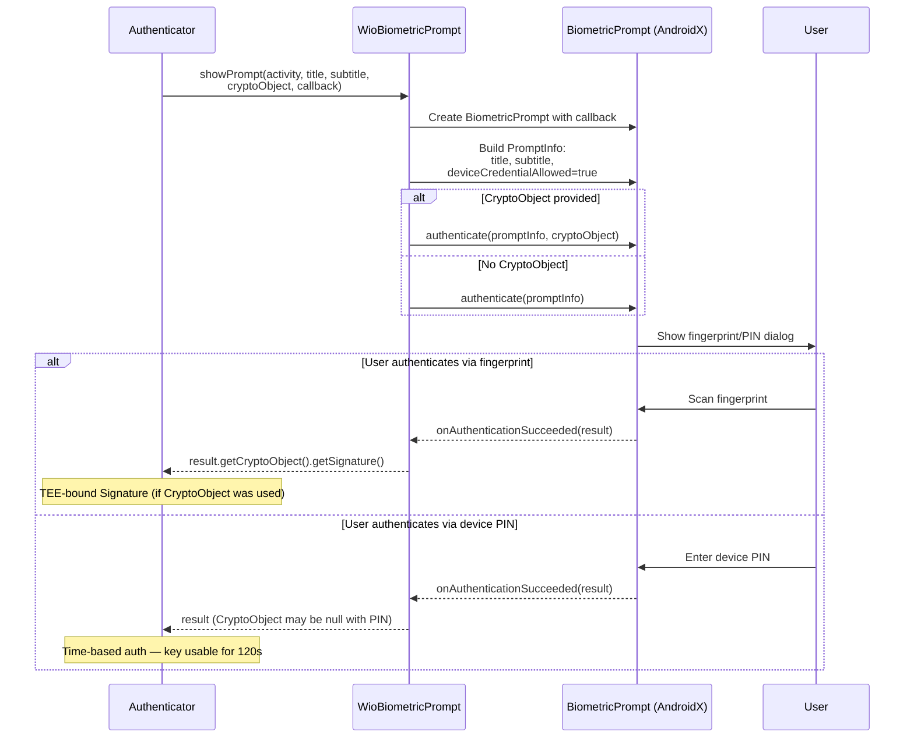

**Important:** When user chooses device PIN instead of biometric, the CryptoObject is not crypto-bound. The 120s timeout makes the key usable for any code in the process during that window.

---

## 6. Security Analysis

### The Two-Layer Architecture

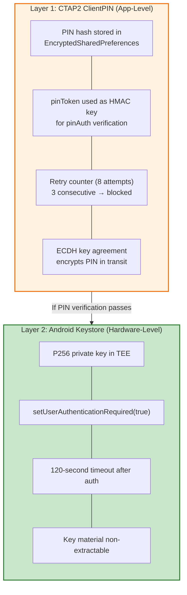

### What Can Be Attacked

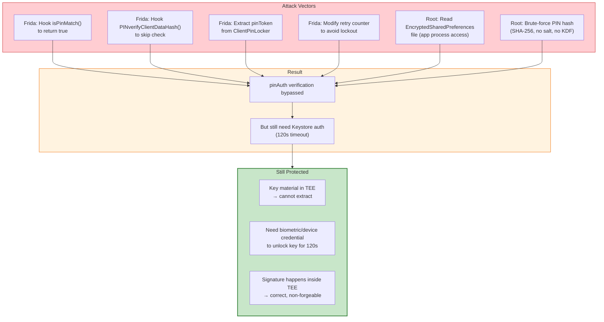

### Complete Attack Scenario: Frida Bypasses PIN, But Then What?

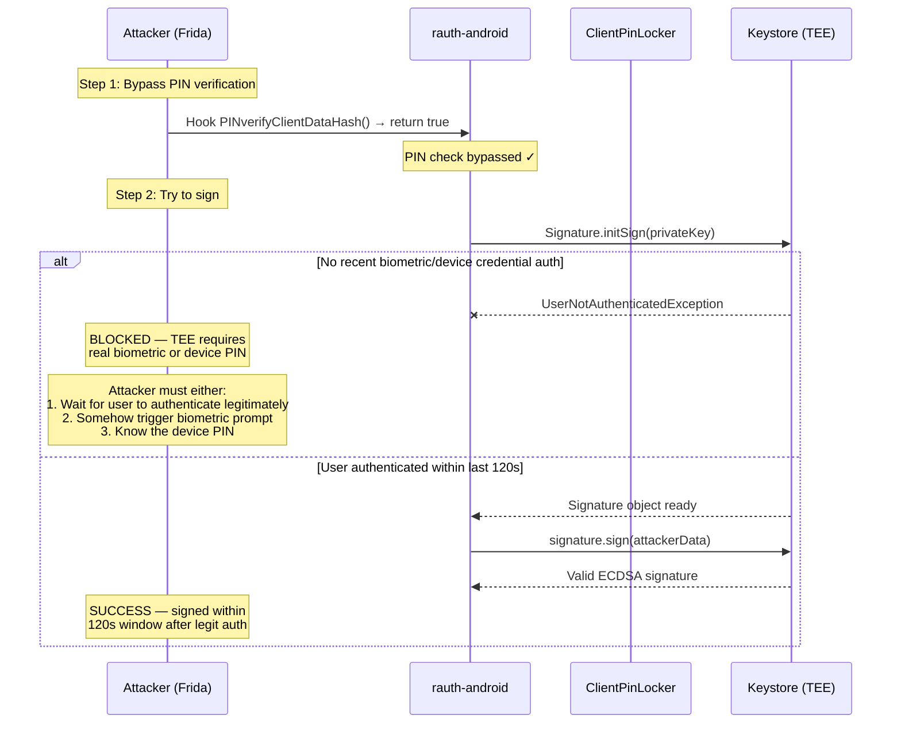

### Vulnerability Summary

| Component | Weakness | Severity | Why |
|---|---|---|---|
| PIN hash | SHA-256, no salt, no KDF (no PBKDF2/Argon2) | **Medium** | Fast brute-force: 10,000 4-digit PINs × SHA-256 = milliseconds |
| PIN storage | EncryptedSharedPrefs with no-auth MasterKey | **Medium** | Any code in process can access when device unlocked |
| Retry counter | Stored in same EncryptedSharedPrefs | **Medium** | Frida can reset to 8 retries indefinitely |
| pinToken | 16 random bytes, stored alongside PIN hash | **Medium** | Extractable by Frida → can compute valid pinAuth |
| Signing key | 120s timeout, not per-use | **Low-Medium** | Root can piggyback within 120s of legitimate auth |
| Key material | TEE-backed, non-extractable | **Strong** | Cannot be extracted even with root |

### What WIOsense Gets Right

1. **ECDH channel**: PIN is never sent in plaintext — encrypted via AES-256-CBC over ECDH shared secret
2. **Retry limiting**: 8 total attempts, 3 consecutive mismatches → blocked
3. **Key agreement regeneration**: New ECDH key pair generated on each PIN mismatch (prevents replay)
4. **TEE key storage**: Signing key is hardware-backed, non-extractable
5. **StrongBox support**: Optional strongest hardware backing
6. **Follows CTAP2 spec**: Compliant with [FIDO Client to Authenticator Protocol](https://fidoalliance.org/specs/fido-v2.0-id-20180227/fido-client-to-authenticator-protocol-v2.0-id-20180227.html)

### What Could Be Stronger

1. **Per-use CryptoObject** (timeout=0) instead of 120s timeout — blocks root piggybacking
2. **Argon2id instead of SHA-256** for PIN hashing — makes brute-force infeasible
3. **MasterKey with biometric auth** — prevents app-level PIN extraction
4. **Hardware-bound PIN verification** — not possible with Keystore API, but Split Signing would achieve this

---

## 7. How This Applies to Your 2FA Authenticator

### If you adopt the WIOsense pattern:

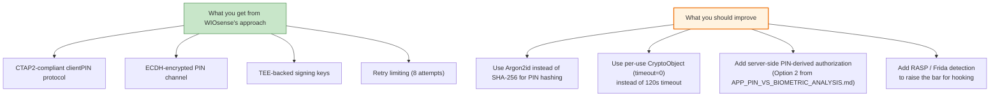

### Recommended Hybrid: WIOsense Pattern + Server-Side Binding

Combine WIOsense's CTAP2 clientPIN with server-side authorization token verification:

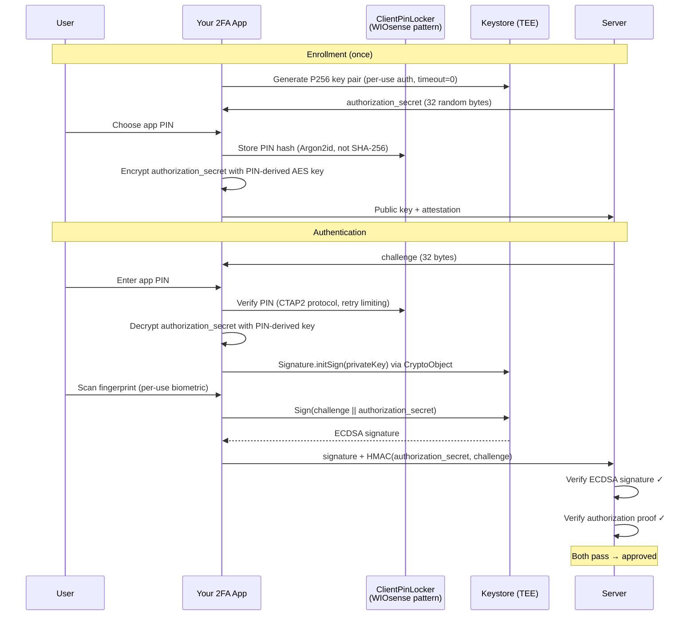

This gives you **three independent layers**:
1. **App PIN** — stops casual physical access (CTAP2 protocol with retry limiting)
2. **Biometric (per-use CryptoObject)** — stops Frida/root (TEE-enforced)
3. **Server-side authorization** — stops any device-only attack (even if PIN + biometric bypassed, server rejects without authorization proof)

---

## Sources

- [WIOsense/rauth-android — GitHub](https://github.com/WIOsense/rauth-android)
- [FIDO CTAP2 Specification — fidoalliance.org](https://fidoalliance.org/specs/fido-v2.0-id-20180227/fido-client-to-authenticator-protocol-v2.0-id-20180227.html)
- [Android Keystore System — developer.android.com](https://developer.android.com/privacy-and-security/keystore)
- [WithSecure — Android Keystore Authentication Security](https://labs.withsecure.com/publications/how-secure-is-your-android-keystore-authentication)
